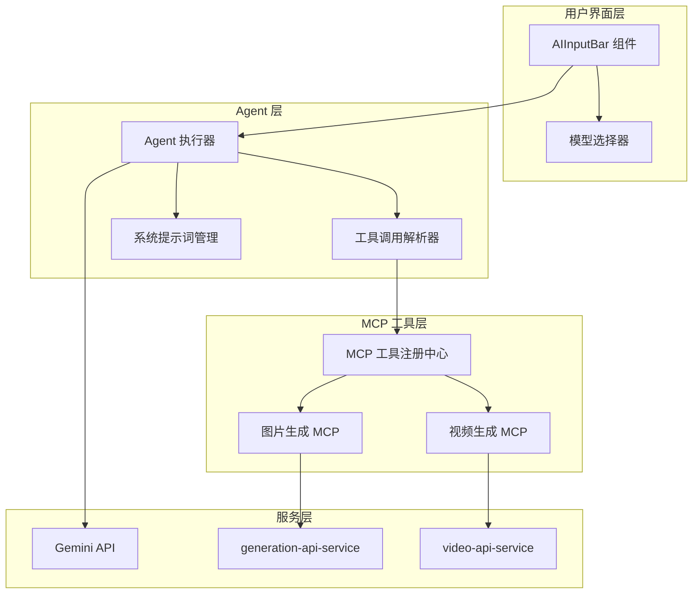
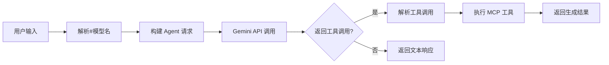

## 产品概述

在 aitu 项目的 AI 输入框中实现 Agent + MCP 架构，用户可以通过 "#模型名" 语法指定使用的模型，AI Agent 会根据用户意图自动决定调用图片生成或视频生成 MCP 工具。

## 核心功能

- **模型选择器**：在输入框中支持 "#模型名" 语法，用户输入时显示模型选择下拉提示
- **MCP 工具注册**：实现图片生成 MCP 和视频生成 MCP，遵循 JSON-RPC 2.0 协议规范
- **Agent 执行器**：通过系统提示词引导模型分析用户意图，自动选择并调用合适的 MCP 工具
- **工具调用解析**：解析模型返回的工具调用指令，执行对应的 MCP 方法并返回结果

## 技术栈

- 前端框架：React + TypeScript（复用现有项目架构）
- AI 集成：Gemini API（现有）
- MCP 协议：JSON-RPC 2.0
- 状态管理：React Hooks

## 技术架构

### 系统架构



### 模块划分

- **UI 模块**：AIInputBar 增强、模型选择器组件
- 依赖：Agent 模块
- 职责：处理用户输入、解析 "#模型名" 语法、展示模型选项

- **Agent 模块**：Agent 执行器、工具调用解析器
- 依赖：MCP 模块、Gemini API
- 职责：构建系统提示词、调用 LLM、解析工具调用、协调执行

- **MCP 模块**：工具注册中心、图片/视频生成 MCP
- 依赖：现有 generation-api-service、video-api-service
- 职责：工具注册、JSON-RPC 协议实现、工具执行

### 数据流



## 实现细节

### 核心目录结构

```
src/
├── components/
│   └── ai-input/
│       ├── AIInputBar.tsx          # 修改：增加模型选择功能
│       └── ModelSelector.tsx       # 新增：模型选择下拉组件
├── services/
│   └── agent/
│       ├── agent-executor.ts       # 新增：Agent 执行器
│       ├── tool-parser.ts          # 新增：工具调用解析器
│       └── system-prompts.ts       # 新增：系统提示词模板
├── mcp/
│   ├── registry.ts                 # 新增：MCP 工具注册中心
│   ├── types.ts                    # 新增：MCP 类型定义
│   ├── image-generation-mcp.ts     # 新增：图片生成 MCP
│   └── video-generation-mcp.ts     # 新增：视频生成 MCP
```

### 关键代码结构

**MCP 工具类型定义**：定义 MCP 工具的标准接口，包含工具名称、描述和输入参数 Schema。

```typescript
// MCP 工具接口
interface MCPTool {
  name: string;
  description: string;
  inputSchema: {
    type: 'object';
    properties: Record<string, unknown>;
    required: string[];
  };
  execute: (params: unknown) => Promise<MCPResult>;
}

// JSON-RPC 2.0 请求/响应
interface JsonRpcRequest {
  jsonrpc: '2.0';
  method: string;
  params: unknown;
  id: string | number;
}
```

**Agent 执行器接口**：负责协调 LLM 调用和工具执行的核心服务类。

```typescript
// Agent 执行器
class AgentExecutor {
  constructor(
    private registry: MCPRegistry,
    private llmClient: GeminiClient
  ) {}
  
  async execute(input: string, model?: string): Promise<AgentResult> {}
  private buildSystemPrompt(tools: MCPTool[]): string {}
  private parseToolCalls(response: string): ToolCall[] {}
}
```

### 技术实现方案

**1. 模型选择器实现**

- 问题：解析用户输入中的 "#模型名" 语法
- 方案：使用正则表达式匹配，提取模型名并从输入中移除
- 技术：React 受控组件 + 下拉提示
- 步骤：监听输入变化 → 检测 "#" 触发 → 显示模型列表 → 选择后替换

**2. Agent 工具调用**

- 问题：让 LLM 决定使用哪个工具
- 方案：通过系统提示词注入可用工具列表，要求 LLM 返回结构化工具调用
- 技术：Gemini Function Calling 或结构化输出
- 步骤：构建提示词 → 调用 LLM → 解析响应 → 执行工具

### 集成点

- **AIInputBar → AgentExecutor**：用户提交时调用 Agent 执行
- **AgentExecutor → MCPRegistry**：获取可用工具列表、执行工具调用
- **MCP 工具 → 现有服务**：复用 generation-api-service 和 video-api-service

## Agent Extensions

### SubAgent

- **code-explorer**
- 用途：深入研究 aitu 项目现有代码结构，了解 AIInputBar、generation-api-service、video-api-service 的具体实现
- 预期结果：获取现有组件和服务的接口定义、调用方式，确保新功能与现有架构无缝集成