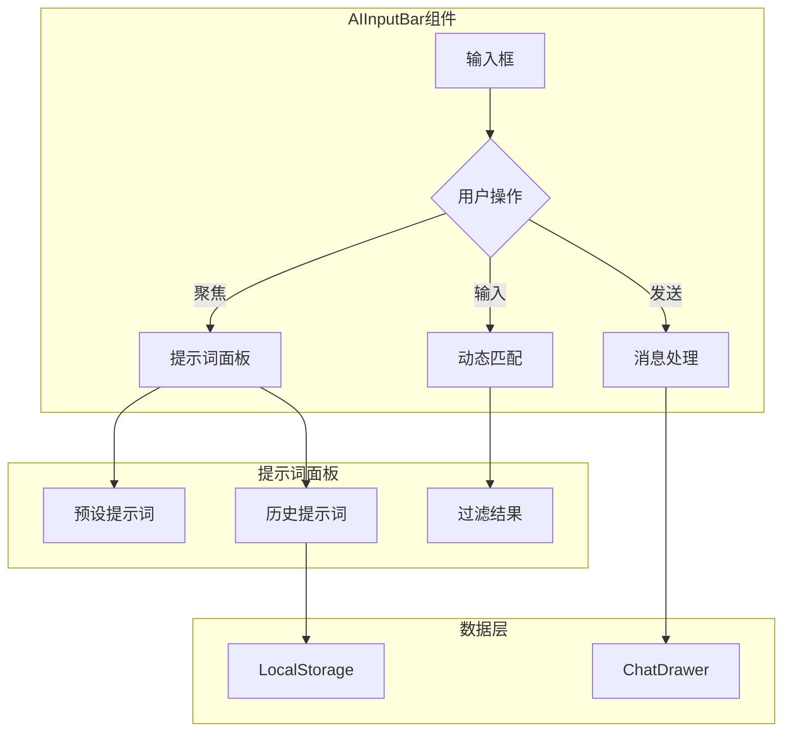

## 产品概述

增强 AIInputBar 组件的交互体验，实现消息发送后自动打开对话抽屉展示对话内容，并在输入框聚焦时显示智能提示词选择面板，支持预设提示词和用户历史输入的动态匹配与选择。

## 核心功能

- **消息发送与对话展示**：用户发送消息后自动打开 ChatDrawer 组件显示对话内容
- **提示词选择面板**：输入框聚焦时在上方展开提示词面板（类似聊天气泡样式）
- **提示词来源整合**：支持预设提示词和用户历史输入两种来源
- **动态匹配过滤**：根据用户输入内容实时过滤匹配的提示词
- **历史记录存储**：用户历史输入通过本地存储持久化保存
- **滚动支持**：提示词列表支持滚动浏览，适应大量提示词场景

## 技术栈

- 前端框架：React + TypeScript
- 状态管理：React Hooks
- 本地存储：LocalStorage
- 现有组件：复用 ChatDrawer 组件

## 技术架构

### 系统架构



### 模块划分

- **AIInputBar 增强模块**：扩展现有输入框组件，集成提示词面板触发和消息发送回调
- **PromptSuggestionPanel 模块**：提示词选择面板组件，负责展示和交互
- **PromptStorage 模块**：历史提示词的本地存储管理
- **ChatDrawer 集成模块**：复用现有 ChatDrawer，处理打开/关闭状态

### 数据流

用户聚焦输入框 → 加载预设+历史提示词 → 展示面板 → 用户输入触发过滤 → 选择提示词填充输入框 → 发送消息 → 保存历史 → 打开 ChatDrawer

## 实现细节

### 核心目录结构

```
src/
├── components/
│   ├── AIInputBar/
│   │   ├── index.tsx              # 修改：集成提示词面板和发送回调
│   │   └── PromptSuggestionPanel.tsx  # 新增：提示词选择面板
│   └── ChatDrawer/                # 复用：现有对话抽屉组件
├── hooks/
│   └── usePromptHistory.ts        # 新增：历史提示词管理 Hook
├── constants/
│   └── presetPrompts.ts           # 新增：预设提示词配置
└── utils/
    └── promptStorage.ts           # 新增：本地存储工具函数
```

### 关键代码结构

**提示词数据结构**：定义提示词的基础数据模型，包含唯一标识、内容文本、来源类型和使用时间戳。

```typescript
interface PromptItem {
  id: string;
  content: string;
  source: 'preset' | 'history';
  timestamp?: number;
}
```

**历史提示词管理 Hook**：提供历史提示词的增删查改能力，封装 LocalStorage 操作逻辑。

```typescript
function usePromptHistory() {
  const getHistory: () => PromptItem[];
  const addHistory: (content: string) => void;
  const clearHistory: () => void;
}
```

**提示词面板组件接口**：定义面板组件的属性接口，支持可见性控制、提示词列表、过滤关键词和选择回调。

```typescript
interface PromptSuggestionPanelProps {
  visible: boolean;
  prompts: PromptItem[];
  filterKeyword: string;
  onSelect: (prompt: PromptItem) => void;
  onClose: () => void;
}
```

### 技术实现方案

**提示词面板交互**

1. 监听输入框 focus/blur 事件控制面板显隐
2. 使用 useMemo 对提示词列表进行动态过滤
3. 面板定位采用 absolute 定位于输入框上方
4. 实现点击外部区域关闭面板

**历史记录存储**

1. 使用 LocalStorage 存储历史提示词数组
2. 限制历史记录数量（建议最多 20 条）
3. 新记录插入头部，自动去重

**ChatDrawer 集成**

1. 在 AIInputBar 父组件管理 ChatDrawer 的 open 状态
2. 消息发送成功后触发 onSend 回调，由父组件打开 ChatDrawer

## Agent Extensions

### SubAgent

- **code-explorer**
- 用途：探索现有 AIInputBar 和 ChatDrawer 组件的代码结构，了解当前实现方式和可复用的接口
- 预期结果：获取组件的 props 接口定义、状态管理方式和样式结构，为增强开发提供基础