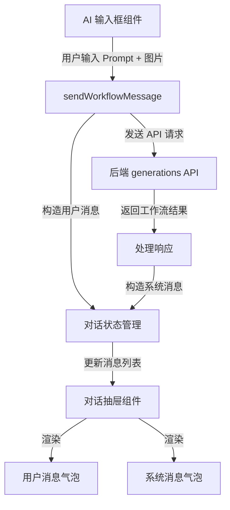

## 产品概述

修复 AI 输入框发送消息后，对话抽屉中不显示用户输入和系统响应的问题。确保用户发送的消息（包含图片和 Prompt）能够正确显示为用户气泡，工作流返回的结果能够正确显示为系统气泡。

## 核心功能

- 扩展 sendWorkflowMessage 接口，支持传递图片参数
- 用户消息气泡中显示用户上传的图片缩略图
- 用户消息气泡中显示用户输入的 Prompt 文本
- 系统消息气泡中正确渲染工作流返回结果
- 消息发送后自动滚动到最新消息位置

## 技术方案

### 问题分析

根据用户反馈，后台请求已正常发出（Network 可见 generations 请求），但对话界面未显示消息。问题可能出在：

1. sendWorkflowMessage 接口未正确传递图片数据
2. 消息发送后未正确添加到对话列表
3. 消息气泡组件未正确处理图片类型消息

### 系统架构



### 数据流

1. 用户在 AI 输入框输入 Prompt 并上传图片
2. 点击发送，调用 sendWorkflowMessage 接口
3. 接口构造用户消息对象（包含 images、prompt），添加到消息列表
4. 发送 API 请求到后端
5. 接收工作流响应，构造系统消息对象
6. 更新消息列表，触发对话抽屉重新渲染
7. 消息气泡组件根据消息类型渲染图片和文本

### 关键代码结构

**消息数据结构扩展**

```typescript
interface ChatMessage {
  id: string;
  role: 'user' | 'assistant';
  content: string;
  images?: string[];  // base64 图片数组
  timestamp: Date;
  type?: 'text' | 'workflow';
}
```

**sendWorkflowMessage 接口扩展**

```typescript
interface SendWorkflowParams {
  prompt: string;
  images?: string[];  // 新增图片参数
  model?: string;
}

async function sendWorkflowMessage(params: SendWorkflowParams): Promise<void> {
  // 1. 构造并添加用户消息到列表
  // 2. 发送 API 请求
  // 3. 处理响应并添加系统消息
}
```

### 实现要点

1. **接口层**：扩展 sendWorkflowMessage 参数类型，支持 images 数组
2. **状态层**：确保用户消息在发送前立即添加到消息列表
3. **组件层**：用户气泡组件支持渲染图片网格和 Prompt 文本
4. **响应处理**：工作流响应正确解析并构造系统消息

## Agent Extensions

### SubAgent

- **code-explorer**
- Purpose: 探索项目中 sendWorkflowMessage 接口的实现位置、对话状态管理逻辑、消息气泡组件结构
- Expected outcome: 定位相关代码文件，理解现有数据流和组件结构，为修复提供准确的代码位置