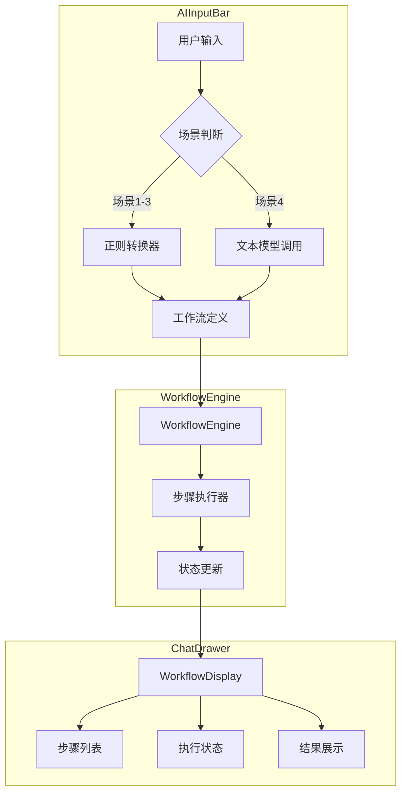
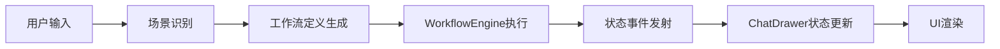

## Product Overview

在 AIInputBar 组件中集成完整的 WorkflowEngine 工作流引擎，实现4种发送场景的工作流支持，并在 ChatDrawer 中展示详细的工作流执行过程，提供类似 TaskWorkflow 组件的可视化步骤展示。

## Core Features

- 从 collimind 项目移植 WorkflowEngine 核心引擎到 drawnix
- 支持4种发送场景的工作流执行：
- 场景1-3（直接生成）：通过正则表达式将用户输入转换为工作流定义后执行
- 场景4（Agent流程）：调用文本模型获取工作流定义后执行
- 在 ChatDrawer 中展示完整的工作流执行步骤，包括：
- 当前执行步骤高亮显示
- 每个步骤的执行状态（等待/执行中/完成/失败）
- 步骤执行结果的实时展示
- 工作流状态管理与错误处理机制

## Tech Stack

- 前端框架：React + TypeScript
- 状态管理：复用现有项目状态管理方案
- 工作流引擎：从 collimind 移植 WorkflowEngine

## Tech Architecture

### System Architecture



### Module Division

- **WorkflowEngine 模块**：从 collimind 移植的核心工作流引擎
- 工作流定义解析
- 步骤顺序执行
- 状态管理与事件发射
- **场景转换模块**：将不同场景的输入转换为工作流定义
- 正则转换器（场景1-3）
- Agent 工作流获取器（场景4）
- **WorkflowDisplay 模块**：工作流可视化展示组件
- 步骤列表渲染
- 状态实时更新
- 结果展示

### Data Flow



## Implementation Details

### Core Directory Structure

```
src/
├── components/
│   ├── ai-input-bar/
│   │   └── workflow-converter.ts    # 新增：场景转工作流转换器
│   └── chat-drawer/
│       └── workflow-display.tsx     # 新增：工作流展示组件
├── engine/
│   └── workflow/                    # 新增：移植的WorkflowEngine
│       ├── index.ts
│       ├── workflow-engine.ts
│       ├── types.ts
│       └── step-executor.ts
└── hooks/
    └── use-workflow.ts              # 新增：工作流状态管理hook
```

### Key Code Structures

**WorkflowDefinition 接口**：定义工作流的结构，包含步骤列表和元数据。

```typescript
interface WorkflowDefinition {
  id: string;
  name: string;
  steps: WorkflowStep[];
  metadata?: Record<string, unknown>;
}

interface WorkflowStep {
  id: string;
  type: string;
  name: string;
  config: Record<string, unknown>;
  status: 'pending' | 'running' | 'completed' | 'failed';
  result?: unknown;
}
```

**WorkflowEngine 类**：核心工作流执行引擎，负责步骤调度和状态管理。

```typescript
class WorkflowEngine {
  execute(definition: WorkflowDefinition): Promise<void>;
  onStepChange(callback: (step: WorkflowStep) => void): void;
  onComplete(callback: (result: unknown) => void): void;
  onError(callback: (error: Error) => void): void;
  abort(): void;
}
```

**场景转换函数**：将用户输入根据场景类型转换为工作流定义。

```typescript
function convertToWorkflow(
  input: string, 
  scenario: 1 | 2 | 3 | 4
): Promise<WorkflowDefinition>;
```

### Technical Implementation Plan

1. **WorkflowEngine 移植**

- 问题：需要将 collimind 的 WorkflowEngine 移植到 drawnix
- 方案：分析 collimind 源码，提取核心逻辑，适配 drawnix 项目结构
- 步骤：复制核心文件 -> 调整依赖 -> 适配类型定义 -> 单元测试

2. **场景转换器实现**

- 问题：4种场景需要统一转换为工作流定义
- 方案：场景1-3使用正则匹配模板，场景4调用文本模型
- 步骤：定义转换规则 -> 实现正则转换器 -> 集成模型调用 -> 统一输出格式

3. **WorkflowDisplay 组件开发**

- 问题：需要在 ChatDrawer 中展示工作流执行过程
- 方案：参考 TaskWorkflow 组件设计，实现步骤列表和状态展示
- 步骤：设计组件结构 -> 实现步骤渲染 -> 添加状态动画 -> 集成到 ChatDrawer

### Integration Points

- AIInputBar 与 WorkflowEngine 的集成：通过场景转换器桥接
- WorkflowEngine 与 ChatDrawer 的集成：通过事件订阅和状态hook
- 场景4与文本模型的集成：通过现有的模型调用接口

## Agent Extensions

### SubAgent

- **code-explorer**
- Purpose: 探索 collimind 项目中 WorkflowEngine 的完整实现，以及 drawnix 项目中 AIInputBar、ChatDrawer 的现有结构
- Expected outcome: 获取 WorkflowEngine 核心代码结构、依赖关系，以及 drawnix 中需要集成的组件接口定义