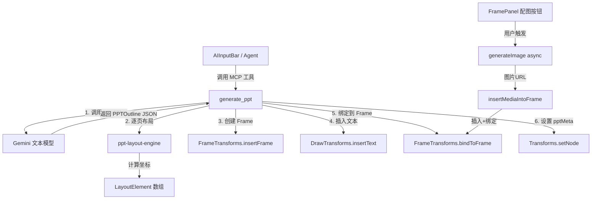

## 产品概述

实现 P0 — AI 一键生成 PPT 核心能力。用户在 AI 输入栏输入主题后，系统调用 AI 生成结构化 PPT 大纲（JSON），然后通过 PPT 布局引擎自动创建多个 Frame（1920x1080），在每个 Frame 内按版式规则放置文本元素（标题、副标题、正文要点）。大纲中同时返回每页的 imagePrompt（AI 自动判断哪些页需要配图），存储在 Frame 的扩展属性中。用户可在 FramePanel 中选择性地为单页或全部页面触发 AI 配图生成。

## 核心功能

- 新增 `generate_ppt` MCP 工具，接收主题/内容描述，调用文本模型生成结构化 PPT 大纲 JSON（含 imagePrompt）
- PPT 布局引擎：支持 6 种版式（封面页、目录页、标题正文页、图文页、对比页、结尾页），在 Frame 内精确放置文本元素
- 批量 Frame 创建与自动横向排列，视口自动聚焦到第一个 Frame
- 大纲中的 imagePrompt 存储到 Frame 扩展属性 `pptMeta.imagePrompt`，供后续配图使用
- FramePanel 中为有 imagePrompt 的 Frame 显示"生成配图"按钮，支持单页和全部页面一键配图
- 配图复用现有 `generate_image` 工具（async 模式）+ `insertMediaIntoFrame()` 插入到对应 Frame
- 通过 `onChunk` 回调实现流式反馈，逐页生成并渲染到画布

## 技术栈

- 框架: React + TypeScript（复用现有项目栈）
- UI 组件: TDesign React（light 主题）
- 画布框架: Plait（@plait/core, @plait/draw）
- AI API: Gemini（通过 `defaultGeminiClient.sendChat` 进行文本生成，通过 `generateImage` 进行图片生成）
- 工具体系: MCP Registry 单例注册

## 实现方案

### 总体策略

采用"MCP 工具 + 布局引擎 + 配图服务"三层架构：

1. **`generate_ppt` MCP 工具**：负责调用 AI 生成大纲、协调 Frame 创建和文本布局的完整流水线
2. **`ppt-layout-engine`**：纯函数模块，根据版式类型和 Frame 尺寸计算元素坐标，解耦可独立测试
3. **FramePanel 配图入口**：在已有 FramePanel 中增加配图按钮，复用 `generateImage` + `insertMediaIntoFrame` 实现

核心流程分两阶段：

**阶段一（自动）**：用户输入 → Agent 识别 → 调用 `generate_ppt` → 文本模型生成大纲 JSON → 逐页创建 Frame + 布局文本 → 完成

**阶段二（用户触发）**：用户在 FramePanel 点击"生成配图" → 读取 Frame 的 `pptMeta.imagePrompt` → 调用 `generateImage`(async) → `insertMediaIntoFrame` 插入到 Frame 内

### 关键技术决策

**文本模型调用**：参照 `long-video-generation.ts` 的模式，通过 `defaultGeminiClient.sendChat()` 调用文本模型（`geminiSettings.get().textModelName`），传入 system prompt + user message，解析 JSON 响应。这是项目中已验证的文本模型调用模式。

**Frame 创建与排列**：复用 `AddFrameDialog.tsx` 中的 `calcNewFramePosition()` 横向排列逻辑。PPT Frame 固定 1920x1080（宽>=高，属于横屏），每个新 Frame 放在最右侧 Frame 右边 60px。

**文本插入**：通过 `DrawTransforms.insertText(board, point, text)` 插入文本到画布绝对坐标，然后通过 `FrameTransforms.bindToFrame()` 绑定到目标 Frame。布局引擎负责计算每个文本元素相对于 Frame 左上角的偏移坐标，并转换为绝对坐标。

**imagePrompt 存储**：利用 Plait 框架 `Transforms.setNode` 可设置任意属性的能力，在 Frame 元素上添加 `pptMeta` 字段存储 PPT 相关扩展数据（包括 `imagePrompt`、`layout` 类型等）。这样不需要修改 PlaitFrame 类型定义（避免影响其他功能），通过类型扩展方式处理。

**配图方案**：

- 大模型调用次数：1 次文本模型（生成大纲）+ N 次图片模型（仅有 imagePrompt 的页面，约 50-60% 的页面）
- 用户控制：默认只生成纯文本 PPT（~5s），配图由用户在 FramePanel 中按需触发
- 单页配图：点击对应 Frame 的配图按钮，调用 `generateImage(async)` → `insertMediaIntoFrame` → 绑定到 Frame
- 全部配图：并行调用所有有 imagePrompt 的 Frame 的图片生成，每完成一张即插入

**提示词设计**：参考 banana-slides 8.2 节大纲生成 prompt（Simple/Part-based 两种格式）和 LandPPT 5.3 节流式大纲 prompt（JSON 格式），设计适配 aitu 的大纲生成 prompt，输出严格 JSON（`PPTOutline`），内置语言控制和页数控制。

### 大模型调用详情

| 步骤 | 调用次数 | 模型 | 触发方式 | 耗时预估 |
| --- | --- | --- | --- | --- |
| 生成大纲 | 1 次 | 文本模型 | 自动 | ~3-5s |
| 配图生成 | N 次（有 imagePrompt 的页面） | 图片模型 | 用户手动触发 | 每张 ~10-20s |


用户完全控制是否生成配图，以及为哪些页面生成配图。

## 实现细节

### 性能考量

- 大纲生成使用单次 LLM 调用，减少网络往返
- Frame 和文本元素创建使用同步 `Transforms.insertNode`（Plait 标准方式），批量操作在一个执行上下文内完成
- 每页生成完毕后通过 `onChunk` 回调通知进度
- 配图生成为异步操作，不阻塞 PPT 文本内容的呈现

### 兼容性与扩展性

- `generate_ppt` 注册到 MCPRegistry，系统提示词自动包含工具描述
- Agent 可通过 `promptGuidance` 识别"生成PPT"、"做个演示文稿"等关键词
- Frame 的 `pptMeta` 扩展属性为后续迭代（演讲者备注、模板主题、大纲编辑等）预留空间
- 布局引擎通过版式函数数组管理，新增版式只需添加对应的布局函数

### Blast Radius

- 新增 4 个文件 + 修改 3 个已有文件
- 修改范围：MCP 注册入口（添加 import + registerAll 条目）、FramePanel（添加配图按钮）
- PlaitFrame 类型定义不修改，通过类型扩展（交叉类型）处理
- 现有 MCP 工具、Agent 系统、Frame 功能不受影响

## 架构设计

### 模块关系



### 数据流

1. 用户输入"生成PPT: AI的未来" → Agent 识别 → 调用 `generate_ppt({ topic: "AI的未来" })`
2. `generate_ppt` 内部：构建 system prompt + user message → `defaultGeminiClient.sendChat()` → 解析 JSON 为 `PPTOutline`
3. 遍历 `outline.pages`，每页执行：

- `calcNewFramePosition()` 计算 Frame 位置 → `FrameTransforms.insertFrame()` 创建 Frame
- `layoutPageContent(pageSpec, frameRect)` 计算文本元素坐标
- 逐个 `DrawTransforms.insertText()` + `FrameTransforms.bindToFrame()`
- `Transforms.setNode(board, { pptMeta: { imagePrompt, layout } }, [frameIndex])`

4. 用户在 FramePanel 看到带图标标记的 Frame → 点击"生成配图" → `generateImage({ prompt: pptMeta.imagePrompt, size: '16x9' })` → `insertMediaIntoFrame()`

## 目录结构

```
packages/drawnix/src/
├── services/
│   └── ppt/
│       ├── ppt.types.ts             # [NEW] PPT 类型定义。包含 PPTOutline、PPTPageSpec、PPTLayoutType、
│       │                            #   PPTGenerateOptions、PPTFrameMeta、LayoutElement 等接口。
│       │                            #   PPTFrameMeta 扩展 Frame 属性（imagePrompt/layout/notes）。约 70 行。
│       ├── ppt-prompts.ts           # [NEW] PPT 大纲生成提示词模块。核心函数 generateOutlinePrompt(topic, options)，
│       │                            #   参考 banana-slides 8.2 和 LandPPT 5.3 设计，输出 PPTOutline JSON 格式约束，
│       │                            #   内置页数控制（short/normal/long）和语言控制。约 120 行。
│       ├── ppt-layout-engine.ts     # [NEW] PPT 布局引擎。定义 6 种版式的元素坐标规则：cover（大标题居中+副标题）、
│       │                            #   toc（目录列表）、title-body（标题+要点列表）、image-text（预留图片区+文本区）、
│       │                            #   comparison（左右对比）、ending（结束语居中）。核心纯函数 layoutPageContent()
│       │                            #   接收 PPTPageSpec + Frame 矩形返回 LayoutElement[]。约 300 行。
│       └── index.ts                 # [NEW] PPT 模块统一导出。
├── mcp/
│   └── tools/
│       └── ppt-generation.ts        # [NEW] generate_ppt MCP 工具。串联完整流水线：
│       │                            #   接收 topic/options → sendChat 生成大纲 → 解析 JSON → 批量创建 Frame →
│       │                            #   逐页调用布局引擎 → 插入文本并绑定 → 设置 pptMeta → 进度回调。
│       │                            #   包含 MCPTool 定义（inputSchema/promptGuidance）和 execute 函数。约 350 行。
├── mcp/
│   ├── index.ts                     # [MODIFY] 在 initializeMCP() 的 registerAll 数组中添加 pptGenerationTool。
│   │                                #   添加导入语句和导出语句。
│   └── tools/
│       └── index.ts                 # [MODIFY] 添加 pptGenerationTool 导出。
└── components/
    └── project-drawer/
        └── FramePanel.tsx           # [MODIFY] 在 Frame 列表项操作区域添加"生成配图"按钮。
                                     #   读取 frame 的 pptMeta.imagePrompt 属性，有则显示图片图标按钮。
                                     #   点击触发 generateImage(async) → insertMediaIntoFrame。
                                     #   操作栏添加"全部配图"按钮（遍历所有有 imagePrompt 的 Frame 并行生成）。
                                     #   添加配图生成中的 loading 状态管理。
```

## 核心代码结构

```typescript
/** PPT 页面版式类型 */
type PPTLayoutType = 'cover' | 'toc' | 'title-body' | 'image-text' | 'comparison' | 'ending';

/** PPT 页面规格（AI 生成的大纲中每页的描述） */
interface PPTPageSpec {
  layout: PPTLayoutType;
  title: string;
  subtitle?: string;
  bullets?: string[];
  imagePrompt?: string;
  notes?: string;
}

/** PPT 大纲（AI 生成的完整大纲结构） */
interface PPTOutline {
  title: string;
  pages: PPTPageSpec[];
}

/** PPT 生成选项 */
interface PPTGenerateOptions {
  pageCount?: 'short' | 'normal' | 'long';
  language?: string;
  extraRequirements?: string;
}

/** Frame 上的 PPT 扩展元数据（存储在 frame 元素的 pptMeta 属性中） */
interface PPTFrameMeta {
  imagePrompt?: string;
  layout?: PPTLayoutType;
  notes?: string;
}

/** 布局引擎输出：单个文本元素的位置和内容 */
interface LayoutElement {
  type: 'title' | 'subtitle' | 'body' | 'bullet';
  text: string;
  point: [number, number]; // 相对于 Frame 左上角的偏移坐标
  fontSize?: 'large' | 'medium' | 'small';
}

/** 布局引擎核心函数 */
function layoutPageContent(
  pageSpec: PPTPageSpec,
  frameRect: { x: number; y: number; width: number; height: number }
): LayoutElement[];
```

## Agent Extensions

### SubAgent

- **code-explorer**
- 用途: 在实现阶段搜索 Plait 框架 API（DrawTransforms.insertText 参数签名、Transforms.setNode 扩展属性用法）、验证导入路径、查找 TDesign 图标组件
- 预期结果: 获取准确的 API 调用方式和导入路径，确保代码与现有架构一致