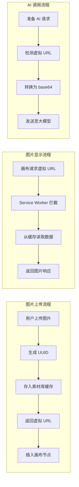

## 产品概述

优化图片存储机制，将本地上传和合并图片从 base64 DataURL 改为素材库虚拟 URL 方案，通过 Service Worker 拦截返回缓存数据，显著减少画布复制粘贴时的数据量，提升编辑器性能。

## 核心功能

- 本地上传图片时生成虚拟 URL 并存入素材库缓存，画布使用虚拟 URL 而非 base64
- 图片拆分/合并操作产生的图片同样使用虚拟 URL 存储
- Service Worker 拦截虚拟 URL 请求，从缓存返回图片数据
- 调用大模型接口时，自动将虚拟 URL 转换回 base64 格式

## 技术方案

### 系统架构

基于现有架构进行增量修改，复用已有的素材库服务和 Service Worker 拦截机制。



### 模块修改

#### 1. 图片上传模块 (image.ts)

- **修改点**: `insertImage` 函数
- **变更**: 将 base64 DataURL 转换为虚拟 URL 后再插入画布
- **依赖**: asset-storage-service.ts

#### 2. 图片拆分模块 (image-splitter.ts)

- **修改点**: 图片拆分后的存储逻辑
- **变更**: 拆分产生的图片使用虚拟 URL 存储
- **依赖**: asset-storage-service.ts

#### 3. 素材库服务 (asset-storage-service.ts)

- **修改点**: 新增 base64 转虚拟 URL 的便捷方法
- **变更**: 提供 `storeBase64AsAsset` 方法，接收 base64 返回虚拟 URL

#### 4. AI 调用层

- **修改点**: 请求预处理逻辑
- **变更**: 调用 `getImageForAI` 将虚拟 URL 转回 base64

### 数据流

```mermaid
flowchart TD
    subgraph 存储流程
        B64[Base64 DataURL] --> |storeBase64AsAsset| Cache[(素材库缓存)]
        Cache --> |生成| VirtualURL[/asset-library/uuid.ext]
    end
    
    subgraph 读取流程
        VirtualURL --> |画布渲染| SW[Service Worker]
        SW --> |handleAssetLibraryRequest| Cache
        Cache --> |Response| IMG[图片显示]
    end
    
    subgraph AI转换流程
        VirtualURL --> |getImageForAI| Cache
        Cache --> |读取| B64Out[Base64 输出]
        B64Out --> |API请求| LLM[大模型]
    end
```

## 实现细节

### 修改的目录结构

```
src/
├── lib/
│   ├── image.ts                    # 修改: insertImage 使用虚拟 URL
│   └── image-splitter.ts           # 修改: 拆分图片使用虚拟 URL
├── services/
│   └── asset-storage-service.ts    # 修改: 新增 storeBase64AsAsset 方法
└── sw/
    └── index.ts                    # 已有: handleAssetLibraryRequest 无需修改
```

### 关键代码结构

**新增方法 - storeBase64AsAsset**

将 base64 DataURL 存入素材库并返回虚拟 URL，供上传和拆分模块调用。

```typescript
// asset-storage-service.ts
interface StoreAssetResult {
  virtualUrl: string;  // /asset-library/{uuid}.{ext}
  uuid: string;
}

async function storeBase64AsAsset(
  base64DataUrl: string,
  filename?: string
): Promise<StoreAssetResult> {
  // 1. 解析 base64 获取 mimeType 和数据
  // 2. 生成 UUID
  // 3. 存入缓存
  // 4. 返回虚拟 URL
}
```

**修改 insertImage 函数**

在插入画布前将 base64 转换为虚拟 URL。

```typescript
// image.ts
async function insertImage(base64DataUrl: string, ...args) {
  // 1. 调用 storeBase64AsAsset 获取虚拟 URL
  // 2. 使用虚拟 URL 创建画布节点
  // 3. 插入画布
}
```

### 技术实现计划

#### 1. 素材库服务扩展

- **问题**: 需要便捷方法将 base64 存入缓存并获取虚拟 URL
- **方案**: 在 asset-storage-service.ts 中新增 `storeBase64AsAsset` 方法
- **步骤**:

1. 解析 base64 DataURL 提取 mimeType 和二进制数据
2. 生成 UUID 和文件扩展名
3. 调用现有缓存存储逻辑
4. 构造并返回虚拟 URL

#### 2. 图片上传改造

- **问题**: insertImage 直接使用 base64 DataURL
- **方案**: 调用 storeBase64AsAsset 后使用返回的虚拟 URL
- **步骤**:

1. 在 insertImage 入口处调用 storeBase64AsAsset
2. 将返回的虚拟 URL 用于创建画布节点
3. 确保兼容现有的图片节点结构

#### 3. 图片拆分改造

- **问题**: 拆分产生的图片使用 base64 存储
- **方案**: 拆分结果同样转换为虚拟 URL
- **步骤**:

1. 定位拆分后图片的存储逻辑
2. 调用 storeBase64AsAsset 转换
3. 使用虚拟 URL 插入画布

#### 4. AI 调用适配

- **问题**: 大模型需要 base64 格式图片
- **方案**: 复用现有 getImageForAI 方法
- **验证**: 确认 AI 调用链路正确处理虚拟 URL 转换

## 技术考量

### 性能优化

- 虚拟 URL 字符串长度固定（约 50 字符），相比 base64（可达数 MB）大幅减少复制粘贴数据量
- Service Worker 缓存命中率高，图片加载性能无明显影响

### 兼容性

- 保持画布节点结构不变，仅替换 src 属性值
- 现有的图片导出、保存逻辑需验证兼容性

## Agent Extensions

### SubAgent

- **code-explorer**
- 用途: 探索现有代码库，理解 image.ts、image-splitter.ts、asset-storage-service.ts 的实现细节和调用关系
- 预期结果: 获取准确的函数签名、数据流和修改点位置