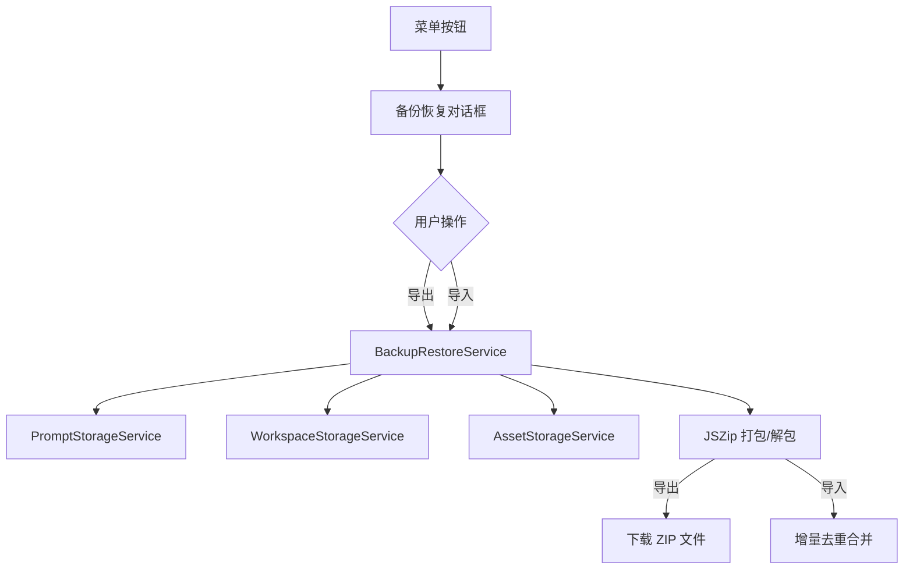

## 产品概述

在现有应用菜单中添加"备份/恢复"功能，允许用户将提示词、项目、素材库数据导出为 ZIP 压缩包，并支持从 ZIP 文件增量导入数据，自动去重避免重复内容。

## 核心功能

- 在菜单"设置"选项上方添加"备份/恢复"按钮入口
- 弹出功能对话框，提供多选复选框选择导出内容（提示词、项目、素材库）
- 将选中的数据打包导出为 ZIP 格式文件
- 支持导入 ZIP 文件，自动解析并增量合并数据
- 导入时根据唯一标识（如 ID）进行去重，避免重复导入

## 技术栈

- 前端框架：React + TypeScript
- 样式方案：复用现有组件样式
- 压缩库：JSZip（复用现有 workspace-export-service.ts 中的模式）
- 文件操作：FileSaver.js / Blob API

## 技术架构

### 系统架构

复用现有分层架构，新增备份恢复服务层：

- UI 层：对话框组件 + 菜单项
- 服务层：备份恢复服务（整合现有存储服务）
- 数据层：IndexedDB（通过现有 storage service 访问）



### 模块划分

- **BackupRestoreService**：核心服务，负责数据收集、打包、解析和去重导入
- **BackupRestoreDialog**：UI 对话框组件，提供导出选项和导入入口
- **菜单项扩展**：在 app-menu-items.tsx 中添加新菜单项

### 数据流

1. 导出流程：用户选择数据类型 → 服务层收集数据 → JSZip 打包 → 触发下载
2. 导入流程：用户选择 ZIP 文件 → 解压解析 → 按类型去重比对 → 增量写入存储

## 实现细节

### 核心目录结构

```
packages/drawnix/src/
├── components/
│   └── backup-restore/
│       └── backup-restore-dialog.tsx  # 新增：备份恢复对话框
├── services/
│   └── backup-restore-service.ts      # 新增：备份恢复服务
└── i18n.tsx                           # 修改：添加国际化文案
```

### 关键代码结构

**备份数据结构定义**：定义 ZIP 包内的数据格式，包含版本号和各类型数据。

```typescript
interface BackupData {
  version: string;
  timestamp: number;
  prompts?: PromptItem[];
  projects?: WorkspaceData[];
  assets?: AssetItem[];
}

interface BackupOptions {
  includePrompts: boolean;
  includeProjects: boolean;
  includeAssets: boolean;
}
```

**BackupRestoreService 类**：提供导出和导入的核心方法，复用现有 JSZip 模式。

```typescript
class BackupRestoreService {
  async exportToZip(options: BackupOptions): Promise<Blob> { }
  async importFromZip(file: File): Promise<ImportResult> { }
  private deduplicateItems<T>(existing: T[], incoming: T[], key: keyof T): T[] { }
}
```

### 技术实现要点

1. **导出实现**：调用各 storage service 的 getAll 方法获取数据，使用 JSZip 打包为 backup.zip
2. **导入实现**：解压 ZIP 读取 JSON，遍历各类型数据，根据 ID 判断是否已存在，仅导入新数据
3. **去重策略**：以数据项的唯一 ID 为键，已存在则跳过，不存在则新增

## Agent Extensions

### SubAgent

- **code-explorer**
- 用途：探索现有存储服务和导出服务的实现细节，理解数据结构和 JSZip 使用模式
- 预期结果：获取各 storage service 的数据结构定义和 workspace-export-service 的 JSZip 使用方式