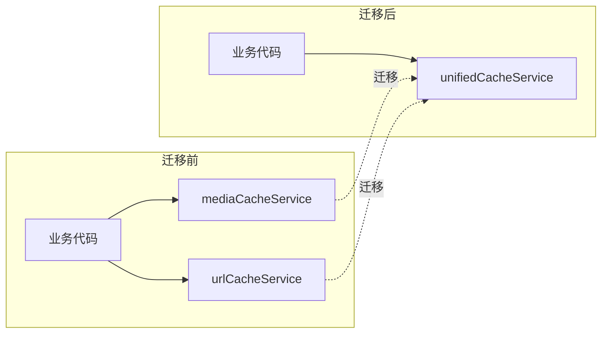

## Product Overview

清理旧的图片/视频缓存方案代码，将所有使用 `mediaCacheService` 和 `urlCacheService` 的地方迁移到统一缓存服务 `unifiedCacheService`，完成迁移后删除旧的缓存服务文件。

## Core Features

- 识别所有使用旧缓存服务的代码位置
- 将 `mediaCacheService` 的调用迁移到 `unifiedCacheService`
- 将 `urlCacheService` 的调用迁移到 `unifiedCacheService`
- 删除旧的缓存服务文件 `media-cache-service.ts` 和 `url-cache-service.ts`
- 确保迁移后功能正常运行

## 技术方案

### 迁移策略

采用渐进式迁移策略，逐个文件替换旧服务调用，确保每次修改后代码可正常编译运行。

### 数据流变更



### 实现细节

#### 涉及修改的文件

根据代码分析，需要修改以下使用旧服务的文件：

```
src/
├── services/
│   ├── media-cache-service.ts    # 待删除
│   └── url-cache-service.ts      # 待删除
├── components/
│   └── [使用旧服务的组件]         # 需迁移
├── pages/
│   └── [使用旧服务的页面]         # 需迁移
└── utils/
    └── [使用旧服务的工具]         # 需迁移
```

#### API 映射关系

- `mediaCacheService.getCache()` → `unifiedCacheService.get()`
- `mediaCacheService.setCache()` → `unifiedCacheService.set()`
- `urlCacheService.getCachedUrl()` → `unifiedCacheService.getUrl()`
- `urlCacheService.cacheUrl()` → `unifiedCacheService.setUrl()`

### 技术考量

#### 兼容性检查

- 确认 `unifiedCacheService` 提供的 API 能覆盖旧服务的所有功能
- 检查参数类型和返回值类型是否一致
- 处理可能的异步/同步差异

#### 清理步骤

1. 先完成所有迁移工作
2. 确认无编译错误
3. 删除旧服务文件
4. 清理可能存在的旧服务相关类型定义

## Agent Extensions

### SubAgent

- **code-explorer**
- Purpose: 搜索项目中所有使用 `mediaCacheService` 和 `urlCacheService` 的文件和代码位置
- Expected outcome: 获取完整的旧服务使用清单，包括文件路径、行号和具体调用方式