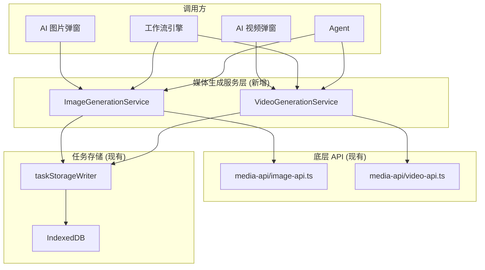

## 用户需求

将 AI 图片生成、视频生成的大模型调用方法与工作流解耦，使其成为独立的底层服务层。

## 产品概述

重构 AI 生成服务架构，建立清晰的依赖层级：

- **底层**：独立的大模型调用服务（ImageGenerationService、VideoGenerationService）
- **上层**：AI 弹窗组件、工作流引擎、Agent 等调用方

## 核心特性

1. **独立的大模型调用服务**

- 服务仍管理任务状态（pending/running/completed），但不依赖工作流概念
- 提供纯净的 API：`generateImage(prompt, options)`、`generateVideo(prompt, options)`
- 支持进度回调、取消、错误处理

2. **AI 弹窗组件直接使用新服务**

- AI 图片弹窗、AI 视频弹窗直接调用底层服务
- 不再通过工作流或复杂的执行器链

3. **工作流引擎作为调用方**

- 工作流引擎依赖新的底层服务
- 执行 `generate_image`、`generate_video` 步骤时调用底层服务
- 不再包含具体的生成逻辑

## 技术栈

- TypeScript
- RxJS（事件驱动状态管理）
- IndexedDB/localforage（任务持久化）
- 现有 API 客户端（tu-zi.com API）

## 实现方案

### 设计思路

创建独立的 **媒体生成服务层**（Media Generation Services），将大模型调用逻辑从工作流引擎和执行器中抽离出来：

```
┌─────────────────────────────────────────────────────────────┐
│                     调用方层 (Consumers)                     │
├──────────────────┬──────────────────┬───────────────────────┤
│ AI 图片弹窗       │ AI 视频弹窗       │ 工作流引擎 / Agent     │
│ (直接调用)       │ (直接调用)        │ (依赖调用)            │
└────────┬─────────┴────────┬─────────┴───────────┬───────────┘
         │                  │                     │
         ▼                  ▼                     ▼
┌─────────────────────────────────────────────────────────────┐
│              媒体生成服务层 (Media Generation Services)       │
│  ┌────────────────────┐  ┌────────────────────┐            │
│  │ ImageGeneration    │  │ VideoGeneration    │            │
│  │ Service            │  │ Service            │            │
│  │ - 任务状态管理      │  │ - 任务状态管理      │            │
│  │ - 进度追踪         │  │ - 进度追踪         │            │
│  │ - 错误处理         │  │ - 错误处理         │            │
│  └─────────┬──────────┘  └─────────┬──────────┘            │
│            │                       │                        │
│            ▼                       ▼                        │
│  ┌──────────────────────────────────────────────────────┐  │
│  │           媒体 API 抽象层 (media-api/)                 │  │
│  │  image-api.ts (同步/异步)  │  video-api.ts            │  │
│  └──────────────────────────────────────────────────────┘  │
└─────────────────────────────────────────────────────────────┘
```

### 关键技术决策

1. **服务层职责边界**

- `ImageGenerationService`：封装图片生成的完整流程（同步/异步），管理任务状态
- `VideoGenerationService`：封装视频生成的完整流程（提交+轮询），管理任务状态
- 服务层不依赖工作流概念，但保留任务状态管理（符合用户选择）

2. **复用现有 media-api 抽象**

- `media-api/image-api.ts` 和 `media-api/video-api.ts` 已经提供了纯净的 API 调用
- 新服务层在此基础上添加任务状态管理和进度追踪

3. **保留 Service Worker 执行路径**

- **SW 是核心能力**：SW 能在页面刷新/关闭时保持 fetch 连接，这是关键特性
- SW 中的 `WorkflowExecutor` 和 `media-executor.ts` 保持不变
- 新服务层提供 `useSW` 选项，默认优先使用 SW 执行，降级时使用主线程

4. **工作流引擎改造**

- 主线程的 `workflow-engine/engine.ts` 改为调用新服务
- 新服务内部封装 SW 优先 + 降级逻辑
- 移除工作流引擎中的具体生成实现

5. **代码精简**

- 不添加 @deprecated 标记
- 逐步移除冗余的中间层（如 `unified-generation-service.ts`）

## 实现细节

### 性能考虑

- 新服务层不增加额外的抽象开销
- 复用现有的 RxJS 事件机制进行状态更新
- 任务状态持久化继续使用 IndexedDB

### 错误处理

- 统一的错误类型定义
- 保留现有的认证错误检测和弹窗触发机制
- 错误信息本地化

### 日志记录

- 复用现有的 `llm-api-logger` 进行 API 调用记录
- 服务层添加关键操作的 debug 日志

## 架构设计

### 新增服务结构



## 目录结构

```
packages/drawnix/src/services/
├── media-generation/                    # [NEW] 媒体生成服务层目录
│   ├── index.ts                        # [NEW] 导出入口
│   ├── image-generation-service.ts     # [NEW] 图片生成服务，封装 SW 优先 + 降级逻辑
│   ├── video-generation-service.ts     # [NEW] 视频生成服务，封装 SW 优先 + 降级逻辑
│   └── types.ts                        # [NEW] 服务层类型定义
├── media-api/
│   ├── image-api.ts                    # [保留] 底层图片 API 调用（主线程直接调用）
│   └── video-api.ts                    # [保留] 底层视频 API 调用（主线程直接调用）
├── media-executor/
│   ├── sw-executor.ts                  # [保留] SW 执行器，通过 RPC 调用 SW
│   └── fallback-executor.ts            # [MODIFY] 简化，复用 media-api
├── workflow-engine/
│   └── engine.ts                       # [MODIFY] 改为调用 media-generation 服务
├── task-queue-service.ts               # [MODIFY] 简化，改为调用 media-generation 服务
├── unified-generation-service.ts       # [DELETE] 移除，逻辑合并到新服务
└── generation-api-service.ts           # [保留] 底层实现，被新服务调用

apps/web/src/sw/task-queue/
├── workflow-executor.ts                # [保留] SW 端工作流执行器，保持 fetch 持久连接能力
└── media-executor.ts                   # [保留] SW 端媒体执行器
```

## 关键代码结构

### ImageGenerationService 接口设计

```typescript
// packages/drawnix/src/services/media-generation/types.ts

/** 生成任务状态 */
export type GenerationStatus = 'pending' | 'processing' | 'completed' | 'failed' | 'cancelled';

/** 生成任务 */
export interface GenerationTask {
  id: string;
  status: GenerationStatus;
  progress?: number;
  result?: { url: string; format: string };
  error?: { code: string; message: string };
  createdAt: number;
  updatedAt: number;
}

/** 生成选项 */
export interface ImageGenerationOptions {
  model?: string;
  size?: string;
  quality?: '1k' | '2k' | '4k';
  referenceImages?: string[];
  /** 进度回调 */
  onProgress?: (progress: number) => void;
  /** 取消信号 */
  signal?: AbortSignal;
  /** 是否强制使用主线程（跳过 SW） */
  forceMainThread?: boolean;
}

export interface VideoGenerationOptions {
  model?: string;
  size?: string;
  duration?: string;
  referenceImages?: string[];
  onProgress?: (progress: number) => void;
  signal?: AbortSignal;
}
```

```typescript
// packages/drawnix/src/services/media-generation/image-generation-service.ts

export interface IImageGenerationService {
  /**
   * 生成图片
   * @param prompt 提示词
   * @param options 生成选项
   * @returns 生成任务（包含状态管理）
   */
  generate(prompt: string, options?: ImageGenerationOptions): Promise<GenerationTask>;
  
  /**
   * 获取任务状态
   */
  getTask(taskId: string): GenerationTask | undefined;
  
  /**
   * 取消任务
   */
  cancel(taskId: string): void;
  
  /**
   * 观察任务更新
   */
  observe(taskId: string): Observable<GenerationTask>;
}
```

## Agent Extensions

### SubAgent

- **code-explorer**
- Purpose: 在实现过程中探索相关文件的依赖关系和调用链
- Expected outcome: 确保重构不遗漏任何调用点，完整覆盖所有需要修改的文件