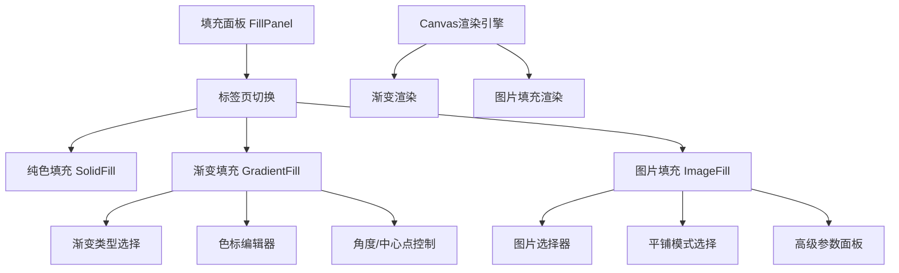

## 产品概述

为图形编辑器的填充功能扩展渐变填充和图片填充两种新模式，与现有纯色填充形成完整的三标签页填充面板，提升用户创作的灵活性和表现力。

## 核心功能

### 渐变填充

- 支持线性渐变和径向渐变两种类型切换
- 多色标编辑：可添加、删除、拖拽调整色标位置
- 每个色标支持颜色选择和透明度调整
- 线性渐变支持角度调整（0-360度）
- 径向渐变支持中心点位置调整

### 图片填充

- 图片来源：支持从素材库选择或本地上传图片
- 三种平铺模式：
- 拉伸：图片拉伸填满整个形状
- 平铺：图片按原始尺寸重复平铺
- 适应：图片等比缩放适应形状
- 高级模式参数调整：
- 缩放：调整图片整体缩放比例
- 偏移：调整图片X/Y方向偏移量
- 旋转：调整图片旋转角度

### 界面交互

- 三标签页切换界面：纯色/渐变/图片
- 实时预览填充效果
- 参数变更即时应用到画布图形

## 技术栈

基于现有项目技术栈进行扩展开发，复用已有的填充面板组件和样式体系。

## 技术架构

### 系统架构



### 模块划分

- **GradientFill模块**：渐变填充UI组件，包含类型切换、色标编辑器、角度控制
- **ImageFill模块**：图片填充UI组件，包含图片选择、平铺模式、高级参数
- **FillRenderer模块**：Canvas层填充渲染逻辑，处理渐变和图片的实际绘制

### 数据流

用户操作填充面板 → 更新填充配置数据 → 触发Canvas重绘 → 应用新填充效果

## 实现详情

### 核心目录结构

```
src/
├── components/
│   └── fill-panel/
│       ├── GradientFill.tsx      # 新增：渐变填充组件
│       ├── GradientSlider.tsx    # 新增：色标滑块组件
│       ├── ImageFill.tsx         # 新增：图片填充组件
│       └── ImageAdvanced.tsx     # 新增：图片高级参数组件
├── types/
│   └── fill.ts                   # 修改：扩展填充类型定义
└── utils/
    └── fillRenderer.ts           # 修改：添加渐变和图片渲染逻辑
```

### 关键代码结构

**渐变填充数据结构**：定义渐变填充的完整配置，包含渐变类型、色标列表和角度/中心点参数。

```typescript
interface GradientStop {
  offset: number;      // 0-1 位置
  color: string;       // 颜色值
  opacity: number;     // 透明度 0-1
}

interface GradientFillConfig {
  type: 'linear' | 'radial';
  stops: GradientStop[];
  angle?: number;           // 线性渐变角度
  centerX?: number;         // 径向渐变中心X
  centerY?: number;         // 径向渐变中心Y
}
```

**图片填充数据结构**：定义图片填充的完整配置，包含图片源、平铺模式和变换参数。

```typescript
interface ImageFillConfig {
  imageUrl: string;
  mode: 'stretch' | 'tile' | 'fit';
  scale?: number;           // 缩放比例
  offsetX?: number;         // X偏移
  offsetY?: number;         // Y偏移
  rotation?: number;        // 旋转角度
}
```

**填充类型联合定义**：扩展现有填充类型，统一管理三种填充模式。

```typescript
type FillType = 'solid' | 'gradient' | 'image';

interface FillConfig {
  type: FillType;
  solid?: SolidFillConfig;
  gradient?: GradientFillConfig;
  image?: ImageFillConfig;
}
```

### 技术实现方案

1. **渐变渲染**：使用Canvas的createLinearGradient/createRadialGradient API创建渐变对象
2. **图片填充**：使用createPattern API创建图案，结合transform实现缩放、偏移、旋转
3. **色标编辑器**：自定义滑块组件，支持拖拽交互和颜色选择器集成

## 设计风格

延续现有编辑器的设计语言，采用深色主题面板设计，保持与纯色填充面板的视觉一致性。

## 页面设计

### 填充面板（扩展现有面板）

**标签页区域**

- 三个等宽标签：纯色、渐变、图片
- 当前选中标签高亮显示，底部指示条

**渐变填充内容区**

- 顶部：线性/径向类型切换按钮组
- 中部：渐变预览条，下方色标滑块可拖拽
- 色标操作：点击添加、拖拽移动、双击编辑颜色
- 底部：角度输入框（线性）或中心点XY输入（径向）

**图片填充内容区**

- 图片预览区：显示当前选中图片缩略图
- 图片来源：素材库按钮 + 上传按钮
- 平铺模式：三个图标按钮（拉伸/平铺/适应）
- 高级参数折叠面板：
- 缩放滑块：50%-200%
- X/Y偏移输入框
- 旋转角度滑块：0-360度

## Agent Extensions

### SubAgent

- **code-explorer**
- Purpose: 探索现有项目中填充面板的实现结构、类型定义和Canvas渲染逻辑
- Expected outcome: 了解现有填充功能的代码组织、数据结构和渲染方式，确保新功能与现有代码无缝集成