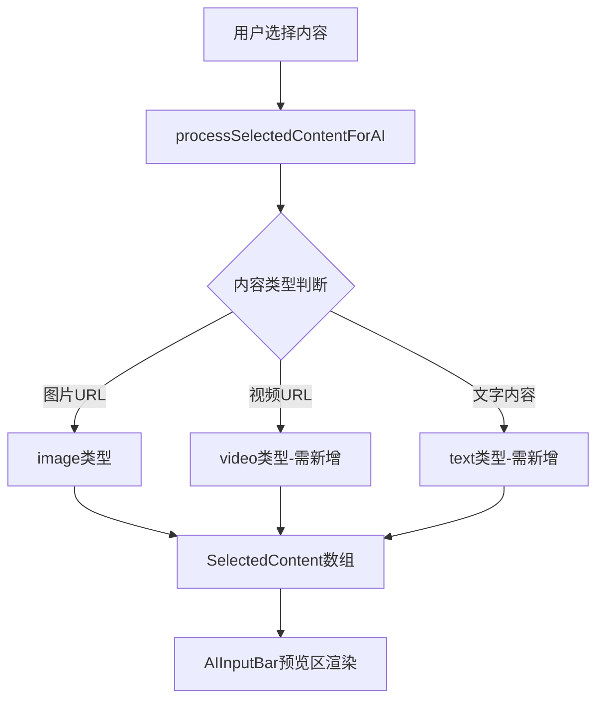

## 产品概述

修复 AI 输入框的选择内容显示问题，确保不同类型的选中内容（文字、图片、视频）能够正确区分并在输入框上方展示。

## 核心功能

- 文字元素显示为文字预览卡片，展示文字内容摘要
- 视频元素与图片区分显示，带有视频图标标识
- 图片元素保持当前的缩略图预览方式
- 所有选中内容统一在输入框上方的预览区正确展示

## 技术方案

### 问题分析

根据用户反馈，当前存在以下问题：

1. 文字元素被提取到 `remainingText` 但未在预览区显示
2. 视频元素（URL 包含 #video 或视频扩展名）被当作普通图片处理
3. `SelectedContent` 接口缺少 `text` 和 `video` 类型定义

### 数据流分析



### 修改方案

#### 1. 扩展 SelectedContent 接口

```typescript
interface SelectedContent {
  type: 'image' | 'video' | 'text';
  url?: string;      // 图片/视频URL
  text?: string;     // 文字内容
  thumbnail?: string; // 视频缩略图（可选）
}
```

#### 2. 视频识别逻辑

```typescript
function isVideoUrl(url: string): boolean {
  const videoExtensions = ['.mp4', '.webm', '.mov', '.avi', '.mkv'];
  const hasVideoHash = url.includes('#video');
  const hasVideoExtension = videoExtensions.some(ext => 
    url.toLowerCase().includes(ext)
  );
  return hasVideoHash || hasVideoExtension;
}
```

#### 3. 预览区渲染逻辑

- `image` 类型：显示图片缩略图
- `video` 类型：显示缩略图 + 视频图标覆盖层
- `text` 类型：显示文字预览卡片（带文字图标，显示内容摘要）

### 核心目录结构

```
src/
├── components/
│   └── AIInputBar/
│       ├── index.tsx           # 修改：预览区渲染逻辑
│       └── SelectedPreview.tsx # 新增：选中内容预览组件
├── types/
│   └── ai.ts                   # 修改：SelectedContent接口
└── utils/
    └── contentProcessor.ts     # 修改：processSelectedContentForAI函数
```

## Agent Extensions

### SubAgent

- **code-explorer**
- 用途：探索项目中 AIInputBar 组件、SelectedContent 接口定义、processSelectedContentForAI 函数的具体实现位置和代码结构
- 预期结果：定位所有需要修改的文件路径和相关代码逻辑