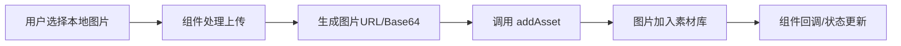

## 产品概述

修复本地图片上传功能，确保所有上传入口的图片都能正确加入素材库（AssetContext），保持素材管理的一致性和完整性。

## 核心功能

- 修复 MultiImageUpload.tsx 组件，上传图片后调用 addAsset 加入素材库
- 修复 ImageUpload.tsx 组件，上传图片后调用 addAsset 加入素材库
- 修复 AIInputBar.tsx 组件，上传图片后调用 addAsset 加入素材库
- 修复 batch-image-generation.tsx 组件，上传图片后调用 addAsset 加入素材库

## 技术方案

### 问题分析

当前项目中有 4 个组件的本地图片上传功能未调用 AssetContext 的 addAsset 方法，导致上传的图片无法被素材库管理。需要参考 MediaLibraryModal.tsx 的正确实现方式进行修复。

### 修复策略

1. 在各组件中引入 AssetContext
2. 在图片上传成功的回调中调用 addAsset 方法
3. 确保传入正确的 Asset 数据结构

### 数据流



### 实现要点

**Asset 数据结构**
每个组件在调用 addAsset 时需要构造符合规范的 Asset 对象，包含 id、type、url、name 等必要字段。

**修改范围**

```
src/
├── components/
│   ├── MultiImageUpload.tsx    # 修改：添加 addAsset 调用
│   ├── ImageUpload.tsx         # 修改：添加 addAsset 调用
│   ├── AIInputBar.tsx          # 修改：添加 addAsset 调用
│   └── batch-image-generation.tsx  # 修改：添加 addAsset 调用
```

### 技术注意事项

- 复用现有的 AssetContext hook（useAsset 或类似）
- 保持与 MediaLibraryModal.tsx 一致的 addAsset 调用方式
- 确保生成唯一的 asset id
- 处理上传失败时不添加到素材库的边界情况

## Agent Extensions

### SubAgent

- **code-explorer**
- Purpose: 探索项目代码结构，查找 AssetContext 的定义、addAsset 方法签名，以及 MediaLibraryModal.tsx 的正确实现方式作为参考
- Expected outcome: 获取 Asset 类型定义、addAsset 调用方式、以及 4 个待修复组件的当前实现代码