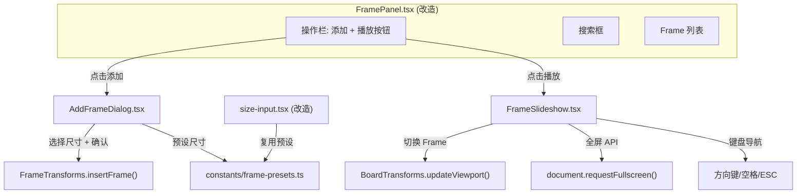

## 用户需求

在 Frame 管理面板增加两个操作按钮：「添加 Frame」和「幻灯片播放」。

## 产品概述

在现有的 Frame 管理面板（搜索框与列表之间）增加操作栏，包含两个功能按钮，提升 Frame 工作流效率。

## 核心功能

### 1. 添加 Frame

- 点击「添加 Frame」按钮，弹出尺寸选择弹窗
- 弹窗展示分类预设尺寸（手机、平板、演示文稿、社交媒体、照片/海报、桌面共 6 类 16 种预设），也支持自定义宽高输入
- 弹窗底部提示 Frame 快捷键 (F)
- 确认后将 Frame 添加到画布，位置规则：新 Frame 放在上一个 Frame 右侧（横屏时）或下方（竖屏时），间距 60px；若无已有 Frame 则放在视口中心
- 添加后自动选中并聚焦到新 Frame

### 2. 幻灯片播放

- 点击「幻灯片播放」按钮，进入全屏演示模式
- 全屏遮罩层覆盖整个屏幕，黑色背景
- 依次展示每个 Frame 的画布内容（Frame 适配屏幕居中显示）
- 支持 PPT 通用快捷键：右箭头/空格/Enter/PageDown 下一页，左箭头/Backspace/PageUp 上一页，Escape 退出
- 底部显示页码指示器（当前页/总页数）
- 无 Frame 时按钮禁用并显示 Tooltip 提示

## 技术栈

- React + TypeScript（复用现有项目架构）
- TDesign React（Dialog、Button、Tooltip、Input 组件）
- SCSS + BEM 命名（复用 `_common-variables.scss` 变量）
- Plait Board API（`BoardTransforms.updateViewport`、`FrameTransforms.insertFrame`）
- Web Fullscreen API（`requestFullscreen` / `exitFullscreen`）

## 实现方案

### 核心策略

1. **添加 Frame 弹窗**：复用 `size-input.tsx` 中已定义的 `PRESET_SIZES` 常量（提取到共享模块），使用 TDesign Dialog 组件构建尺寸选择弹窗。新 Frame 的位置通过遍历已有 Frame 计算最右侧/最下方边界，加上间距偏移。

2. **幻灯片播放器**：创建独立的全屏组件，通过 React Portal 渲染到 body，使用 Web Fullscreen API 进入全屏。复用 FramePanel 中 `handleFrameClick` 的视口计算逻辑（`updateViewport` 一步完成缩放+平移），通过 `useEffect` 监听键盘事件实现 PPT 快捷键导航。

3. **FramePanel 改造**：在搜索框和列表之间插入操作栏（`frame-panel__actions`），放置两个按钮。弹窗和播放器状态由 FramePanel 内部管理。

### 关键技术决策

- **预设尺寸提取为共享常量**：`PRESET_SIZES` 从 `size-input.tsx` 提取到 `constants/frame-presets.ts`，同时被 `SizeInput` 和新的「添加 Frame」弹窗复用，避免代码重复。
- **幻灯片播放不改变画布状态**：播放器是纯展示层叠加（React Portal + 全屏遮罩），不修改画布的 selection 或 viewport，退出后画布状态不变。播放器内部通过 canvas 截图或直接克隆 SVG 内容来展示 Frame 内容——但考虑到 Plait 框架的复杂性，采用更简单的方案：直接操作 board viewport 来聚焦 Frame，全屏遮罩隐藏 UI 元素。
- **全屏实现方案**：使用 `document.documentElement.requestFullscreen()` 进入浏览器全屏，叠加黑色遮罩隐藏所有 UI，仅保留画布区域。通过 `BoardTransforms.updateViewport` 切换 Frame 视图。退出时恢复原始 viewport 状态。
- **Z-Index**：幻灯片播放器使用 `SLIDESHOW` 层级常量（9500，在 Critical Overlays 层），确保覆盖所有 UI 元素。

## 实现注意事项

- **Viewport 操作原子性**：使用 `BoardTransforms.updateViewport(board, origination, zoom)` 一步完成，禁止 `updateZoom + moveToCenter` 分步调用（已有编码规则）。
- **新 Frame 位置计算**：需遍历所有已有 Frame 找到边界，横屏（宽>高的 Frame）放右侧，竖屏放下方，间距 60px。
- **键盘事件清理**：幻灯片播放器 `useEffect` 中的 `addEventListener` 必须在 cleanup 函数中 `removeEventListener`。
- **文件大小限制**：每个文件不超过 500 行，幻灯片播放器和添加弹窗各自独立文件。
- **TDesign Tooltip**：必须使用 `theme='light'`。

## 架构设计



## 目录结构

```
packages/drawnix/src/
├── constants/
│   └── frame-presets.ts                    # [NEW] Frame 预设尺寸常量，从 size-input.tsx 提取。定义 PresetSize / PresetCategory 接口和 PRESET_SIZES 数组（6类16种），供 SizeInput 和 AddFrameDialog 共用。
├── components/
│   └── project-drawer/
│       ├── FramePanel.tsx                  # [MODIFY] 添加操作栏区域（搜索框下方），包含「添加 Frame」和「幻灯片播放」按钮，管理两个子组件的 open 状态。
│       ├── AddFrameDialog.tsx              # [NEW] 添加 Frame 弹窗组件。使用 TDesign Dialog，展示预设尺寸网格 + 自定义宽高输入，底部显示快捷键提示。确认后调用 FrameTransforms.insertFrame 并计算合适位置。
│       ├── FrameSlideshow.tsx              # [NEW] 幻灯片播放组件。React Portal 渲染全屏遮罩，操作 board viewport 实现 Frame 切换，支持 PPT 快捷键导航，底部页码指示器。
│       └── project-drawer.scss             # [MODIFY] 添加操作栏样式（frame-panel__actions）、添加弹窗样式（add-frame-dialog）、幻灯片播放样式（frame-slideshow）。
├── components/toolbar/popup-toolbar/
│   └── size-input.tsx                      # [MODIFY] 将 PRESET_SIZES 常量和 PresetSize/PresetCategory 类型导入从 constants/frame-presets.ts，删除本地定义。
└── constants/
    └── z-index.ts                          # [MODIFY] 添加 SLIDESHOW: 9500 层级常量。
├── styles/
│   └── z-index.scss                        # [MODIFY] 添加 $z-slideshow: 9500 变量和映射。
```

## Agent Extensions

### SubAgent

- **code-explorer**
- Purpose: 在实现过程中探索 Plait Board API 的具体用法（如 `getViewportOrigination`、`updateViewport` 的参数细节），以及验证 TDesign Dialog 组件的 props 接口
- Expected outcome: 确认 API 调用方式，确保实现代码与框架兼容