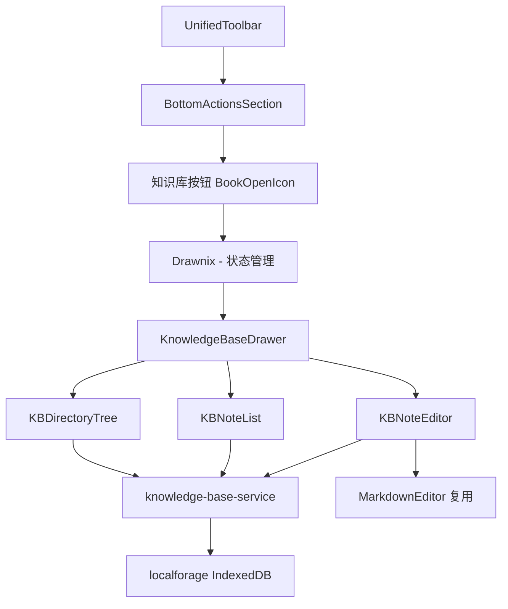

## 产品概述

为 aitu（开图）白板应用添加知识库功能，参考 collimind 浏览器插件的知识库模块，迁移核心能力到 Web 应用环境。用户可在工具抽屉区域打开知识库抽屉，管理笔记、目录和标签，进行 Markdown 编辑和搜索。

## 核心功能

1. **知识库抽屉入口**：在底部工具区域（BottomActionsSection）新增"知识库"按钮，点击后打开知识库侧边抽屉，与其他抽屉互斥
2. **目录管理**：支持创建、重命名、删除目录，内置默认目录（收集、笔记），目录树形展示
3. **笔记 CRUD**：在目录下创建、编辑、重命名、删除笔记，使用 Milkdown Markdown 编辑器（复用现有 MarkdownEditor 组件）
4. **标签系统**：创建/编辑/删除标签，为笔记添加/移除标签，按标签筛选笔记
5. **搜索与筛选**：全文搜索笔记标题和内容，按标签过滤
6. **排序功能**：支持按更新时间、创建时间、标题排序
7. **数据持久化**：使用 IndexedDB（通过 localforage）存储所有知识库数据（目录、笔记元数据、笔记正文、标签、标签关联）

## 技术栈

- **UI 框架**：React + TypeScript（复用项目现有栈）
- **UI 组件库**：TDesign React（light theme，项目统一规范）
- **Markdown 编辑器**：复用已有 `MarkdownEditor` 组件（基于 Milkdown）
- **数据存储**：localforage（IndexedDB 封装，项目现有模式）
- **图标**：复用 `BookOpenIcon`（已存在于 icons.tsx）
- **样式**：SCSS + BEM 命名规范

## 实现方案

### 高级策略

将 collimind 的知识库核心数据模型和 CRUD 操作迁移到 aitu，去掉 Chrome 扩展的消息传递层，直接使用 localforage 操作 IndexedDB。UI 层使用 aitu 现有的 BaseDrawer 抽屉体系，内部构建目录树 + 笔记列表 + Markdown 编辑器的三栏/两栏布局。

### 关键技术决策

1. **存储层选择 localforage 而非原生 IndexedDB**：项目现有的 chat-storage-service、asset-storage-service 等均采用 localforage 模式（createInstance），保持一致性，降低维护成本。
2. **简化数据模型**：collimind v3 有 6 张表（noteMeta/noteContent 分表 + noteImage 图片表）。aitu 是 Web 应用，不需要分表优化列表加载（无 Chrome 扩展消息开销），简化为 4 个 store：directories、notes（含正文）、tags、noteTags。图片暂不单独存储（可使用现有的 unified-cache-service）。
3. **去掉 Chrome API 依赖**：排序偏好使用 localStorage 存储（`LS_KEYS.KB_SORT_PREFERENCE`），而非 `chrome.storage.sync`。
4. **去掉域名/favicon 相关逻辑**：aitu 的笔记来源于用户手动创建（非网页收藏），不需要域名过滤和 favicon 显示。
5. **抽屉互斥机制**：复用 drawnix.tsx 中已有的 `closeAllDrawers` 互斥模式。

### 性能考量

- 笔记列表延迟加载正文内容，列表仅显示标题和元数据
- 使用 `useMemo` 缓存过滤/排序结果，避免重复计算
- 编辑器内容变化使用防抖保存（500ms）
- 知识库抽屉通过 `React.lazy` 懒加载

## 实现注意事项

- **存储键注册**：在 `storage-keys.ts` 的 `IDB_DATABASES` 中注册 `KNOWLEDGE_BASE` 数据库配置，在 `LS_KEYS` 中添加排序偏好和抽屉宽度键
- **文件行数限制**：单文件不超过 500 行，知识库主组件需拆分为 KBDirectoryTree、KBNoteList、KBNoteEditor 等子组件
- **笔记内容防抖保存**：参考 collimind NoteEditor 的 saveTimeoutRef 模式，延迟保存避免频繁写入
- **抽屉互斥**：在 `closeAllDrawers` 中添加 `setKnowledgeBaseOpen(false)`
- **BookOpenIcon 已存在**：icons.tsx 中已有 BookOpenIcon，无需新建图标

## 架构设计

### 数据流

```
用户操作 → KnowledgeBase 组件 → knowledge-base-service.ts (localforage) → IndexedDB (aitu-knowledge-base)
```

### 模块关系



### IndexedDB 数据库结构

- 数据库名：`aitu-knowledge-base`
- Store: `directories`（目录）、`notes`（笔记含正文）、`tags`（标签）、`noteTags`（笔记-标签关联）

## 目录结构

```
packages/drawnix/src/
├── constants/
│   └── storage-keys.ts                    # [MODIFY] 添加 KNOWLEDGE_BASE 数据库配置和 LS_KEYS
├── types/
│   └── knowledge-base.types.ts            # [NEW] 知识库类型定义。定义 KBDirectory、KBNote、KBTag、KBNoteTag、SortOptions、FilterOptions 等接口，以及 SortField、SortOrder 类型。
├── services/
│   └── knowledge-base-service.ts          # [NEW] 知识库存储服务。使用 localforage 实现目录 CRUD、笔记 CRUD、标签 CRUD、笔记标签关联、搜索、排序、过滤功能。参考 chat-storage-service.ts 的 localforage 模式。包含默认目录初始化逻辑。
├── components/
│   ├── knowledge-base/
│   │   ├── index.ts                       # [NEW] 知识库组件导出入口。
│   │   ├── KnowledgeBaseDrawer.tsx         # [NEW] 知识库抽屉主组件。使用 BaseDrawer 作为容器，组合目录树和编辑区，管理选中目录/笔记状态、搜索、排序、标签过滤。包含头部搜索框和操作按钮。
│   │   ├── KBDirectoryTree.tsx            # [NEW] 目录树组件。展示目录列表（可展开/折叠），每个目录下显示笔记列表。支持创建/重命名/删除目录，创建笔记。使用 TDesign 的输入框和按钮。
│   │   ├── KBNoteList.tsx                 # [NEW] 笔记列表组件。展示当前目录下的笔记列表项，显示标题、更新时间、标签 Badge。支持搜索过滤和排序。点击笔记项切换编辑视图。
│   │   ├── KBNoteEditor.tsx               # [NEW] 笔记编辑器组件。复用 MarkdownEditor，支持标题编辑、正文 Markdown 编辑（防抖自动保存）、标签选择。显示笔记元数据（创建/更新时间）。
│   │   ├── KBTagSelector.tsx              # [NEW] 标签选择器组件。下拉多选标签，支持创建新标签、编辑标签颜色。显示标签色块和名称。
│   │   ├── KBSortDropdown.tsx             # [NEW] 排序下拉组件。选择排序字段和顺序（更新时间/创建时间/标题，升序/降序）。
│   │   └── knowledge-base-drawer.scss     # [NEW] 知识库抽屉样式文件。采用 BEM 命名，定义三栏布局、目录树、笔记列表、编辑器区域的样式。
│   ├── toolbar/
│   │   └── bottom-actions-section.tsx     # [MODIFY] 在工具箱按钮和任务队列按钮之间添加知识库按钮（BookOpenIcon），传递 knowledgeBaseOpen 和 onKnowledgeBaseToggle 属性。
│   │   └── toolbar.types.ts               # [MODIFY] 在 UnifiedToolbarProps 中添加知识库相关属性。
│   └── toolbar/
│       └── unified-toolbar.tsx            # [MODIFY] 透传知识库抽屉开关状态和回调到 BottomActionsSection。
├── drawnix.tsx                            # [MODIFY] 添加 knowledgeBaseOpen 状态、handleKnowledgeBaseToggle 互斥切换、closeAllDrawers 中关闭知识库、懒加载 KnowledgeBaseDrawer 并渲染在抽屉区域。
```

## 关键代码结构

```typescript
// types/knowledge-base.types.ts - 核心类型定义
export interface KBDirectory {
  id: string;
  name: string;
  isDefault: boolean;
  createdAt: number;
  updatedAt: number;
  order: number;
}

export interface KBNote {
  id: string;
  title: string;
  content: string;        // Markdown 正文
  directoryId: string;
  createdAt: number;
  updatedAt: number;
  metadata?: KBNoteMetadata;
}

export interface KBTag {
  id: string;
  name: string;
  color: string;
  createdAt: number;
}

export interface KBNoteTag {
  id: string;
  noteId: string;
  tagId: string;
}
```

## Agent Extensions

### SubAgent

- **code-explorer**
- Purpose: 在实现知识库服务层时，搜索 collimind 的 knowledgeBaseBackground.ts 中各个 CRUD 方法的完整实现，确保迁移逻辑完整
- Expected outcome: 获取 collimind 中目录管理、笔记管理、标签管理、搜索过滤等方法的完整实现细节，为 knowledge-base-service.ts 的编写提供参考