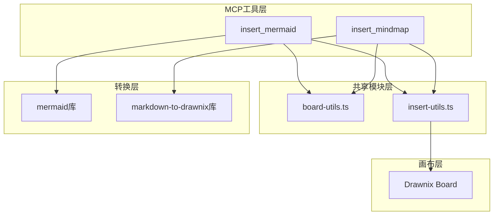

## 产品概述

开发一个MCP工具 `insert_mindmap`，实现Markdown语法转思维导图并插入画布功能。同时对现有的 `mermaid-tool` 和新的 `mindmap-tool` 进行代码重构，将公共能力抽象到共享模块中，提升代码复用性和可维护性。

## 核心功能

- **insert_mindmap MCP工具**：接收Markdown格式的思维导图定义，转换为思维导图元素并插入画布
- **Markdown转思维导图**：使用 `@plait-board/markdown-to-drawnix` 库将Markdown语法解析为MindElement
- **公共能力抽象**：将Board引用管理、插入位置计算、代码块提取、insertFragment调用等公共逻辑抽象到共享模块
- **AI智能生成支持**：支持用户通过自然语言指令（如"创作大模型未来趋势思维导图"）触发AI生成Markdown内容并转换

## 技术栈

- 语言：TypeScript
- 依赖库：`@plait-board/markdown-to-drawnix`
- 参考模板：现有 `mermaid-tool.ts`
- MCP框架：项目现有MCP工具架构

## 技术架构

### 系统架构



### 模块划分

- **shared/board-utils.ts**：Board引用管理、获取当前Board实例
- **shared/insert-utils.ts**：插入位置计算、代码块提取、insertFragment封装
- **mindmap-tool.ts**：insert_mindmap工具实现，调用共享模块和markdown-to-drawnix库
- **mermaid-tool.ts**：重构后的insert_mermaid工具，使用共享模块

### 数据流


## 实现细节

### 核心目录结构

```
src/
├── mcp/
│   ├── tools/
│   │   ├── shared/
│   │   │   ├── board-utils.ts      # 新增：Board引用管理
│   │   │   └── insert-utils.ts     # 新增：插入工具函数
│   │   ├── mermaid-tool.ts         # 修改：使用共享模块重构
│   │   └── mindmap-tool.ts         # 新增：思维导图工具
```

### 关键代码结构

**共享工具接口**：定义插入操作的通用参数和返回类型

```typescript
// 插入配置接口
interface InsertConfig {
  board: PlaitBoard;
  elements: PlaitElement[];
  position?: { x: number; y: number };
}

// 代码块提取结果
interface CodeBlockResult {
  content: string;
  language: string;
}
```

**mindmap-tool核心逻辑**：

```typescript
// insert_mindmap工具签名
async function insertMindmap(params: {
  definition: string;  // Markdown格式的思维导图定义
  mainTopic?: string;  // 可选的主题名称
}): Promise<InsertResult>
```

### 技术实现方案

**1. 公共能力抽象**

- 问题：mermaid-tool和mindmap-tool存在重复代码
- 方案：提取Board管理、位置计算、插入操作到shared目录
- 关键技术：TypeScript模块化、依赖注入模式
- 实现步骤：

1. 分析mermaid-tool.ts中的可复用逻辑
2. 创建board-utils.ts封装Board引用管理
3. 创建insert-utils.ts封装插入相关工具函数
4. 导出统一的API接口

**2. mindmap-tool实现**

- 问题：需要将Markdown转换为思维导图并插入画布
- 方案：调用parseMarkdownToDrawnix库进行转换，复用共享插入逻辑
- 关键技术：@plait-board/markdown-to-drawnix
- 实现步骤：

1. 创建mindmap-tool.ts文件
2. 定义insert_mindmap工具schema
3. 实现Markdown解析和转换逻辑
4. 调用共享模块完成插入操作

### 集成点

- 与现有MCP工具注册机制集成
- 与Drawnix Board画布API集成
- 与@plait-board/markdown-to-drawnix库集成

## Agent Extensions

### SubAgent

- **code-explorer**
- 用途：探索现有mermaid-tool.ts的实现细节，分析可复用的公共逻辑
- 预期结果：获取完整的mermaid-tool实现代码，识别Board管理、位置计算、插入操作等可抽象的公共能力