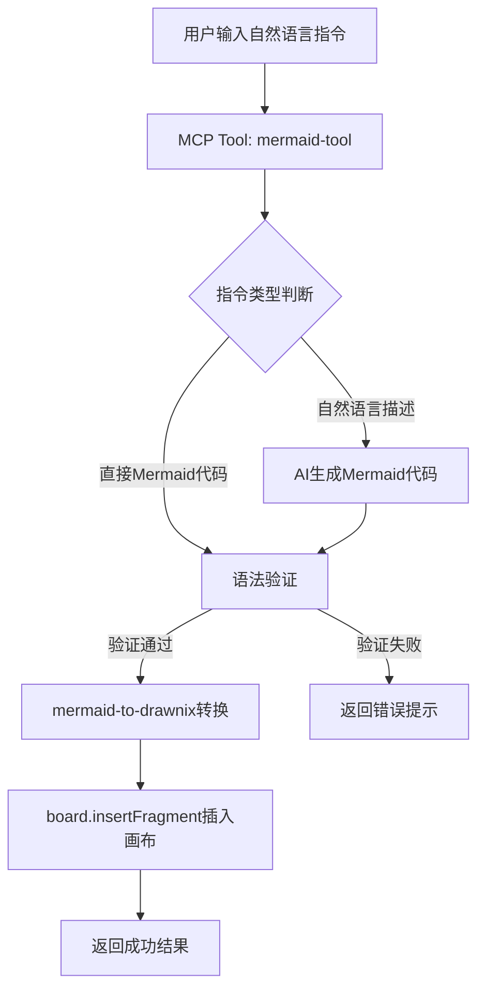

## Product Overview

开发一个MCP工具，实现AI驱动的Mermaid图表生成和画布插入功能。用户可通过自然语言指令（如"生成OAuth2.0时序图"）自动生成Mermaid代码，并将图表转换为Drawnix元素插入画布。

## Core Features

- 自然语言指令解析：支持用户输入描述性指令，AI自动理解需求并生成对应的Mermaid代码
- 多图表类型支持：支持时序图(sequence)、流程图(flowchart)、类图(classDiagram)、状态图(stateDiagram)、ER图(erDiagram)等
- Mermaid代码转换：利用现有 `@plait-board/mermaid-to-drawnix` 库将Mermaid语法转换为Drawnix元素
- 画布插入功能：通过 `board.insertFragment` API 将转换后的图表元素插入到画布中
- 语法验证：在转换前验证Mermaid代码的正确性，提供错误提示

## Tech Stack

- 语言：TypeScript
- MCP框架：项目现有MCP工具架构
- Mermaid解析：@plait-board/mermaid-to-drawnix
- AI能力：参考现有ai-analyze.ts实现

## Tech Architecture

### System Architecture



### Module Division

- **MCP Tool模块**：注册mermaid-tool到MCP registry，定义工具schema和handler
- **AI生成模块**：处理自然语言指令，调用AI生成Mermaid代码
- **转换模块**：调用mermaid-to-drawnix库进行语法转换
- **画布插入模块**：使用canvas-insertion工具将元素插入画布

### Data Flow

用户指令 → MCP Tool Handler → AI生成/直接解析 → Mermaid代码 → mermaid-to-drawnix转换 → Drawnix Elements → board.insertFragment → 画布渲染

## Implementation Details

### Core Directory Structure

```
project-root/
├── src/
│   └── mcp/
│       └── tools/
│           └── mermaid-tool.ts    # 新增：Mermaid MCP工具实现
```

### Key Code Structures

**MCP Tool Schema定义**：定义工具的输入参数结构，支持自然语言描述和直接Mermaid代码两种输入方式。

```typescript
interface MermaidToolInput {
  // 用户输入的自然语言描述或Mermaid代码
  input: string;
  // 图表类型提示（可选）
  diagramType?: 'sequence' | 'flowchart' | 'classDiagram' | 'stateDiagram' | 'erDiagram';
  // 是否为直接Mermaid代码
  isRawMermaid?: boolean;
}
```

**Tool Handler实现**：处理用户请求，协调AI生成和图表转换流程。

```typescript
async function handleMermaidTool(input: MermaidToolInput): Promise<ToolResult> {
  // 1. 判断输入类型（自然语言/Mermaid代码）
  // 2. 如需AI生成，调用AI服务
  // 3. 验证Mermaid语法
  // 4. 调用mermaid-to-drawnix转换
  // 5. 插入画布并返回结果
}
```

### Technical Implementation Plan

**AI生成Mermaid代码**

- 问题：将自然语言描述转换为有效的Mermaid代码
- 方案：参考ai-analyze.ts，构建专门的prompt模板，引导AI生成符合规范的Mermaid语法
- 关键技术：Prompt Engineering，图表类型识别
- 实现步骤：

1. 解析用户输入，识别图表类型需求
2. 构建包含Mermaid语法规范的prompt
3. 调用AI服务生成代码
4. 提取并验证生成的Mermaid代码

**Mermaid转Drawnix转换**

- 问题：将Mermaid代码转换为画布可识别的元素
- 方案：直接使用@plait-board/mermaid-to-drawnix库
- 实现步骤：

1. 导入转换函数
2. 传入验证后的Mermaid代码
3. 获取Drawnix元素数组

### Integration Points

- MCP Registry：注册工具到现有MCP架构
- AI服务：复用项目现有AI调用能力
- 画布API：使用board.insertFragment进行元素插入

## Agent Extensions

### SubAgent

- **code-explorer**
- Purpose：探索项目现有MCP工具架构、ai-analyze.ts实现、mermaid-to-drawnix库用法和canvas-insertion工具
- Expected outcome：获取现有代码结构和API使用方式，确保新工具与现有架构一致