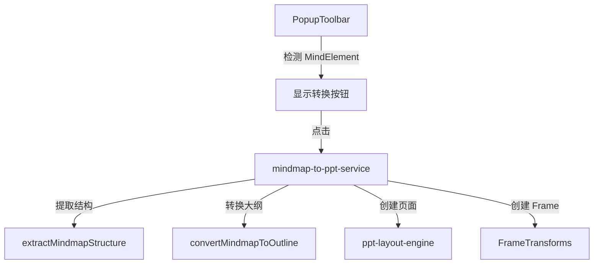

## 用户需求

支持从思维导图（MindMap）转换成 PPT 演示文稿。

## 产品概述

在现有 PPT 生成功能基础上，新增从思维导图直接转换为 PPT 的能力。用户选中画布上的思维导图后，可以一键将其结构转换为多页 PPT Frame，自动根据思维导图的层级结构生成封面页、目录页、内容页和结尾页。

## 核心功能

1. **思维导图转 PPT**：选中思维导图后，通过 PopupToolbar 菜单触发转换
2. **智能结构映射**：

- 根节点 → 封面页标题
- 一级子节点 → 目录项 + 独立内容页标题
- 二级及更深子节点 → 内容页的正文要点

3. **自动布局**：复用现有 PPT 布局引擎，创建 1920x1080 标准 Frame
4. **视口聚焦**：转换完成后自动聚焦到第一个 PPT Frame

## 技术栈

- 前端框架：React + TypeScript
- 画布框架：Plait（@plait/core, @plait/mind, @plait/draw）
- UI 组件库：TDesign React
- 样式：SCSS

## 实现方案

### 核心思路

从选中的 MindElement 递归遍历树结构，提取各层级文本内容，按照映射规则转换为 PPTOutline 结构，然后复用现有的 PPT 布局引擎和 Frame 创建逻辑生成多页 PPT。

### 关键技术决策

1. **入口选择：PopupToolbar 新增按钮**

- 理由：选中思维导图时 PopupToolbar 已可见，用户操作路径最短
- 按钮仅在选中单个完整思维导图（PlaitMind，即 isRoot 的 MindElement）时显示

2. **结构映射规则**

```
MindElement (isRoot=true)
├── data.topic → 封面页标题
└── children[]
├── [0].data.topic → 目录项1 + 内容页1标题
│   └── children[].data.topic → 内容页1要点
├── [1].data.topic → 目录项2 + 内容页2标题
│   └── children[].data.topic → 内容页2要点
└── ...
```

3. **页面生成策略**

- 封面页（cover）：根节点标题
- 目录页（toc）：所有一级子节点标题作为目录项
- 内容页（title-body）：每个一级子节点生成一页，其子节点作为 bullets
- 结尾页（ending）：固定"谢谢观看"

4. **文本提取**

- MindElement.data 存储 Slate 节点数组，需要用 Node.string() 提取纯文本
- 复用 selection-utils.ts 中的 extractTextFromElement 逻辑

### 数据流

```
选中 MindElement
    ↓
extractMindmapStructure() - 递归遍历提取层级结构
    ↓
convertToOutline() - 转换为 PPTOutline
    ↓
复用 ppt-generation.ts 中的 createPPTPage() 逻辑
    ↓
多个 Frame + 文本元素插入画布
    ↓
focusOnFrame() 聚焦视口
```

## 实现要点

### 性能考量

- 思维导图节点数量通常有限（几十个），无需分批处理
- Frame 创建采用同步方式，避免异步带来的状态不一致

### 边界情况处理

- 空思维导图：提示用户先添加内容
- 超深层级（>3层）：将 3 级及以下节点都作为子要点展平
- 节点文本为空：跳过该节点

### 代码复用

- 复用 `ppt-layout-engine.ts` 的布局计算函数
- 复用 `ppt-generation.ts` 的 Frame 创建和文本插入逻辑
- 复用 `selection-utils.ts` 的文本提取函数

## 架构设计

### 模块划分



## 目录结构

```
packages/drawnix/src/
├── services/ppt/
│   ├── index.ts                    # [MODIFY] 新增导出
│   ├── ppt.types.ts               # [MODIFY] 新增 MindmapToPPTOptions 类型
│   └── mindmap-to-ppt.ts          # [NEW] 思维导图转PPT核心服务
│       - extractMindmapStructure(): 递归遍历思维导图，提取层级文本结构
│       - convertMindmapToOutline(): 将层级结构转换为 PPTOutline
│       - generatePPTFromMindmap(): 主入口函数，完成从选中元素到PPT Frame的完整转换
│       - 复用 layoutPageContent、createPPTPage 等现有逻辑
│
└── components/toolbar/popup-toolbar/
    └── popup-toolbar.tsx           # [MODIFY] 新增思维导图转PPT按钮
        - 添加 hasMindmapToPPT 状态判断（选中单个 PlaitMind 时为 true）
        - 添加转换按钮组件，点击调用 generatePPTFromMindmap
```

## 关键代码结构

```typescript
// services/ppt/ppt.types.ts - 新增类型
export interface MindmapToPPTOptions {
  /** 是否生成目录页，默认 true */
  includeToc?: boolean;
  /** 结尾页文案，默认"谢谢观看" */
  endingTitle?: string;
}

// services/ppt/mindmap-to-ppt.ts - 核心接口
export interface MindmapNodeInfo {
  text: string;
  children: MindmapNodeInfo[];
  depth: number;
}

export function extractMindmapStructure(
  board: PlaitBoard,
  mindElement: MindElement
): MindmapNodeInfo;

export function convertMindmapToOutline(
  rootInfo: MindmapNodeInfo,
  options?: MindmapToPPTOptions
): PPTOutline;

export async function generatePPTFromMindmap(
  board: PlaitBoard,
  mindElement: PlaitMind,
  options?: MindmapToPPTOptions
): Promise<{ success: boolean; pageCount?: number; error?: string }>;
```

## Agent Extensions

### SubAgent

- **code-explorer**
- Purpose: 在实现过程中探索 @plait/mind 模块的更多 API 细节
- Expected outcome: 确认 MindElement 的完整数据结构和遍历方法