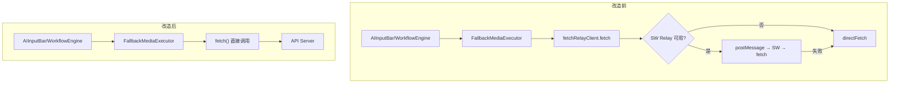

## 用户需求

将所有大模型（LLM）相关的 API 请求从 Service Worker 迁移到应用层（主线程），并彻底清理 SW 中的 LLM 相关逻辑。

## 产品概述

当前项目使用 Service Worker 代理大模型 API 请求（图片生成、视频生成、Chat 等），设计初衷是避免用户刷新/关闭页面导致请求丢失。但实践中 SW 通道通信不稳定（频繁出现 ReturnCode -99）、大 payload 序列化开销大、错误处理复杂化，引入了更多问题。需要将所有 LLM 请求回归主线程直接 fetch，同时通过 beforeunload 提示和禁止自动刷新来保护正在执行的请求。

## 核心功能

1. **应用层直接发起 LLM 请求**：fallback-executor 中的图片生成不再通过 fetchRelayClient 代理，改为直接使用原生 fetch API
2. **清理应用层 SW LLM 模块**：删除 fetch-relay 目录、sw-executor、sw-task-queue-service、sw-chat-service、sw-chat-workflow-service、sw-generation-service、unified-generation-service、sw-detection 等不再需要的服务文件
3. **清理 SW 端 LLM 模块**：删除 sw/fetch-relay.ts 及 sw/task-queue 目录下的 LLM 相关处理器（image/video/chat/character handlers）、工作流执行器、通道管理器等
4. **简化 task-queue/index.ts**：移除 SW 路由逻辑，始终导出主线程 taskQueueService
5. **页面关闭/刷新保护**：增强 useBeforeUnload，同时检测活跃任务和运行中的工作流；所有 location.reload() 调用点加上活跃任务检测，有活跃任务时提示用户确认
6. **保留 SW 非 LLM 功能**：CDN fallback、缓存管理、crash snapshot、thumbnail 生成、console log capture 等功能保持不变

## 技术栈

- 前端框架：React + TypeScript
- 构建工具：Vite + Nx（monorepo）
- UI 组件库：TDesign React
- 状态管理：RxJS Subjects + React Context
- 数据持久化：IndexedDB (localforage)
- SW 通信：postmessage-duplex

## 实现方案

### 核心策略

采用「替换 + 删除 + 保护」三步走策略：

1. **替换**：`fallback-executor.ts` 中 `generateImage` 的 `fetchRelayClient.fetch()` 替换为原生 `fetch()`，保持相同的错误处理和 abort signal 支持
2. **删除**：分层清理不再需要的 SW LLM 模块——先清理应用层引用（import 链），再删除服务文件，最后清理 SW 端代码
3. **保护**：增强 beforeunload 拦截 + 所有 `location.reload()` 调用点添加活跃任务检测

### 关键技术决策

1. **直接替换 fetchRelayClient.fetch() 为原生 fetch()**：fetchRelayClient 内部的 `directFetch` 方法就是包装了原生 fetch，替换后行为完全一致，不存在功能回退
2. **保留 swChannelClient 核心**：unified-cache-service、crash-logger、sw-console-capture 等非 LLM 服务仍依赖 swChannelClient 进行 SW 通信，因此 sw-channel/client.ts 保留但移除 LLM 相关 RPC 方法（createTask, startChat, callExecutor, submitWorkflow 等）
3. **task-queue/index.ts 简化为直接导出 taskQueueService**：移除 shouldUseSWTaskQueue 路由逻辑和 swTaskQueueService 导入
4. **活跃任务检测工具函数抽取**：创建 `hasActiveLLMTasks()` 工具函数，同时检查 taskQueueService 活跃任务和 workflowSubmissionService 运行中工作流，供 useBeforeUnload 和 location.reload() 保护点复用

## 实现注意事项

1. **保持 API 兼容**：executorFactory 已经始终返回 FallbackMediaExecutor，改造不影响上层调用
2. **SW 端清理边界**：sw/index.ts 中仍需要 initTaskQueue 和 initChannelManager（供 crash snapshot、console log、thumbnail 等非 LLM 功能使用），但可以删除 initFetchRelay、LLM handlers、workflow executor 等
3. **sw-channel/client.ts 的 LLM 方法清理**：createTask、cancelTask、retryTask、startChat、stopChat、callExecutor、submitWorkflow、getWorkflowStatus、getAllWorkflows、cancelWorkflow 等可标记 @deprecated 或直接移除
4. **swTaskQueueService 的下游引用**：backup-restore-service、github-sync/media-collector、github-sync/task-sync-service、github-sync/data-serializer、MediaLibraryGrid 等文件引用了 swTaskQueueService，需要统一替换为 taskQueueService
5. **useSWTaskQueue hook**：该 hook 用于 drawnix.tsx 初始化 SW 任务队列，整体可移除，初始化逻辑简化

## 架构设计

改造前后对比：



## 目录结构

### 应用层 (packages/drawnix/src/)

```
services/
├── fetch-relay/                    # [DELETE] 整个目录，fetchRelayClient 不再需要
│   ├── client.ts
│   ├── index.ts
│   └── types.ts
├── media-executor/
│   ├── fallback-executor.ts        # [MODIFY] 移除 fetchRelayClient 依赖，改用原生 fetch
│   ├── sw-executor.ts              # [DELETE] SW 媒体执行器，不再需要
│   ├── factory.ts                  # [MODIFY] 移除 SW 相关注释和废弃方法
│   └── index.ts                    # [MODIFY] 移除 SWMediaExecutor 导出
├── task-queue/
│   ├── index.ts                    # [MODIFY] 简化为直接导出 taskQueueService
│   └── sw-detection.ts             # [DELETE] SW 检测不再需要
├── sw-task-queue-service.ts        # [DELETE] SW 任务队列服务
├── sw-chat-service.ts              # [DELETE] SW Chat 服务
├── sw-chat-workflow-service.ts     # [DELETE] SW Chat Workflow 服务
├── sw-generation-service.ts        # [DELETE] SW 生成服务
├── unified-generation-service.ts   # [DELETE] 统一生成入口（SW 路由层）
├── sw-channel/
│   └── client.ts                   # [MODIFY] 移除 LLM 相关 RPC 方法和事件处理
├── workflow-submission-service.ts  # [MODIFY] 移除 @deprecated checkSWAvailability 等 SW 残留
├── backup-restore-service.ts       # [MODIFY] swTaskQueueService → taskQueueService
├── chat-service.ts                 # [MODIFY] 检查并移除 SW 相关引用
├── github-sync/
│   ├── media-collector.ts          # [MODIFY] swTaskQueueService → taskQueueService
│   ├── task-sync-service.ts        # [MODIFY] swTaskQueueService → taskQueueService
│   └── data-serializer.ts          # [MODIFY] swTaskQueueService → taskQueueService
├── task-queue-service.ts           # [KEEP] 主线程任务队列服务（无需修改）
└── unified-cache-service.ts        # [KEEP] 保留 swChannelClient 用于缓存通信

hooks/
├── useBeforeUnload.ts              # [MODIFY] 增强：同时检测工作流和任务
├── useSWTaskQueue.ts               # [DELETE] SW 任务队列 hook
├── useChatWorkflowHandler.ts       # [MODIFY] 移除 swChatWorkflowService 依赖
└── useWorkflowSubmission.ts        # [MODIFY] 移除 SW 通道检测和 submitToSW 逻辑

utils/
├── gemini-api/apiCalls.ts          # [MODIFY] 移除未使用的 fetchRelayClient 导入
└── active-tasks.ts                 # [NEW] hasActiveLLMTasks() 工具函数

components/
├── media-library/MediaLibraryGrid.tsx  # [MODIFY] swTaskQueueService → taskQueueService

drawnix.tsx                         # [MODIFY] 移除 swTaskQueueService 初始化逻辑
index.ts                            # [MODIFY] 检查并更新导出
```

### SW 端 (apps/web/src/sw/)

```
sw/
├── index.ts                        # [MODIFY] 移除 initFetchRelay、workflow 相关消息处理、LLM task-queue 初始化
├── fetch-relay.ts                  # [DELETE] SW 端 Fetch 代理
└── task-queue/
    ├── handlers/                   # [DELETE] 整个目录（image/video/chat/character 处理器）
    ├── chat-workflow/              # [DELETE] 整个目录
    ├── mcp/                        # [DELETE] 整个目录
    ├── agent/                      # [DELETE] 整个目录
    ├── channel-manager.ts          # [MODIFY] 移除 LLM 相关 RPC 方法注册
    ├── channel-manager/            # [MODIFY] 移除 LLM 相关常量
    ├── queue.ts                    # [DELETE] 核心队列
    ├── storage.ts                  # [MODIFY] 保留 thumbnail/cache 相关，移除 task/workflow 相关
    ├── workflow-executor.ts        # [DELETE] 工作流执行器
    ├── workflow-handler.ts         # [DELETE] 工作流消息处理
    ├── workflow-types.ts           # [DELETE] 工作流类型
    ├── media-executor.ts           # [DELETE] SW 端媒体执行器
    ├── llm-api-logger.ts           # [KEEP] LLM API 日志记录（仍可用于主线程日志广播）
    ├── debug-fetch.ts              # [KEEP] 调试 fetch 日志
    ├── postmessage-logger.ts       # [KEEP] PostMessage 通信日志
    ├── task-step-registry.ts       # [DELETE] 任务-步骤映射
    ├── types.ts                    # [MODIFY] 保留通用类型，移除 LLM 任务类型
    ├── index.ts                    # [MODIFY] 简化导出
    └── utils/
        ├── thumbnail-utils.ts      # [KEEP] 缩略图工具
        ├── message-bus.ts          # [KEEP] 消息总线
        ├── sanitize-utils.ts       # [KEEP] 数据脱敏
        ├── media-generation-utils.ts # [DELETE] 媒体生成工具
        ├── timeout-utils.ts        # [KEEP/DELETE] 评估是否仍需
        └── index.ts                # [MODIFY] 更新导出
```

### 页面刷新保护点 (需添加活跃任务检测)

```
apps/web/src/main.tsx               # [MODIFY] SW 更新刷新前检测活跃任务
apps/web/src/app/app.tsx            # [MODIFY] 崩溃恢复刷新前检测活跃任务
packages/drawnix/src/drawnix.tsx     # [MODIFY] 导入切换画布刷新前检测活跃任务
packages/drawnix/src/components/sync-settings/SyncSettings.tsx    # [MODIFY] 同步刷新前检测
packages/drawnix/src/components/project-drawer/ProjectDrawer.tsx  # [MODIFY] 导入刷新前检测
packages/drawnix/src/components/backup-restore/backup-restore-dialog.tsx  # [MODIFY] 备份恢复刷新前检测
packages/drawnix/src/components/performance-panel/PerformancePanel.tsx    # [MODIFY] 性能面板刷新前检测
```

## 关键代码结构

```typescript
// utils/active-tasks.ts [NEW]

import { taskQueueService } from '../services/task-queue-service';
import { workflowSubmissionService } from '../services/workflow-submission-service';
import { TaskStatus } from '../types/task.types';

/**
 * 检查是否有活跃的 LLM 任务（正在执行的任务或工作流）
 * 用于 beforeunload 拦截和 location.reload() 保护
 */
export function hasActiveLLMTasks(): boolean {
  // 检查任务队列中的活跃任务
  const tasks = taskQueueService.getAllTasks();
  const hasActiveTasks = tasks.some(
    t => t.status === TaskStatus.PENDING || t.status === TaskStatus.PROCESSING
  );
  if (hasActiveTasks) return true;

  // 检查运行中的工作流
  const runningWorkflows = workflowSubmissionService.getRunningWorkflows();
  return runningWorkflows.length > 0;
}

/**
 * 安全刷新页面：如果有活跃任务，提示用户确认
 * @returns 是否执行了刷新
 */
export function safeReload(): boolean {
  if (hasActiveLLMTasks()) {
    const confirmed = window.confirm(
      '当前有正在进行的 AI 生成任务，刷新页面会中断这些任务。确定要刷新吗？'
    );
    if (!confirmed) return false;
  }
  window.location.reload();
  return true;
}
```

## Agent Extensions

### SubAgent

- **code-explorer**
- 目的：在每个实现步骤中探索受影响文件的完整内容和依赖关系，确保清理彻底且不遗漏引用
- 预期结果：准确定位所有需要修改的 import 语句和引用，避免遗漏导致构建失败