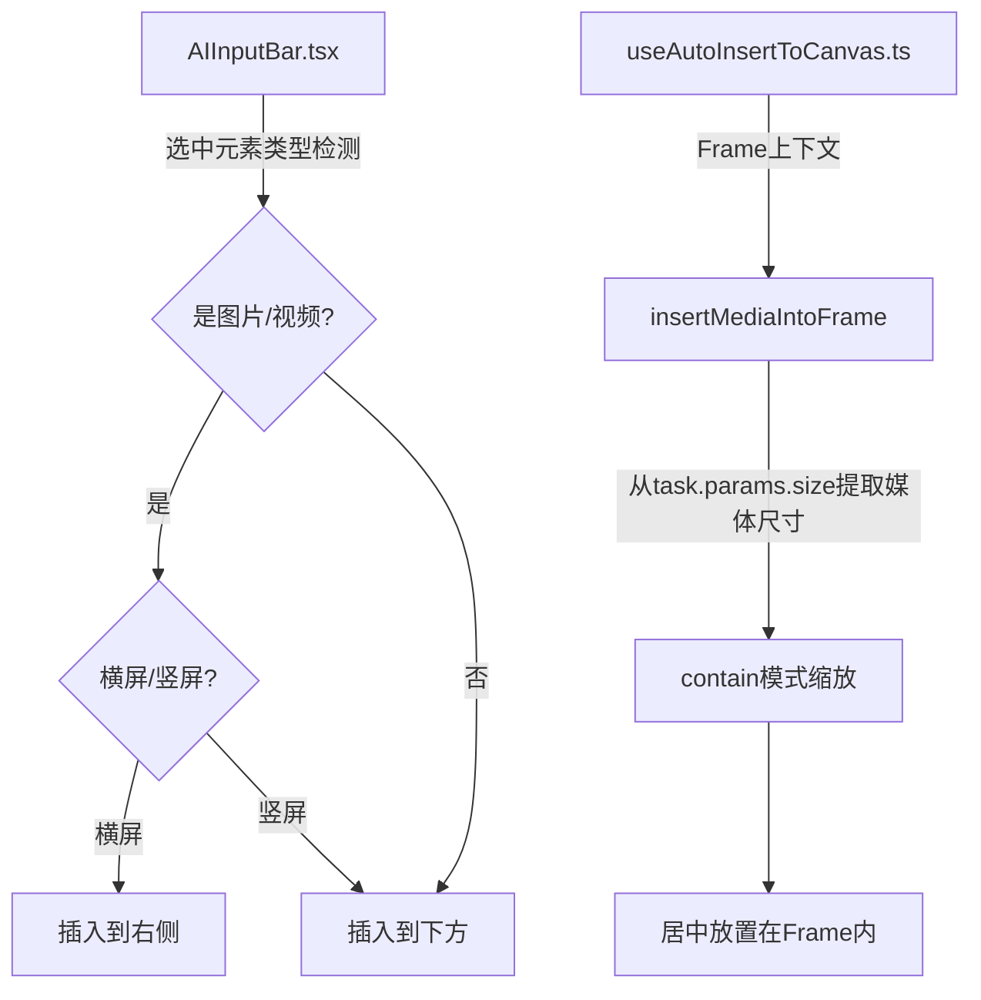

## 用户需求

优化 AI 生成图片/视频后的画布插入逻辑，涉及两个核心场景：

## 核心功能

### 1. Frame 内插入的等比缩放

当选中 Frame 后生成图片/视频时，媒体应插入到 Frame 内部，并以 **等比缩放（contain 模式）** 适配 Frame 尺寸，而非当前的拉伸填满行为。媒体应在 Frame 内居中显示，保持原始宽高比不变形。

### 2. 选中图片/视频元素时的智能插入方向

当选中的元素是图片或视频时，新生成的内容应根据选中元素的朝向决定插入位置：

- **横屏**（宽 > 高）：插入到选中元素的右侧
- **竖屏**（宽 <= 高）：插入到选中元素的下方

当前行为是统一插入到选中元素下方，不区分朝向。

## 技术栈

- 现有项目：React + TypeScript + Plait 画布框架
- 相关模块：AIInputBar、useAutoInsertToCanvas、canvas-insertion、frame-insertion-utils

## 实现方案

### 问题 1：Frame 内等比缩放（contain 模式）

**当前问题**：`frame-insertion-utils.ts` 的 `insertMediaIntoFrame` 函数直接使用 `frameDimensions` 作为媒体宽高（第 59-60 行），这相当于拉伸填满 Frame，会导致图片变形。

**解决方案**：修改 `insertMediaIntoFrame`，根据实际媒体宽高比和 Frame 宽高比计算 contain 模式的尺寸。由于生成时已有 `task.params.size`（如 `1024x1024`、`1536x1024`），可以从中提取实际媒体宽高比来计算缩放。同时函数签名新增可选参数 `mediaDimensions` 传递实际媒体尺寸。

计算逻辑：

```
mediaAspect = mediaWidth / mediaHeight
frameAspect = frameWidth / frameHeight
if (mediaAspect > frameAspect):
  // 媒体更宽，以宽度为基准
  fitWidth = frameWidth
  fitHeight = frameWidth / mediaAspect
else:
  // 媒体更高，以高度为基准
  fitHeight = frameHeight
  fitWidth = frameHeight * mediaAspect
```

### 问题 2：选中图片/视频时的智能插入方向

**当前问题**：`AIInputBar.tsx` 第 1046-1054 行，选中元素时统一取 `selectedRect` 的 bounding box 底部 + GAP 作为插入点，始终向下排列。

**解决方案**：在选中元素位置计算逻辑中，增加对图片/视频元素类型的检测。当所有选中元素均为图片/视频时，根据 bounding box 的宽高比判断朝向：

- 横屏（width > height）：`expectedInsertLeftX = selectedRect.x + selectedRect.width + GAP`，`expectedInsertY = selectedRect.y`（右侧，顶部对齐）
- 竖屏（width <= height）：保持当前逻辑，插入到下方

需要在 `AIInputBar.tsx` 中引入 `PlaitDrawElement` 和 `isVideoElement` 来判断元素类型。

## 实现注意事项

### 性能考量

- `insertMediaIntoFrame` 中的 contain 计算是纯数学操作，无性能开销
- 元素类型检测仅在生成触发时执行一次（非高频事件），不影响性能

### 向后兼容

- `insertMediaIntoFrame` 新增的 `mediaDimensions` 参数为可选，缺省时回退到当前的填满行为
- 非图片/视频选中元素的场景保持原有"向下插入"行为不变

### 数据流传递

Frame 内插入需要同时传递 Frame 尺寸和实际媒体尺寸：

- **AIInputBar 路径**：`selectedFrameRef` 已保存 Frame 信息 → WorkZone 中已有 `targetFrameDimensions` → `useAutoInsertToCanvas` 中从 `task.params.size` 提取媒体实际尺寸传递给 `insertMediaIntoFrame`
- **TTD Dialog 路径**：`task.params` 中已有 `targetFrameId`、`targetFrameDimensions` 和 `size`（媒体尺寸），同样从中提取

### 智能插入方向的数据流

- 方向判断在 `AIInputBar.tsx` 的 `handleGenerate` 中计算 `expectedInsertPosition` 时完成
- 传入 WorkZone 的 `expectedInsertPosition` 已包含正确的方向信息
- `useAutoInsertToCanvas` 和 `canvas-insertion` 无需修改，它们直接使用 `insertionPoint` 作为 `[leftX, topY]`

## 架构设计

### 修改范围



## 目录结构

```
packages/drawnix/src/
├── components/ai-input-bar/
│   └── AIInputBar.tsx           # [MODIFY] 选中图片/视频时智能判断插入方向（右侧/下方）；需新增 PlaitDrawElement 和 isVideoElement 导入
├── hooks/
│   └── useAutoInsertToCanvas.ts # [MODIFY] 调用 insertMediaIntoFrame 时传递实际媒体尺寸（从 task.params.size 提取）
└── utils/
    └── frame-insertion-utils.ts # [MODIFY] 实现 contain 模式等比缩放逻辑；新增可选 mediaDimensions 参数
```

## 关键代码结构

```typescript
// frame-insertion-utils.ts - 新增的 contain 缩放计算
export async function insertMediaIntoFrame(
  board: PlaitBoard,
  mediaUrl: string,
  mediaType: 'image' | 'video',
  frameId: string,
  frameDimensions: { width: number; height: number },
  mediaDimensions?: { width: number; height: number } // 新增：实际媒体尺寸
): Promise<void>;
```

## Agent Extensions

### SubAgent

- **code-explorer**
- 用途：在实现过程中，如需探索相关依赖或确认 API 用法时使用
- 预期结果：快速定位代码位置和确认 API 签名