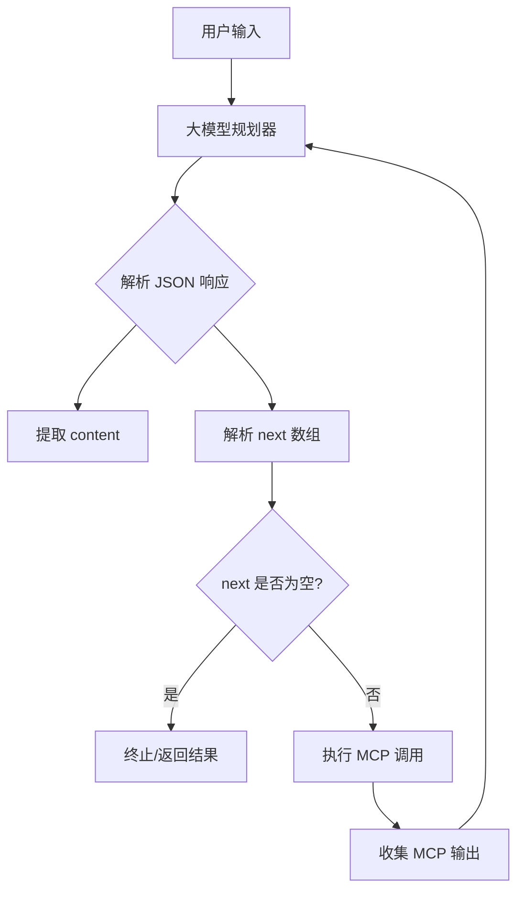
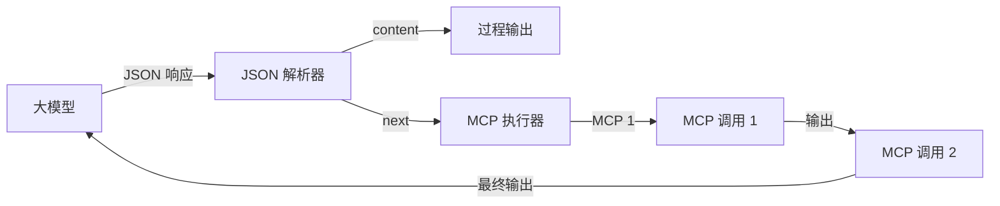

## 产品概述

优化递归规划系统的 Prompt，使大模型能够返回简洁、结构化的工作流 JSON 格式，支持链式 MCP 调用，实现自动化任务编排。

## 核心功能

- **简洁 JSON 格式输出**：大模型返回 `{"content": "输出内容", "next": [{"mcp": "名称", "args": {}}]}` 格式
- **链式 MCP 调用**：`next` 数组定义工作流顺序，前一个 MCP 的输出可作为后一个 MCP 的输入
- **终止条件识别**：无 `next` 字段或 `next` 为空数组时表示工作流终止
- **输出传递机制**：最后一个 MCP 的输出作为下次大模型调用的输入
- **严格格式约束**：JSON 结构严格遵循规范，避免额外嵌套或冗余字段

## 技术栈

- **语言**：Prompt Engineering（提示词工程）
- **格式**：JSON Schema 约束
- **目标系统**：递归规划系统（Recursive Planning System）

## 架构设计

### 系统架构

采用递归调用模式，大模型作为规划器，MCP 作为执行器：



### 数据流设计



### JSON 格式规范

```
{
  "content": "string - 当前步骤的输出内容或思考过程",
  "next": [
    {
      "mcp": "string - MCP 工具名称",
      "args": {
        "key": "value - MCP 参数"
      }
    }
  ]
}
```

### 关键实现逻辑

1. **输出格式约束**

- `content`：必填字段，记录当前步骤的输出
- `next`：可选数组，定义后续 MCP 调用序列
- `mcp`：MCP 工具的精确名称
- `args`：MCP 调用所需的参数对象

2. **链式调用规则**

- `next[0]` 的输出可通过 `content` 参数传递给 `next[1]`
- 执行顺序严格按数组索引顺序
- 支持并行调用（同一 `next` 数组中的独立 MCP）

3. **终止条件**

- `next` 字段不存在
- `next` 为空数组 `[]`
- 所有 MCP 执行完毕

## Agent Extensions

### SubAgent

- **code-explorer**
- 用途：探索现有递归规划系统的代码结构，理解当前 Prompt 实现
- 预期结果：获取现有 Prompt 文件位置和格式规范