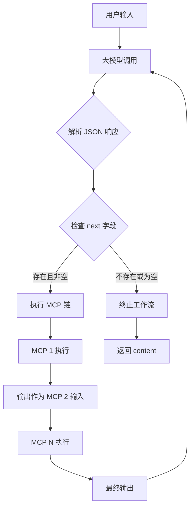

## Product Overview

优化递归规划系统的 Prompt 约束和工作流引擎，使大模型返回更简洁、结构化的 JSON 格式，支持链式 MCP 调用和自动化任务编排。

## Core Features

- **简洁 JSON 格式约束**：大模型严格返回 `{"content": "输出内容", "next": [{"mcp": "名称", "args": {}}]}` 格式，避免冗余字段
- **链式 MCP 调用**：前一个 MCP 的输出自动作为后一个 MCP 的输入，支持多步骤任务编排
- **明确终止条件**：无 `next` 字段或空数组时终止工作流，最后一个 MCP 输出作为下次大模型调用的输入
- **Prompt 优化**：精简约束描述，增强格式强制性，减少大模型输出偏差

## Tech Stack

- 语言：TypeScript
- 运行时：Node.js
- 现有框架：基于项目已有的递归规划系统架构

## Tech Architecture

### System Architecture



### Module Division

- **Prompt 模块**：定义简洁的 JSON 格式约束和输出规范
- **JSON 解析模块**：解析大模型响应，提取 content 和 next 字段
- **工作流引擎模块**：执行链式 MCP 调用，管理数据流转
- **终止判断模块**：检测工作流终止条件

### Data Flow

1. 用户输入 → 大模型生成 JSON 响应
2. 解析 JSON → 提取 `content` 和 `next`
3. 若 `next` 非空 → 依次执行 MCP 链，传递输出
4. 若 `next` 为空或不存在 → 终止，返回 `content`

## Implementation Details

### Key Code Structures

**JSON 响应格式定义**：

```typescript
interface LLMResponse {
  content: string;
  next?: MCPCall[];
}

interface MCPCall {
  mcp: string;
  args: Record<string, unknown>;
}
```

**工作流执行逻辑**：

```typescript
async function executeWorkflow(response: LLMResponse, context: unknown): Promise<string> {
  if (!response.next || response.next.length === 0) {
    return response.content;
  }
  
  let currentInput = context;
  for (const call of response.next) {
    currentInput = await executeMCP(call.mcp, { ...call.args, input: currentInput });
  }
  
  return await callLLMWithInput(currentInput);
}
```

### Technical Implementation Plan

#### 1. Prompt 约束优化

- **问题**：现有 Prompt 约束冗长，大模型可能输出额外字段
- **方案**：精简为核心规则，使用示例强化格式
- **关键点**：
- 明确只允许 `content` 和 `next` 两个字段
- 提供正确/错误示例对比
- 强调 JSON 严格模式

#### 2. 链式调用优化

- **问题**：数据流转逻辑分散
- **方案**：统一链式执行器，管理输入输出传递
- **关键点**：
- 前一个 MCP 的返回值自动注入后一个的 args
- 支持错误中断和重试机制

#### 3. 终止条件明确化

- **问题**：终止判断逻辑不够清晰
- **方案**：统一终止检测函数
- **关键点**：
- `next` 不存在 → 终止
- `next` 为空数组 → 终止
- `next` 包含有效调用 → 继续执行

## Agent Extensions

### SubAgent

- **code-explorer**
- Purpose：探索现有递归规划系统的代码结构，定位 Prompt 定义、工作流引擎和 JSON 解析相关文件
- Expected outcome：获取现有实现的文件路径和代码结构，为优化提供准确的修改位置