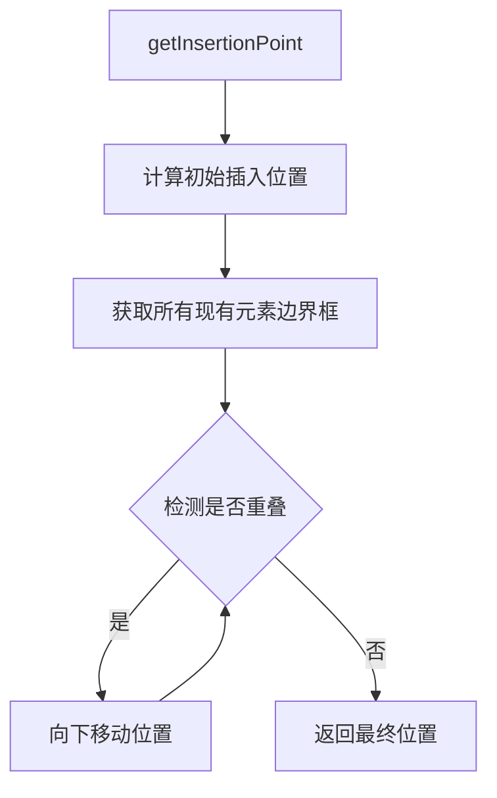

## 产品概述

改进画布元素插入位置计算逻辑，增加重叠检测功能，确保新插入的思维导图或其他元素不会与现有元素发生重叠，提升用户体验。

## 核心功能

- **重叠检测算法**：检测新元素边界框是否与现有元素边界框重叠
- **智能位置调整**：当检测到重叠时，自动向下移动新元素直到找到不重叠的位置
- **边界框计算**：准确计算各类元素（思维导图、图片、文本等）的边界范围
- **安全间距保障**：在元素之间保持适当的间距，避免视觉上过于拥挤

## 技术栈

- 语言：TypeScript
- 框架：基于现有项目架构

## 技术方案

### 系统架构

基于现有的 `insert-utils.ts` 工具模块进行扩展，保持与现有代码架构的一致性。



### 模块划分

- **边界框计算模块**：计算元素的边界矩形
- **重叠检测模块**：判断两个矩形是否重叠
- **位置调整模块**：在检测到重叠时调整插入位置

### 数据流

1. 调用 `getInsertionPoint` 获取初始位置
2. 收集画布上所有现有元素的边界框
3. 计算新元素的预期边界框
4. 循环检测重叠，若重叠则向下偏移
5. 返回不重叠的最终位置

## 实现细节

### 核心目录结构

```
src/
└── utils/
    └── insert-utils.ts  # 修改：添加重叠检测相关函数
```

### 关键代码结构

**BoundingBox 接口**：定义元素边界框的数据结构，包含位置和尺寸信息。

```typescript
interface BoundingBox {
  x: number;
  y: number;
  width: number;
  height: number;
}
```

**重叠检测函数**：判断两个边界框是否存在重叠区域。

```typescript
function isOverlapping(box1: BoundingBox, box2: BoundingBox, padding?: number): boolean;
```

**获取所有元素边界框函数**：遍历画布元素，返回所有元素的边界框数组。

```typescript
function getAllElementBoundingBoxes(elements: CanvasElement[]): BoundingBox[];
```

**查找非重叠位置函数**：从初始位置开始，向下搜索直到找到不与任何现有元素重叠的位置。

```typescript
function findNonOverlappingPosition(
  initialPosition: Point,
  newElementSize: Size,
  existingBoxes: BoundingBox[],
  stepSize?: number
): Point;
```

### 技术实现方案

1. **问题定义**：新插入元素与现有元素重叠
2. **解决思路**：

- 使用 AABB（轴对齐边界框）碰撞检测算法
- 采用增量下移策略寻找空闲位置

3. **关键技术**：

- 矩形碰撞检测公式
- 可配置的安全间距（padding）

4. **实现步骤**：

- 添加 `BoundingBox` 类型定义
- 实现 `isOverlapping` 检测函数
- 实现 `getAllElementBoundingBoxes` 收集函数
- 实现 `findNonOverlappingPosition` 位置查找函数
- 修改 `getInsertionPoint` 集成重叠检测

5. **测试策略**：验证多元素场景下插入位置的正确性