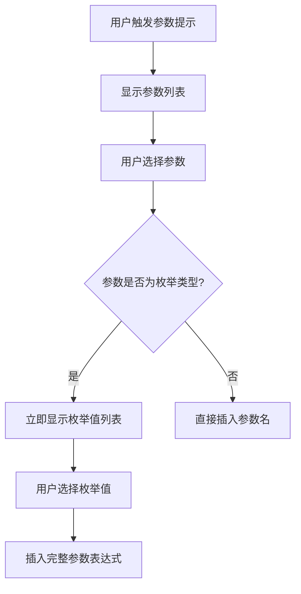

## 产品概述

优化参数选择交互流程，当用户选择一个参数后，自动展开该参数的枚举值选项供用户选择，无需手动输入冒号触发。

## 核心功能

- 选择参数后自动展开枚举值列表
- 用户必须从枚举值中选择一个值完成参数输入
- 非枚举类型参数选择后直接插入参数名
- 移除手动输入冒号触发枚举值的交互方式

## 技术方案

### 现有逻辑分析

当前参数选择流程：

1. 用户触发参数提示（如输入 `@` 或特定前缀）
2. 显示参数列表供用户选择
3. 用户选择参数后插入参数名
4. 用户需手动输入冒号 `:` 触发枚举值提示
5. 显示枚举值列表供用户选择

### 目标逻辑

修改后的参数选择流程：

1. 用户触发参数提示
2. 显示参数列表供用户选择
3. 用户选择参数后：

- 若为枚举类型：立即显示枚举值列表
- 若为非枚举类型：直接插入参数名

4. 用户从枚举值列表中选择一个值
5. 插入完整的参数表达式（如 `参数名:枚举值`）

### 数据流

### 关键修改点

1. **参数选择回调函数**：修改选择参数后的处理逻辑，判断参数类型
2. **枚举值触发机制**：从"输入冒号触发"改为"选择参数后自动触发"
3. **状态管理**：可能需要增加中间状态标记当前正在选择哪个参数的枚举值

## Agent Extensions

### SubAgent

- **code-explorer**
- 用途：探索现有代码库，查找参数选择相关的组件、回调函数和状态管理逻辑
- 预期结果：定位到参数选择的核心代码文件和关键函数，理解现有实现方式