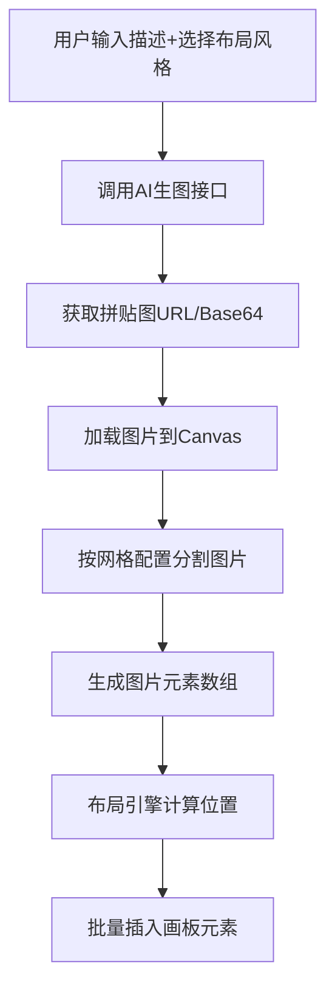

## 产品概述

照片墙功能是一个创意图片生成工具，用户通过一条指令即可生成完整的照片墙效果。系统调用一次 AI 生图模型生成拼贴图，然后通过 Canvas 技术将图片分割成多个独立元素，按照用户选择的布局风格（散落、网格、环形等）插入画板，形成富有艺术感的照片墙展示效果。

## 核心功能

- **一键生成拼贴图**：用户输入描述，调用 AI 生图模型生成一张完整的拼贴图
- **规则网格分割**：支持 3x3、4x4 等规则网格方式将拼贴图分割成多个独立图片元素
- **多种布局风格**：提供散落、网格、环形等多种布局风格供用户选择
- **画板元素插入**：将分割后的图片元素按选定布局风格自动插入画板，形成照片墙效果

## 技术栈

- 开发语言：TypeScript
- 核心技术：Canvas API 用于图片分割处理
- 依赖模块：现有项目的生图模型调用接口、画板元素插入接口

## 技术架构

### 系统架构


### 模块划分

- **PhotoWallService 模块**
- 职责：照片墙功能的核心服务，协调生图、分割、布局流程
- 关键技术：异步流程控制
- 依赖：ImageGenerator、GridSplitter、LayoutEngine

- **GridSplitter 模块**
- 职责：使用 Canvas 将图片按规则网格分割成多个独立图片
- 关键技术：Canvas API、图片裁剪算法
- 接口：`split(image, gridConfig) => ImageElement[]`

- **LayoutEngine 模块**
- 职责：根据布局风格计算每个图片元素在画板上的位置和变换参数
- 关键技术：布局算法（散落、网格、环形）
- 接口：`calculate(elements, style, canvasSize) => PositionedElement[]`

### 数据流



## 实现细节

### 核心目录结构

```
src/
├── services/
│   └── photoWall/
│       ├── index.ts              # PhotoWallService 主服务
│       ├── gridSplitter.ts       # 网格分割器
│       └── layoutEngine.ts       # 布局引擎
├── types/
│   └── photoWall.ts              # 类型定义
```

### 关键代码结构

**PhotoWall 类型定义**：定义照片墙功能所需的核心数据结构，包括网格配置、布局风格和图片元素。

```typescript
// 网格配置
interface GridConfig {
  rows: number;      // 行数，如 3、4
  cols: number;      // 列数，如 3、4
}

// 布局风格枚举
type LayoutStyle = 'scattered' | 'grid' | 'circular';

// 分割后的图片元素
interface ImageElement {
  id: string;
  imageData: string;  // base64 或 blob URL
  originalIndex: number;
}

// 带位置信息的元素
interface PositionedElement extends ImageElement {
  x: number;
  y: number;
  rotation: number;
  scale: number;
}
```

**GridSplitter 类**：负责将完整拼贴图按规则网格分割成多个独立图片，使用 Canvas API 实现高效裁剪。

```typescript
class GridSplitter {
  async split(imageUrl: string, config: GridConfig): Promise<ImageElement[]> {
    // 1. 加载图片到 Canvas
    // 2. 计算每个格子的尺寸
    // 3. 遍历网格，裁剪并导出每个区域
    // 4. 返回图片元素数组
  }
}
```

**LayoutEngine 类**：根据选定的布局风格计算每个图片元素在画板上的位置、旋转角度和缩放比例。

```typescript
class LayoutEngine {
  calculate(
    elements: ImageElement[],
    style: LayoutStyle,
    canvasSize: { width: number; height: number }
  ): PositionedElement[] {
    switch (style) {
      case 'scattered': return this.scatteredLayout(elements, canvasSize);
      case 'grid': return this.gridLayout(elements, canvasSize);
      case 'circular': return this.circularLayout(elements, canvasSize);
    }
  }
}
```

### 技术实现方案

**1. Canvas 图片分割**

- 问题：将一张完整图片按网格分割成多个独立图片
- 方案：使用 Canvas drawImage 的裁剪参数，逐个提取网格区域
- 步骤：

1. 创建离屏 Canvas
2. 计算单元格尺寸 = 图片尺寸 / 网格数
3. 遍历网格，使用 drawImage 裁剪并 toDataURL 导出

- 验证：检查输出数组长度是否等于 rows * cols

**2. 布局算法实现**

- 散落布局：随机位置 + 随机旋转角度（-15° ~ 15°）+ 轻微缩放变化
- 网格布局：等间距排列，保持整齐
- 环形布局：围绕中心点按角度均匀分布

### 集成点

- 调用现有生图模型接口生成拼贴图
- 调用现有画板元素插入接口批量添加图片元素

## Agent Extensions

### SubAgent

- **code-explorer**
- 用途：探索现有项目代码结构，查找生图模型调用接口和画板元素插入接口的实现方式
- 预期结果：获取现有接口的调用方式和参数格式，确保新功能与现有系统无缝集成