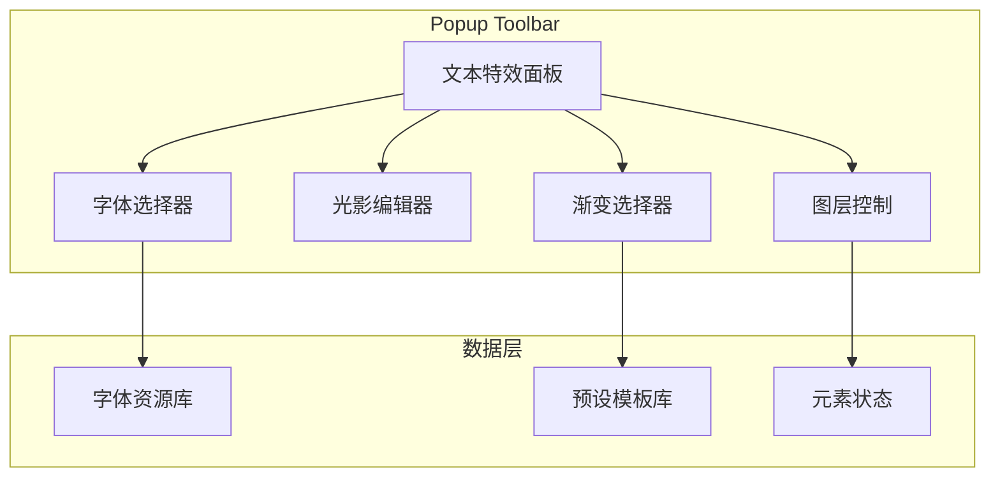
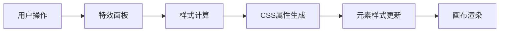

## 产品概述

为 popup-toolbar 组件扩展文本元素的高级视觉效果功能，包括艺术字效果、光影效果、渐变色选择器和图层调整，实现类似"元旦快乐"金色渐变发光的节日特效。

## 核心功能

### 艺术字效果

- 字体选择器：支持系统Web安全字体、Google Fonts在线字体、内置预设装饰字体
- 自定义字体上传：通过素材库上传TTF/OTF/WOFF格式字体文件
- 字体预览：实时预览字体效果

### 光影效果

- 元素阴影(box-shadow)：支持偏移、模糊、扩散、颜色配置
- 文字阴影(text-shadow)：支持多层阴影叠加
- 光晕/发光效果：外发光、内发光、霓虹灯效果

### 渐变色选择器

- 渐变类型：支持文字填充渐变、背景填充渐变、描边渐变
- 预设渐变模板：金色、银色、彩虹、节日主题等预设
- 自定义渐变编辑器：支持线性/径向渐变、多色标控制、角度调整

### 图层调整

- 层级操作：上移一层、下移一层、置顶、置底
- 可视化层级指示

## 技术栈

- 前端框架：React + TypeScript
- 样式方案：Tailwind CSS
- 状态管理：复用现有项目状态管理方案

## 技术架构

### 系统架构

基于现有 popup-toolbar 组件架构进行扩展，新增文本特效相关的子面板和控制器。



### 模块划分

- **FontSelector 模块**：字体选择与管理
- 系统字体列表、Google Fonts集成、自定义字体上传
- 依赖：素材库上传接口

- **ShadowEditor 模块**：阴影与发光效果编辑
- box-shadow、text-shadow、glow效果配置
- 依赖：颜色选择器组件

- **GradientPicker 模块**：渐变色选择与编辑
- 预设模板、自定义渐变编辑器
- 依赖：颜色选择器组件

- **LayerControl 模块**：图层层级管理
- 层级调整操作
- 依赖：元素状态管理

### 数据流



## 实现细节

### 核心目录结构

```
src/
├── components/
│   └── popup-toolbar/
│       ├── panels/
│       │   ├── TextEffectsPanel.tsx      # 文本特效主面板
│       │   ├── FontSelectorPanel.tsx     # 字体选择面板
│       │   ├── ShadowEditorPanel.tsx     # 光影编辑面板
│       │   ├── GradientPickerPanel.tsx   # 渐变选择面板
│       │   └── LayerControlPanel.tsx     # 图层控制面板
│       └── components/
│           ├── FontPreview.tsx           # 字体预览组件
│           ├── ShadowControl.tsx         # 阴影控制组件
│           ├── GlowControl.tsx           # 发光控制组件
│           ├── GradientEditor.tsx        # 渐变编辑器
│           ├── GradientPresets.tsx       # 渐变预设
│           └── LayerButtons.tsx          # 图层按钮组
├── hooks/
│   ├── useFontLoader.ts                  # 字体加载Hook
│   ├── useShadowStyle.ts                 # 阴影样式Hook
│   └── useGradientStyle.ts               # 渐变样式Hook
├── utils/
│   ├── fontUtils.ts                      # 字体工具函数
│   ├── shadowUtils.ts                    # 阴影CSS生成
│   └── gradientUtils.ts                  # 渐变CSS生成
└── constants/
    ├── fonts.ts                          # 字体预设常量
    ├── shadows.ts                        # 阴影预设常量
    └── gradients.ts                      # 渐变预设常量
```

### 关键代码结构

**文本特效样式接口**：定义文本元素的完整特效配置结构

```typescript
interface TextEffectStyle {
  // 字体配置
  font: {
    family: string;
    source: 'system' | 'google' | 'custom';
    url?: string;
  };
  // 阴影配置
  shadow: {
    boxShadow: BoxShadowConfig[];
    textShadow: TextShadowConfig[];
    glow: GlowConfig;
  };
  // 渐变配置
  gradient: {
    type: 'linear' | 'radial';
    angle: number;
    stops: GradientStop[];
    target: 'text' | 'background' | 'stroke';
  };
  // 图层层级
  zIndex: number;
}
```

**渐变样式生成函数**：将渐变配置转换为CSS样式

```typescript
function generateGradientCSS(config: GradientConfig): CSSProperties {
  const gradient = config.type === 'linear'
    ? `linear-gradient(${config.angle}deg, ${formatStops(config.stops)})`
    : `radial-gradient(circle, ${formatStops(config.stops)})`;
  
  if (config.target === 'text') {
    return {
      background: gradient,
      WebkitBackgroundClip: 'text',
      WebkitTextFillColor: 'transparent',
    };
  }
  return { background: gradient };
}
```

### 技术实现方案

**字体加载方案**

1. 系统字体：直接使用CSS font-family
2. Google Fonts：动态注入link标签加载
3. 自定义字体：使用FontFace API加载用户上传的字体文件

**渐变文字实现**
使用 `background-clip: text` + `-webkit-text-fill-color: transparent` 实现文字渐变填充效果

**发光效果实现**
通过多层 text-shadow 叠加实现发光效果，外层使用较大模糊半径和透明度递减

## 设计风格

采用现代化的深色主题编辑器风格，与现有 popup-toolbar 保持视觉一致性。面板采用紧凑布局，支持折叠展开，确保在有限空间内提供丰富的编辑功能。

## 页面设计

### 文本特效主面板

- 顶部：面板标题栏，带折叠按钮
- 功能区：四个可折叠的功能分区（艺术字、光影、渐变、图层）
- 每个分区采用卡片式设计，带图标和标题

### 字体选择面板

- 字体分类标签页：系统字体 / Google Fonts / 自定义
- 字体列表：带实时预览的可滚动列表
- 上传区域：拖拽上传自定义字体

### 光影编辑面板

- 阴影类型切换：元素阴影 / 文字阴影 / 发光
- 参数滑块：偏移X/Y、模糊、扩散、颜色
- 预览区：实时效果预览

### 渐变选择面板

- 预设模板网格：金色、银色、彩虹等预设卡片
- 渐变编辑器：渐变条 + 色标控制点 + 角度调节
- 应用目标：文字/背景/描边切换

### 图层控制面板

- 四个图标按钮：置顶、上移、下移、置底
- 当前层级显示

## Agent Extensions

### SubAgent

- **code-explorer**
- 用途：探索现有 popup-toolbar 组件结构、了解现有颜色选择器实现、查找素材库上传接口
- 预期结果：获取现有组件架构和可复用代码，确保新功能与现有代码风格一致