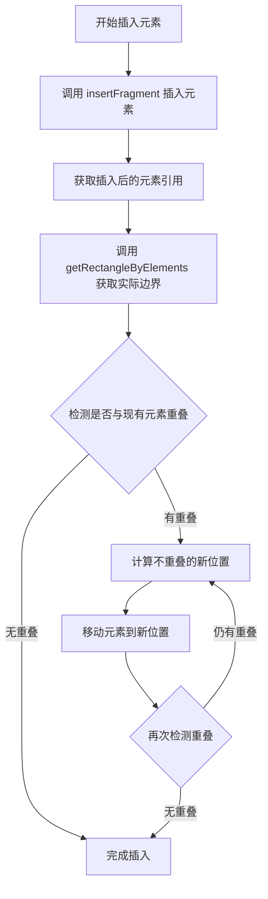
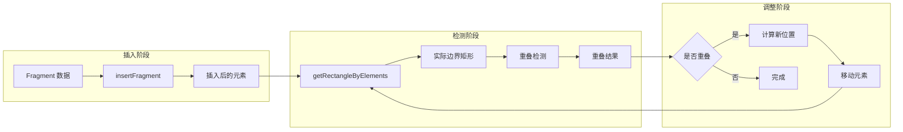

## 产品概述

实现思维导图等动态尺寸元素的插入后重叠检测方案。由于思维导图的实际渲染尺寸在插入前无法预判，需要采用"先插入、后检测、再调整"的策略来确保元素不与画布上其他元素重叠。

## 核心功能

- 元素插入后获取实际渲染尺寸
- 检测新插入元素与现有元素的重叠情况
- 自动将重叠元素移动到不重叠的位置
- 支持思维导图等动态尺寸元素的正确处理

## 技术方案

### 问题分析

根据用户反馈，思维导图插入后仍与其他元素重叠的根本原因：

1. 思维导图的 `points` 只有 `[[0, 0]]`，无法在插入前预判实际尺寸
2. `calculateElementsBoundingRect` 基于 `element.points` 计算，对思维导图无效
3. 实际尺寸需要在 `insertFragment` 执行后通过 `getRectangleByElements` 获取

### 解决方案架构



### 模块划分

#### 1. 重叠检测模块

- **职责**：检测两个矩形区域是否重叠
- **输入**：新元素边界矩形、现有元素边界矩形列表
- **输出**：是否重叠、重叠元素列表

#### 2. 位置计算模块

- **职责**：计算不重叠的新位置
- **策略**：优先向右移动，其次向下移动，保持一定间距
- **输出**：新的 x, y 坐标

#### 3. 元素移动模块

- **职责**：将元素移动到指定位置
- **方式**：通过修改元素的位置属性实现

### 数据流



## 实现细节

### 核心目录结构

```
src/
├── utils/
│   └── overlap-detection.ts    # 新增：重叠检测与位置调整工具函数
```

### 关键代码结构

**边界矩形接口**：定义元素的边界矩形数据结构

```typescript
interface BoundingRect {
  x: number;
  y: number;
  width: number;
  height: number;
}
```

**重叠检测函数**：判断两个矩形是否重叠

```typescript
function isRectOverlap(rect1: BoundingRect, rect2: BoundingRect): boolean;
```

**查找不重叠位置函数**：计算元素的不重叠新位置

```typescript
function findNonOverlapPosition(
  elementRect: BoundingRect,
  existingRects: BoundingRect[],
  gap?: number
): { x: number; y: number };
```

**插入后重叠处理函数**：主流程函数，处理插入后的重叠检测与调整

```typescript
async function handlePostInsertOverlap(
  insertedElements: Element[],
  existingElements: Element[]
): Promise<void>;
```

### 技术实现要点

1. **获取实际尺寸**

- 使用 `getRectangleByElements` 获取思维导图等元素的实际渲染边界
- 该方法在元素插入并渲染后才能返回正确尺寸

2. **重叠检测算法**

- 使用 AABB（轴对齐边界框）碰撞检测
- 两矩形重叠条件：`!(r1.right < r2.left || r1.left > r2.right || r1.bottom < r2.top || r1.top > r2.bottom)`

3. **位置调整策略**

- 优先向右平移，保持 20px 间距
- 若右侧空间不足，向下移动一行
- 循环检测直到找到不重叠位置，设置最大迭代次数防止死循环

4. **元素移动实现**

- 计算位置偏移量 `deltaX`, `deltaY`
- 更新元素的坐标属性

## Agent Extensions

### SubAgent

- **code-explorer**
- Purpose：探索现有代码库，了解 `insertFragment`、`getRectangleByElements` 等函数的实现位置和调用方式，以及元素位置更新的正确方法
- Expected outcome：获取相关函数的具体实现细节和调用上下文，确保新功能与现有代码无缝集成