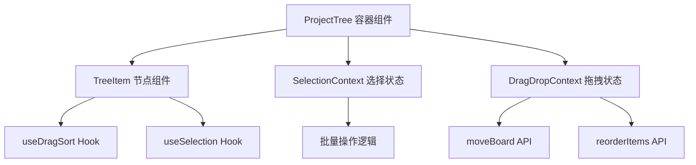
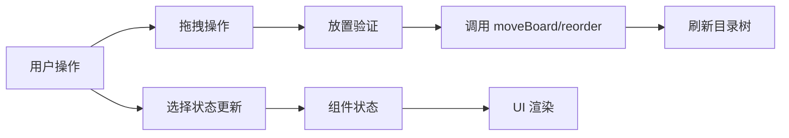

## 产品概述

优化现有项目的目录树组件，实现类似 VSCode 风格的文件管理功能，包括拖拽排序/移动、多选批量操作、复制画板等核心功能，提升用户在管理画板和文件夹时的操作效率和体验。

## 核心功能

- **拖拽排序与移动**：支持画板和文件夹的拖拽操作，可移动到其他文件夹或调整同级顺序
- **多选批量操作**：支持 Ctrl/Cmd+点击进行多选，可批量移动、删除选中项
- **复制画板**：支持复制已有画板，快速创建副本
- **视觉反馈**：拖拽时显示放置指示器，多选时高亮显示选中项
- **右键菜单增强**：根据选中状态显示相应的批量操作选项

## 技术栈

- 前端框架：React + TypeScript（现有项目技术栈）
- 状态管理：React Hooks + Context
- 拖拽实现：复用现有 use-drag-sort.ts hook
- 样式方案：Tailwind CSS（现有项目方案）

## 架构设计

### 系统架构

采用组件化架构，将目录树功能拆分为独立的可复用模块：



### 模块划分

| 模块名称 | 职责 | 关键技术 |
| --- | --- | --- |
| SelectionManager | 管理多选状态、选中项列表 | React Context + useReducer |
| DragDropManager | 处理拖拽逻辑、放置判断 | use-drag-sort.ts |
| TreeItem | 渲染单个节点、处理交互 | React Component |
| ContextMenu | 右键菜单、批量操作入口 | Dropdown Menu |
| BoardCopyService | 复制画板业务逻辑 | API Service |


### 数据流



## 实现细节

### 核心目录结构

```
src/
├── components/
│   └── project-tree/
│       ├── index.tsx              # 主容器组件
│       ├── tree-item.tsx          # 节点组件
│       ├── context-menu.tsx       # 右键菜单
│       └── drop-indicator.tsx     # 放置指示器
├── hooks/
│   ├── use-drag-sort.ts           # 现有拖拽 hook
│   ├── use-selection.ts           # 新增多选 hook
│   └── use-tree-operations.ts     # 树操作 hook
├── contexts/
│   └── selection-context.tsx      # 选择状态 Context
└── services/
    └── board-service.ts           # 画板操作服务
```

### 关键代码结构

```typescript
// 选择状态接口
interface SelectionState {
  selectedIds: Set<string>;
  lastSelectedId: string | null;
  isMultiSelectMode: boolean;
}

// 拖拽数据接口
interface DragData {
  type: 'board' | 'folder';
  id: string;
  sourceParentId: string | null;
}

// 放置目标接口
interface DropTarget {
  targetId: string;
  position: 'before' | 'after' | 'inside';
}
```

### 技术实现要点

1. **多选实现**

- 使用 Set 存储选中 ID，支持高效增删查
- 监听 Ctrl/Cmd 键状态切换多选模式
- Shift+点击支持范围选择

2. **拖拽增强**

- 复用 use-drag-sort.ts 的核心逻辑
- 增加多选拖拽支持（拖拽时移动所有选中项）
- 添加放置位置指示器（上方/下方/内部）

3. **复制画板**

- 调用后端 API 创建画板副本
- 自动生成副本名称（原名称 + "副本"）
- 复制后自动选中新画板

## Agent Extensions

### SubAgent

- **code-explorer**
- 用途：探索现有项目结构，分析 use-drag-sort.ts、moveBoard 方法及目录树组件的实现细节
- 预期结果：获取现有代码的完整实现，了解接口定义和数据结构，确保新功能与现有代码无缝集成