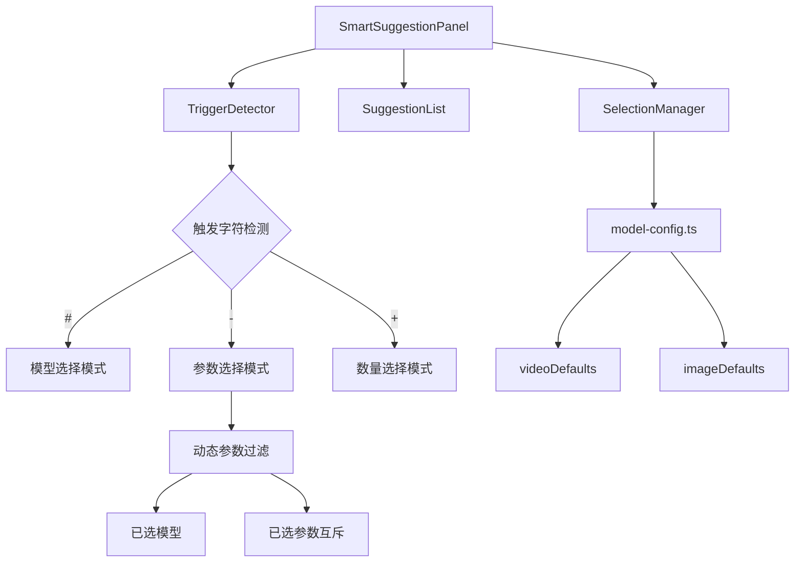

## 产品概述

SmartSuggestionPanel 是一个统一的智能建议面板组件，整合了模型选择、参数提示和生成个数选择功能。用户通过特定前缀触发不同的选择菜单：`#` 触发模型选择、`-` 触发参数提示、`+` 触发生成个数选择。参数列表根据已选模型动态过滤，确保参数与模型兼容且互斥。

## 核心功能

- **# 模型选择**：输入 `#` 触发模型选择菜单，展示可用的视频/图片生成模型
- **- 参数提示**：输入 `-` 触发参数选择菜单，根据当前已选模型动态过滤显示兼容参数
- **+ 生成个数**：输入 `+` 触发数字选择菜单，选择生成内容的数量
- **动态参数过滤**：参数列表根据已选模型实时变化，已选参数互斥不可重复选择
- **统一交互体验**：三种选择模式共用一个面板组件，通过前缀字符切换模式

## 技术栈

- 前端框架：React + TypeScript
- 样式方案：复用项目现有样式体系
- 状态管理：React Hooks

## 技术架构

### 系统架构



### 模块划分

- **SmartSuggestionPanel**：主组件，负责整合所有子功能和状态管理
- **TriggerDetector**：触发检测逻辑，识别 `#`、`-`、`+` 前缀
- **SuggestionList**：通用建议列表渲染，支持模型、参数、数量三种数据类型
- **SelectionManager**：选择状态管理，处理参数互斥和动态过滤逻辑

### 数据流

用户输入触发字符 -> TriggerDetector 识别模式 -> 从 model-config.ts 获取对应数据 -> 动态过滤（参数模式下根据已选模型过滤）-> SuggestionList 渲染 -> 用户选择 -> 更新状态并回调

## 实现细节

### 核心目录结构

```
src/
├── components/
│   └── SmartSuggestionPanel/
│       ├── index.tsx                 # 主组件入口
│       ├── SmartSuggestionPanel.tsx  # 面板主体实现
│       ├── SuggestionList.tsx        # 建议列表组件
│       ├── types.ts                  # 类型定义
│       └── hooks/
│           ├── useTriggerDetection.ts    # 触发检测 Hook
│           └── useParameterFilter.ts     # 参数过滤 Hook
├── config/
│   └── model-config.ts               # 扩展现有配置，添加参数定义
```

### 关键代码结构

**SuggestionMode 类型**：定义三种建议模式的枚举类型。

```typescript
type SuggestionMode = 'model' | 'parameter' | 'count' | null;
```

**SmartSuggestionPanelProps 接口**：定义组件的属性接口，包含当前输入、已选模型、已选参数和选择回调。

```typescript
interface SmartSuggestionPanelProps {
  inputValue: string;
  selectedModel: string | null;
  selectedParams: string[];
  onSelectModel: (model: string) => void;
  onSelectParam: (param: string) => void;
  onSelectCount: (count: number) => void;
}
```

**ParameterConfig 接口**：扩展 model-config.ts 中的参数配置结构，支持模型兼容性定义。

```typescript
interface ParameterConfig {
  key: string;
  label: string;
  compatibleModels: string[];  // 兼容的模型列表
  type: 'video' | 'image';
}
```

### 技术实现方案

1. **触发检测机制**

- 监听输入变化，检测最后输入字符
- 根据 `#`、`-`、`+` 切换对应模式
- 支持关键词过滤搜索

2. **动态参数过滤**

- 从 model-config.ts 的 videoDefaults/imageDefaults 读取参数配置
- 根据 selectedModel 过滤 compatibleModels 包含该模型的参数
- 排除 selectedParams 中已选的参数实现互斥

3. **数量选择菜单**

- 显示预设数字列表（如 1-10）
- 支持快速选择常用数量

## Agent Extensions

### SubAgent

- **code-explorer**
- 用途：探索现有 ModelSelector、PromptSuggestionPanel 组件实现及 model-config.ts 配置结构
- 预期结果：获取现有组件的接口定义、样式规范和配置数据结构，确保新组件与现有代码风格一致