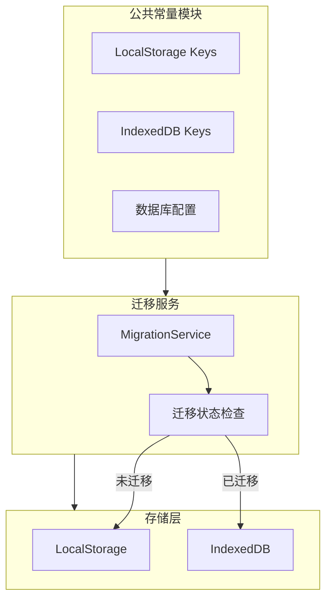
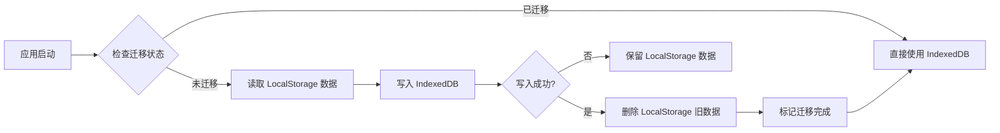

## 产品概述

将 LocalStorage 中有增量风险的数据迁移到 IndexedDB，实现向下兼容的数据迁移方案。同时清理废弃的 IndexedDB 数据库和遗留数据，并新增公共常量模块统一管理所有存储 key。

## 核心功能

- 创建公共常量模块，统一管理 LocalStorage 和 IndexedDB 的所有存储 key
- 将有增量风险的数据（提示词历史、批量缓存、颜色历史等）从 LocalStorage 迁移到 IndexedDB
- 实现向下兼容：先迁移数据到 IndexedDB，迁移成功后删除 LocalStorage 中的旧数据
- 清理废弃的 IndexedDB 数据库
- 清理遗留数据 `aitu-recent-colors-shadow`

## 技术栈

- 存储方案：IndexedDB（主存储）+ LocalStorage（兼容读取）
- 工具库：使用原生 IndexedDB API 或轻量封装
- 语言：TypeScript

## 技术架构

### 系统架构



### 模块划分

- **常量模块 (storage-keys.ts)**：统一管理所有存储 key 常量，包括 LocalStorage keys、IndexedDB 数据库名和 store 名
- **IndexedDB 服务模块**：封装 IndexedDB 操作，提供统一的 CRUD 接口
- **迁移服务模块**：负责数据迁移逻辑，包括读取旧数据、写入新存储、删除旧数据
- **清理服务模块**：负责清理废弃的数据库和遗留数据

### 数据流



## 实现细节

### 核心目录结构

```
src/
├── constants/
│   └── storage-keys.ts          # 新增：存储 key 常量模块
├── services/
│   ├── indexeddb-service.ts     # 新增：IndexedDB 服务封装
│   ├── migration-service.ts     # 新增：数据迁移服务
│   └── storage-cleanup.ts       # 新增：存储清理服务
```

### 关键代码结构

**存储 Key 常量定义**：统一管理所有存储相关的 key，避免硬编码分散在各处，便于维护和追踪。

```typescript
// 常量模块结构
export const STORAGE_KEYS = {
  // LocalStorage keys (待迁移)
  LOCAL_STORAGE: {
    PROMPT_HISTORY: 'aitu-prompt-history',
    BATCH_CACHE: 'aitu-batch-cache',
    RECENT_COLORS: 'aitu-recent-colors',
    // ... 其他 keys
  },
  // IndexedDB 配置
  INDEXED_DB: {
    DATABASE_NAME: 'aitu-storage',
    VERSION: 1,
    STORES: {
      PROMPT_HISTORY: 'prompt-history',
      BATCH_CACHE: 'batch-cache',
      RECENT_COLORS: 'recent-colors',
    }
  },
  // 废弃的 keys（需清理）
  DEPRECATED: {
    RECENT_COLORS_SHADOW: 'aitu-recent-colors-shadow',
    // 废弃的 IndexedDB 数据库名
  }
} as const;
```

**迁移服务接口**：提供数据迁移的核心逻辑，确保迁移过程的原子性和可靠性。

```typescript
// 迁移服务接口
interface MigrationService {
  checkMigrationStatus(): Promise<boolean>;
  migrateToIndexedDB(): Promise<void>;
  cleanupDeprecatedData(): Promise<void>;
}
```

### 技术实现方案

**1. 迁移策略**

- 应用启动时检查迁移状态标记
- 未迁移时执行迁移流程：读取 -> 写入 -> 验证 -> 删除旧数据
- 迁移成功后设置标记，后续启动跳过迁移

**2. 向下兼容**

- 迁移过程中保持 LocalStorage 数据不变
- 仅在 IndexedDB 写入成功并验证后才删除旧数据
- 迁移失败时保留原有存储方式

**3. 错误处理**

- IndexedDB 不可用时降级使用 LocalStorage
- 迁移失败时记录日志，不影响应用正常使用

## Agent Extensions

### SubAgent

- **code-explorer**
- Purpose：探索现有代码库，查找所有 LocalStorage 和 IndexedDB 的使用位置，确定需要迁移的数据 key 和废弃的数据库
- Expected outcome：获取完整的存储 key 列表、现有存储服务的实现方式、以及需要修改的文件清单