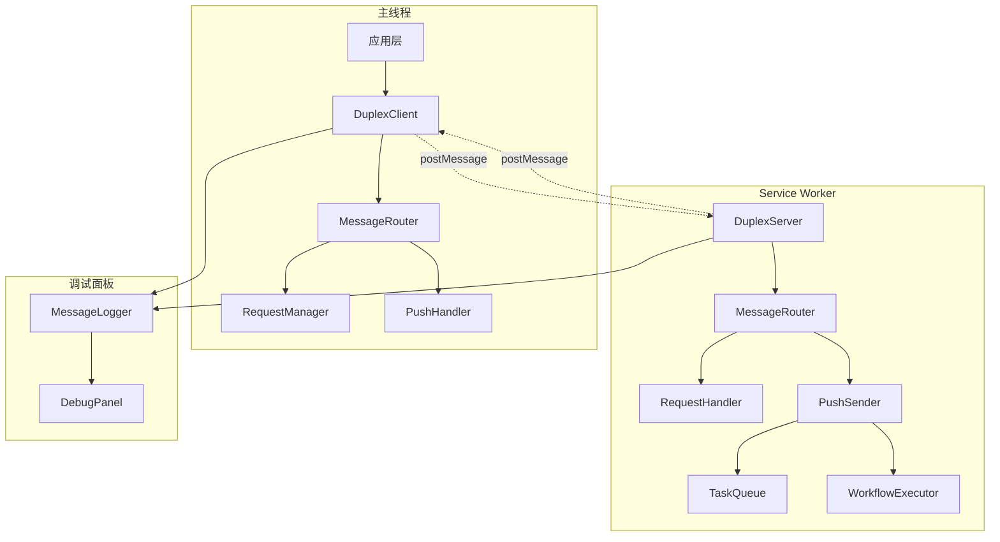
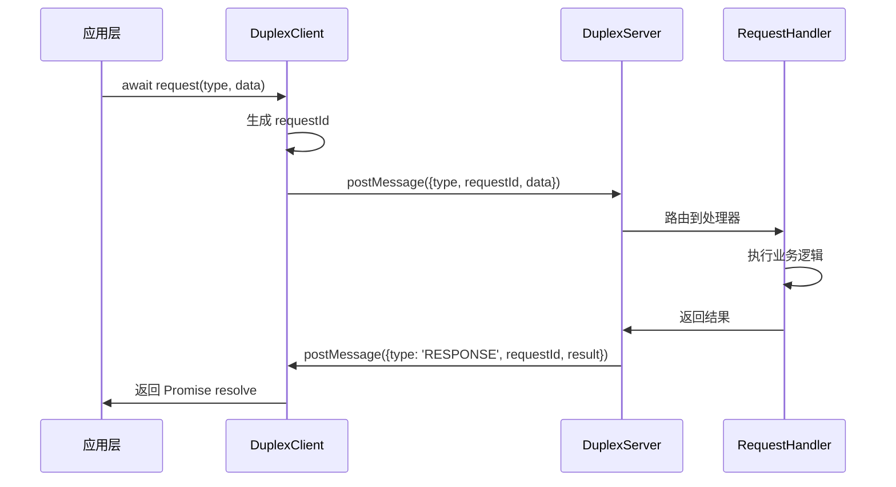
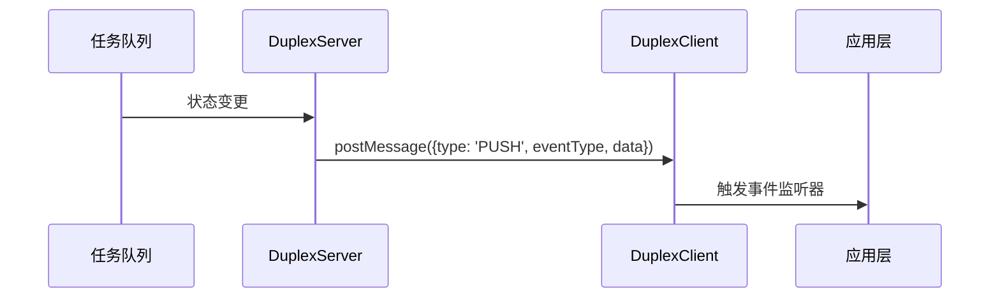

## 产品概述

设计并实现一个基于 postMessage 的双工通讯机制，用于替换现有的 TaskQueue 和 Workflow 通讯系统。新系统将支持请求-响应模式（可通过 await 等待返回数据）和推送模式（状态更新），同时集成调试面板的日志记录功能。

## 核心功能

- **双工通讯协议**：基于 postMessage 实现主线程与 Service Worker 之间的双向通讯
- **请求-响应模式**：支持 async/await 语法，发送端可等待响应数据
- **推送模式**：支持单向推送消息（如状态更新、进度通知）
- **混合通讯模式**：创建任务使用请求-响应，状态更新使用推送
- **调试面板集成**：所有通讯过程可在调试面板中查看和分析
- **消息路由系统**：智能路由不同类型的消息到对应处理器
- **错误处理机制**：完善的超时、重试和错误恢复机制
- **向后兼容**：逐步替换现有通讯，保持系统稳定性

## 技术栈选择

- **核心语言**：TypeScript
- **通讯协议**：postMessage API
- **状态管理**：RxJS Subject/Observable
- **存储**：IndexedDB（消息持久化）
- **调试工具**：现有 sw-debug 面板扩展

## 系统架构

### 整体架构模式

采用分层架构模式，将通讯系统分为协议层、路由层、处理层和应用层：



### 模块划分

#### 协议层模块

- **MessageProtocol**：定义统一的消息格式和类型
- **MessageValidator**：消息格式验证和类型检查
- **MessageSerializer**：消息序列化和反序列化

#### 路由层模块

- **MessageRouter**：消息路由和分发
- **RequestManager**：请求-响应管理（主线程）
- **RequestHandler**：请求处理（Service Worker）

#### 处理层模块

- **TaskQueueAdapter**：TaskQueue 系统适配器
- **WorkflowAdapter**：Workflow 系统适配器
- **DebugLogger**：调试日志记录器

### 数据流设计

#### 请求-响应流程



#### 推送消息流程



## 实现细节

### 核心目录结构

```
packages/drawnix/src/services/duplex-communication/
├── core/
│   ├── protocol.ts          # 消息协议定义
│   ├── client.ts           # 主线程客户端
│   ├── server.ts           # SW 服务端
│   └── types.ts            # 类型定义
├── adapters/
│   ├── task-queue-adapter.ts    # TaskQueue 适配器
│   ├── workflow-adapter.ts      # Workflow 适配器
│   └── debug-adapter.ts         # 调试适配器
├── utils/
│   ├── message-router.ts        # 消息路由
│   ├── request-manager.ts       # 请求管理
│   └── validator.ts             # 消息验证
└── index.ts                     # 统一导出
```

### 关键代码结构

#### 消息协议接口

```typescript
// 统一消息格式
interface DuplexMessage {
  id: string;                    // 消息唯一标识
  type: MessageType;             // 消息类型
  mode: 'request' | 'response' | 'push';  // 通讯模式
  requestId?: string;            // 请求关联ID（响应模式）
  timestamp: number;             // 时间戳
  data?: unknown;                // 消息数据
  error?: string;                // 错误信息
}

// 请求-响应管理器
class RequestManager {
  private pendingRequests: Map<string, PendingRequest> = new Map();
  
  async sendRequest<T>(type: string, data: unknown, timeout = 30000): Promise<T> {
    const requestId = generateId();
    const promise = this.createPendingRequest<T>(requestId, timeout);
    await this.postMessage({ type, mode: 'request', requestId, data });
    return promise;
  }
}
```

#### 双工客户端类

```typescript
class DuplexClient {
  private requestManager = new RequestManager();
  private eventEmitter = new Subject<PushEvent>();
  
  // 请求-响应模式
  async request<T>(type: string, data?: unknown): Promise<T> {
    return this.requestManager.sendRequest<T>(type, data);
  }
  
  // 推送事件监听
  onPush(eventType: string): Observable<unknown> {
    return this.eventEmitter.pipe(
      filter(event => event.type === eventType)
    );
  }
}
```

### 技术实现方案

#### 消息路由策略

1. **类型路由**：根据消息类型路由到不同处理器
2. **模式路由**：区分请求、响应、推送三种模式
3. **优先级路由**：紧急消息优先处理

#### 错误处理策略

1. **超时处理**：请求超时自动清理和错误返回
2. **重试机制**：网络错误自动重试（指数退避）
3. **降级处理**：通讯失败时回退到原有机制

#### 性能优化策略

1. **消息批处理**：高频消息合并发送
2. **连接池管理**：复用 postMessage 连接
3. **内存管理**：定期清理过期请求和缓存

### 集成点设计

#### 与现有系统集成

- **TaskQueue 集成**：通过适配器模式包装现有 TaskQueue API
- **Workflow 集成**：渐进式替换 Workflow 通讯机制
- **调试面板集成**：扩展现有调试面板显示双工通讯日志

#### 向后兼容策略

- **渐进迁移**：新功能使用双工通讯，旧功能保持不变
- **双协议支持**：同时支持新旧两套通讯协议
- **平滑切换**：提供开关控制使用哪套通讯机制

### 调试和监控

#### 调试面板增强

- **消息流可视化**：实时显示消息流向和状态
- **性能监控**：显示请求响应时间、成功率等指标
- **错误追踪**：详细的错误日志和堆栈信息

#### 日志记录策略

- **结构化日志**：统一的日志格式便于分析
- **分级日志**：DEBUG、INFO、WARN、ERROR 四个级别
- **持久化存储**：重要日志存储到 IndexedDB

## Agent Extensions

### SubAgent

- **code-explorer**
- 目的：深度探索现有通讯系统的实现细节，分析 TaskQueue 和 Workflow 的消息流
- 预期结果：获得现有系统的完整架构图和关键接口定义，为新系统设计提供参考