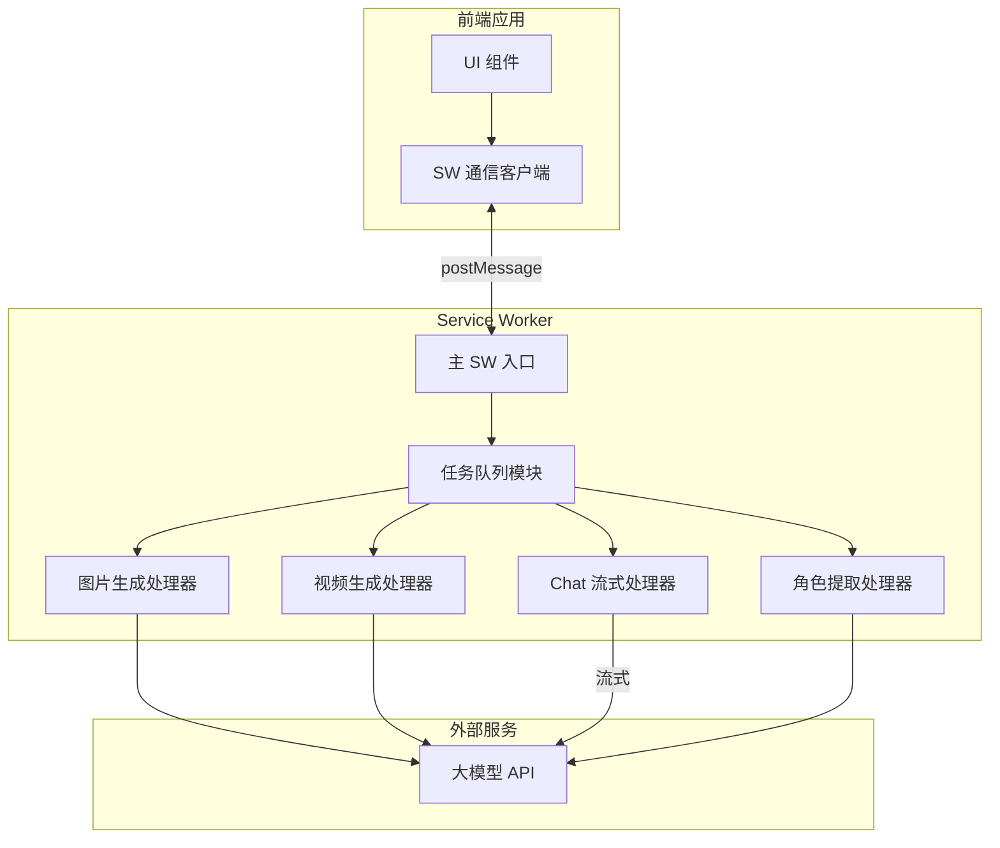
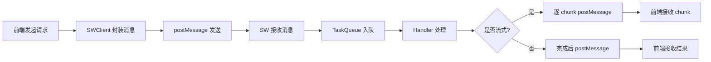

## 产品概述

将现有前端应用中的所有大模型请求迁移至 Service Worker 处理，创建独立的任务队列模块，实现前端与 SW 之间的 postMessage 通信机制，同时保持 Chat 的流式响应能力。

## 核心功能

- **任务队列管理**: 在 Service Worker 中创建独立的任务队列模块，支持任务的添加、执行、状态追踪
- **图片生成请求迁移**: 将图片生成的大模型请求迁移至 SW 处理
- **视频生成请求迁移**: 将视频生成的大模型请求迁移至 SW 处理
- **Chat 流式响应**: 迁移 Chat 请求至 SW，通过 postMessage 逐步传递 chunk 保持流式体验
- **角色提取请求迁移**: 将角色提取的大模型请求迁移至 SW 处理
- **前端通信层**: 封装 postMessage 通信机制，提供统一的请求/响应接口

## 技术栈

- 运行环境: Service Worker
- 通信机制: postMessage / MessageChannel
- 模块化: ES Module import
- 现有技术栈: 复用项目现有的 TypeScript 和前端框架

## 技术架构

### 系统架构



### 模块划分

- **TaskQueue 模块**: 任务队列核心逻辑，负责任务调度、状态管理、优先级处理
- **Handler 模块**: 各类型请求的具体处理器（图片、视频、Chat、角色提取）
- **SWClient 模块**: 前端与 SW 通信的客户端封装
- **Message 模块**: 消息类型定义和序列化/反序列化

### 数据流



## 实现细节

### 核心目录结构

```
src/
├── sw/
│   ├── task-queue/
│   │   ├── index.ts              # 任务队列模块入口
│   │   ├── queue.ts              # 队列核心实现
│   │   ├── types.ts              # 任务类型定义
│   │   └── handlers/
│   │       ├── image.ts          # 图片生成处理器
│   │       ├── video.ts          # 视频生成处理器
│   │       ├── chat.ts           # Chat 流式处理器
│   │       └── character.ts      # 角色提取处理器
│   └── service-worker.ts         # 现有 SW 入口（集成任务队列）
├── lib/
│   └── sw-client/
│       ├── index.ts              # SW 通信客户端
│       ├── types.ts              # 消息类型定义
│       └── stream.ts             # 流式响应处理
```

### 关键代码结构

**任务类型定义**: 定义任务队列中的任务结构，包含任务 ID、类型、负载数据、状态和回调信息。

```typescript
// 任务类型定义
interface Task {
  id: string;
  type: 'image' | 'video' | 'chat' | 'character';
  payload: unknown;
  status: 'pending' | 'running' | 'completed' | 'failed';
  clientId: string;
}

// 消息类型定义
interface SWMessage {
  type: 'request' | 'response' | 'chunk' | 'error';
  taskId: string;
  data: unknown;
}
```

**TaskQueue 类**: 任务队列核心实现，负责任务的入队、出队、执行调度和状态管理。

```typescript
// 任务队列核心
class TaskQueue {
  private queue: Task[] = [];
  private handlers: Map<string, TaskHandler>;
  
  enqueue(task: Task): void { }
  process(): Promise<void> { }
  getStatus(taskId: string): TaskStatus { }
}
```

**SWClient 类**: 前端与 Service Worker 通信的客户端封装，提供请求发送和流式响应订阅能力。

```typescript
// 前端通信客户端
class SWClient {
  request(type: string, payload: unknown): Promise<unknown> { }
  stream(type: string, payload: unknown): AsyncIterable<unknown> { }
}
```

### 技术实现要点

1. **Chat 流式响应实现**

- 问题: 需要在 SW 中处理流式响应并逐步传递给前端
- 方案: 使用 ReadableStream 读取响应，每个 chunk 通过 postMessage 发送
- 步骤: SW 发起 fetch -> 读取 stream -> 解析 chunk -> postMessage 传递 -> 前端重组

2. **任务队列集成**

- 问题: 需要将任务队列模块集成到现有 SW 中
- 方案: 通过 ES Module import 方式引入，在 message 事件中分发到任务队列
- 步骤: 创建独立模块 -> 导出初始化函数 -> 在主 SW 中 import 并调用

3. **错误处理与重试**

- 任务失败时通过 postMessage 返回错误信息
- 支持任务状态查询，前端可追踪任务执行状态

## Agent Extensions

### SubAgent

- **code-explorer**
- 用途: 探索现有项目结构，查找当前的大模型请求实现位置、Service Worker 配置、以及相关的类型定义
- 预期结果: 获取现有代码结构信息，确定需要修改的文件和可复用的代码逻辑