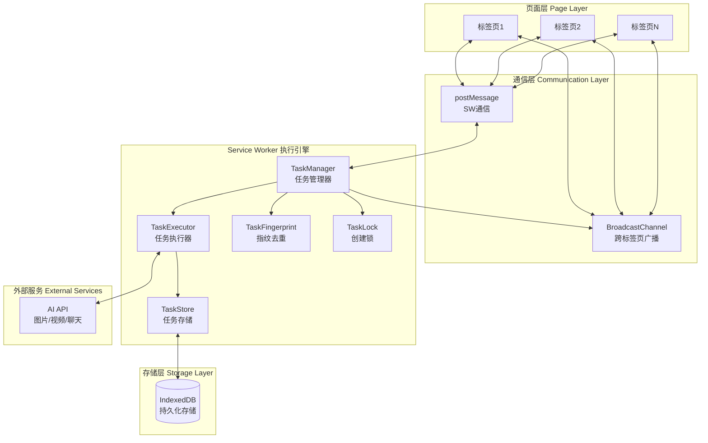
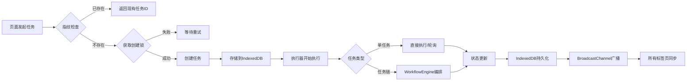

## 产品概述

将 Service Worker 重构为统一的后台任务执行引擎，支持 AI 图片/视频生成和聊天工作流。实现页面刷新不中断任务执行、自动恢复状态、多标签页同步，并通过任务指纹和创建锁机制防止重复请求。

## 核心功能

- **统一任务执行引擎**：SW 作为唯一执行点，支持单任务（图片/视频生成）和多步骤任务链（长视频链、聊天工作流）
- **页面刷新不中断**：任务在 SW 中持续执行，页面刷新后自动同步最新状态
- **多标签页状态同步**：使用 BroadcastChannel 实现跨标签页实时状态广播
- **防重复机制**：任务指纹去重 + 创建锁机制 + 页面端快速拦截，防止并发创建重复任务
- **模块化架构**：将现有约1700行 SW 代码按职责拆分为多个独立模块，提升可维护性

## 技术栈

- 运行环境：Service Worker
- 数据存储：IndexedDB
- 通信机制：postMessage + BroadcastChannel
- 语言：TypeScript

## 技术架构

### 系统架构



### 模块划分

| 模块 | 职责 | 主要接口 |
| --- | --- | --- |
| **TaskManager** | 任务生命周期管理、状态协调 | createTask, cancelTask, getTaskStatus |
| **TaskExecutor** | 任务执行、轮询逻辑、重试机制 | execute, poll, retry |
| **TaskStore** | IndexedDB 存储封装 | save, load, update, delete |
| **TaskFingerprint** | 任务指纹生成与去重检查 | generate, isDuplicate |
| **TaskLock** | 创建锁机制防并发 | acquire, release, isLocked |
| **MessageBus** | 统一消息通信 | broadcast, sendToClient |
| **WorkflowEngine** | 多步骤任务链编排 | runChain, stepComplete |


### 数据流



## 实现细节

### 核心目录结构

```
src/
├── sw/
│   ├── index.ts              # SW 入口，事件监听注册
│   ├── core/
│   │   ├── TaskManager.ts    # 任务管理器
│   │   ├── TaskExecutor.ts   # 任务执行器
│   │   └── WorkflowEngine.ts # 多步骤任务链引擎
│   ├── store/
│   │   ├── TaskStore.ts      # IndexedDB 存储封装
│   │   └── schemas.ts        # 数据结构定义
│   ├── utils/
│   │   ├── TaskFingerprint.ts # 任务指纹生成
│   │   ├── TaskLock.ts       # 创建锁机制
│   │   └── MessageBus.ts     # 消息通信总线
│   ├── executors/
│   │   ├── ImageExecutor.ts  # 图片生成执行器
│   │   ├── VideoExecutor.ts  # 视频生成执行器（含轮询）
│   │   └── ChatExecutor.ts   # 聊天工作流执行器
│   └── types/
│       └── index.ts          # 类型定义
├── lib/
│   └── sw-client.ts          # 页面端 SW 通信封装
```

### 关键代码结构

**任务数据结构**：定义任务的核心属性，包括唯一标识、类型、状态、指纹等信息，支持单任务和任务链两种模式。

```typescript
interface Task {
  id: string;
  fingerprint: string;
  type: 'image' | 'video' | 'chat' | 'workflow';
  status: 'pending' | 'running' | 'polling' | 'completed' | 'failed';
  payload: Record<string, unknown>;
  result?: unknown;
  error?: string;
  createdAt: number;
  updatedAt: number;
  // 任务链相关
  workflowId?: string;
  stepIndex?: number;
  totalSteps?: number;
}
```

**任务管理器接口**：负责任务的创建、取消、查询，集成指纹去重和创建锁机制。

```typescript
class TaskManager {
  async createTask(payload: TaskPayload): Promise<Task> {
    const fingerprint = TaskFingerprint.generate(payload);
    
    // 指纹去重检查
    const existing = await this.store.findByFingerprint(fingerprint);
    if (existing) return existing;
    
    // 获取创建锁
    const lockAcquired = await this.lock.acquire(fingerprint);
    if (!lockAcquired) throw new Error('Task creation in progress');
    
    try {
      const task = await this.store.create({ ...payload, fingerprint });
      this.executor.execute(task);
      return task;
    } finally {
      this.lock.release(fingerprint);
    }
  }
  
  async cancelTask(taskId: string): Promise<void> { }
  async getTaskStatus(taskId: string): Promise<Task | null> { }
  async recoverTasks(): Promise<void> { } // SW 激活时恢复未完成任务
}
```

**消息总线**：统一处理 SW 与页面、多标签页之间的通信。

```typescript
class MessageBus {
  private channel: BroadcastChannel;
  
  broadcast(event: string, data: unknown): void {
    this.channel.postMessage({ event, data });
  }
  
  sendToClient(clientId: string, event: string, data: unknown): void {
    // 通过 postMessage 发送给特定客户端
  }
  
  onMessage(handler: (msg: Message) => void): void { }
}
```

### 技术实现要点

1. **SW 激活恢复机制**

- SW activate 事件时从 IndexedDB 加载未完成任务
- 自动恢复 running/polling 状态的任务继续执行

2. **视频生成轮询**

- VideoExecutor 使用 setInterval 在 SW 中执行轮询
- 轮询间隔可配置，支持指数退避

3. **页面端快速拦截**

- sw-client 维护本地任务缓存
- 创建任务前先本地检查指纹，减少 SW 通信

4. **错误处理与重试**

- 网络错误自动重试（最多3次，指数退避）
- 业务错误直接标记失败并通知页面

## Agent Extensions

### SubAgent

- **code-explorer**
- 用途：深入分析现有 Service Worker 代码结构（约1700行），理解当前的任务处理逻辑、状态管理方式和通信机制
- 预期结果：获取现有代码的模块划分、关键函数、数据结构，为重构提供准确的代码基础