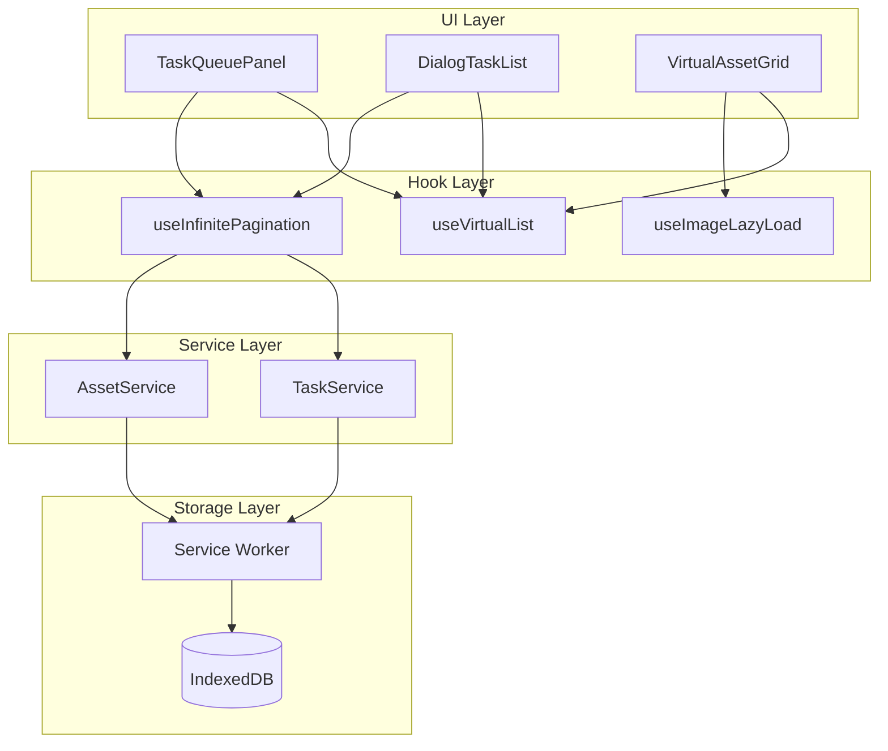
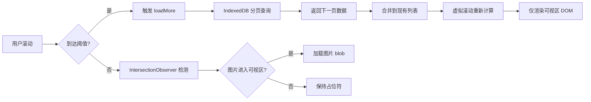

## Product Overview

实现任务队列和素材库的高性能数据展示方案，通过分页加载、虚拟滚动和图片懒加载技术，解决 1000+ 数据量场景下的内存占用和渲染性能问题。

## Core Features

- 虚拟滚动列表：仅渲染可视区域内的 DOM 节点，支持任务队列和素材库两种场景
- 分页数据加载：IndexedDB 分页查询，配合无限滚动实现按需加载
- 图片懒加载：基于 IntersectionObserver 的可视区域检测，延迟加载非可视区图片
- 统一性能优化层：封装通用的虚拟滚动和懒加载 Hook，便于复用

## Tech Stack

- 虚拟滚动：@tanstack/react-virtual（项目已有依赖）
- 图片懒加载：IntersectionObserver API
- 数据分页：IndexedDB cursor 分页查询
- 状态管理：复用现有 Map 缓存机制

## Tech Architecture

### System Architecture



### Module Division

- **useVirtualList Hook**：封装 @tanstack/react-virtual，提供统一的虚拟滚动接口
- **useInfinitePagination Hook**：管理分页状态、加载更多逻辑、数据合并
- **useImageLazyLoad Hook**：IntersectionObserver 封装，管理图片加载状态
- **TaskService 分页扩展**：IndexedDB cursor 分页查询实现
- **LazyImage 组件**：支持懒加载的图片组件，带占位符和加载状态

### Data Flow



## Implementation Details

### Core Directory Structure

```
src/
├── hooks/
│   ├── useVirtualList.ts          # 新增：虚拟滚动封装
│   ├── useInfinitePagination.ts   # 新增：无限分页加载
│   └── useImageLazyLoad.ts        # 新增：图片懒加载
├── components/
│   ├── LazyImage.tsx              # 新增：懒加载图片组件
│   ├── VirtualTaskList.tsx        # 新增：虚拟任务列表
│   └── task-queue/
│       └── TaskQueuePanel.tsx     # 修改：集成虚拟滚动
├── services/
│   └── taskService.ts             # 修改：添加分页查询方法
└── lib/
    └── indexeddb-pagination.ts    # 新增：IndexedDB 分页工具
```

### Key Code Structures

**分页查询接口**：定义分页请求参数和响应结构，支持游标分页模式。

```typescript
interface PaginationParams {
  pageSize: number;
  cursor?: string;  // 上一页最后一条记录的 ID
}

interface PaginatedResult<T> {
  items: T[];
  nextCursor?: string;
  hasMore: boolean;
  total: number;
}
```

**useInfinitePagination Hook**：管理分页状态和加载逻辑，提供统一的无限滚动数据加载接口。

```typescript
interface UseInfinitePaginationOptions<T> {
  fetcher: (params: PaginationParams) => Promise<PaginatedResult<T>>;
  pageSize?: number;
}

interface UseInfinitePaginationReturn<T> {
  items: T[];
  isLoading: boolean;
  hasMore: boolean;
  loadMore: () => Promise<void>;
  reset: () => void;
}
```

**LazyImage 组件接口**：支持懒加载的图片组件，包含占位符、加载状态和错误处理。

```typescript
interface LazyImageProps {
  src: string;
  alt: string;
  placeholder?: React.ReactNode;
  className?: string;
  onLoad?: () => void;
  onError?: () => void;
}
```

### Technical Implementation Plan

**1. IndexedDB 分页查询实现**

- 问题：getAllTasks() 一次性返回所有数据导致内存压力
- 方案：使用 IDBCursor 实现游标分页，每次只查询指定数量
- 技术：IndexedDB openCursor + advance 方法
- 步骤：

1. 扩展 taskService 添加 getTasksPaginated 方法
2. 使用 cursor 遍历并限制返回数量
3. 返回下一页游标用于后续查询

- 验证：对比分页前后内存占用和查询耗时

**2. 虚拟滚动集成**

- 问题：TaskQueuePanel 和 DialogTaskList 渲染 1000+ DOM 节点卡顿
- 方案：复用 @tanstack/react-virtual 实现虚拟滚动
- 技术：useVirtualizer + 动态高度计算
- 步骤：

1. 创建 useVirtualList Hook 封装通用逻辑
2. 改造 TaskQueuePanel 使用虚拟列表
3. 改造 DialogTaskList 使用虚拟列表

- 验证：检查滚动流畅度和 DOM 节点数量

**3. 图片懒加载实现**

- 问题：同时解码 1000+ 张缩略图导致内存暴涨
- 方案：IntersectionObserver 检测可视区域，延迟加载图片
- 技术：IntersectionObserver API + 图片占位符
- 步骤：

1. 创建 useImageLazyLoad Hook
2. 实现 LazyImage 组件
3. 集成到 VirtualAssetGrid 和任务列表

- 验证：监控图片加载时机和内存占用

### Integration Points

- **Service Worker 通信**：分页查询通过现有 SW 消息通道，添加新的消息类型
- **现有 VirtualAssetGrid**：复用其虚拟滚动逻辑，补充分页加载能力
- **Map 缓存同步**：分页加载的数据增量更新到主线程 Map 缓存

## Technical Considerations

### Performance Optimization

- 虚拟滚动 overscan 设置为 5，平衡渲染性能和滚动体验
- 图片懒加载 rootMargin 设置为 200px，提前加载即将进入可视区的图片
- 分页大小设置为 50，平衡请求次数和单次数据量
- 使用 requestIdleCallback 处理非紧急的图片预加载

### Logging

- 记录分页加载耗时和数据量
- 监控虚拟滚动渲染的 DOM 节点数量
- 追踪图片懒加载命中率

## Agent Extensions

### SubAgent

- **code-explorer**
- Purpose：探索现有代码结构，了解 TaskQueuePanel、DialogTaskList、VirtualAssetGrid 的实现细节，以及 taskService 和 Service Worker 的数据交互方式
- Expected outcome：获取现有组件的 props 接口、数据流转方式、IndexedDB 操作方法，为分页和虚拟滚动改造提供准确的代码上下文