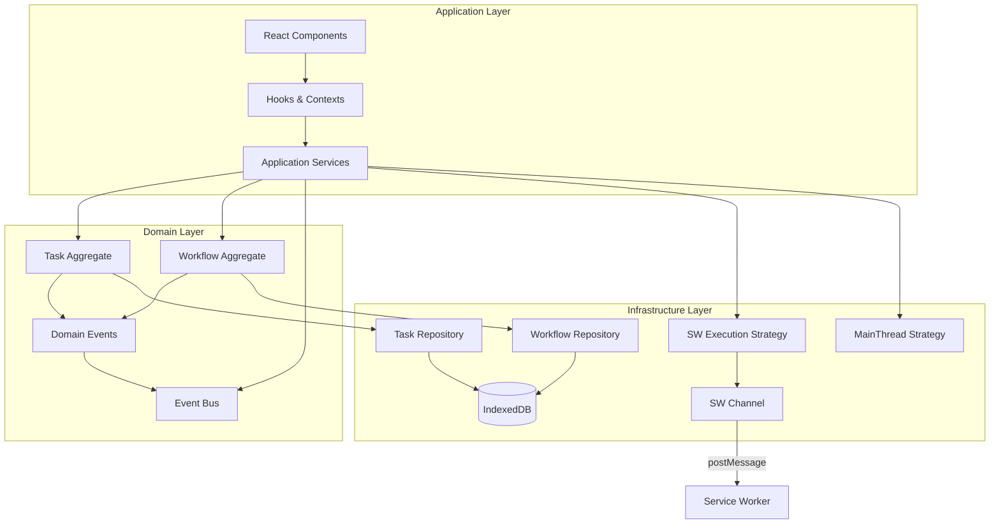
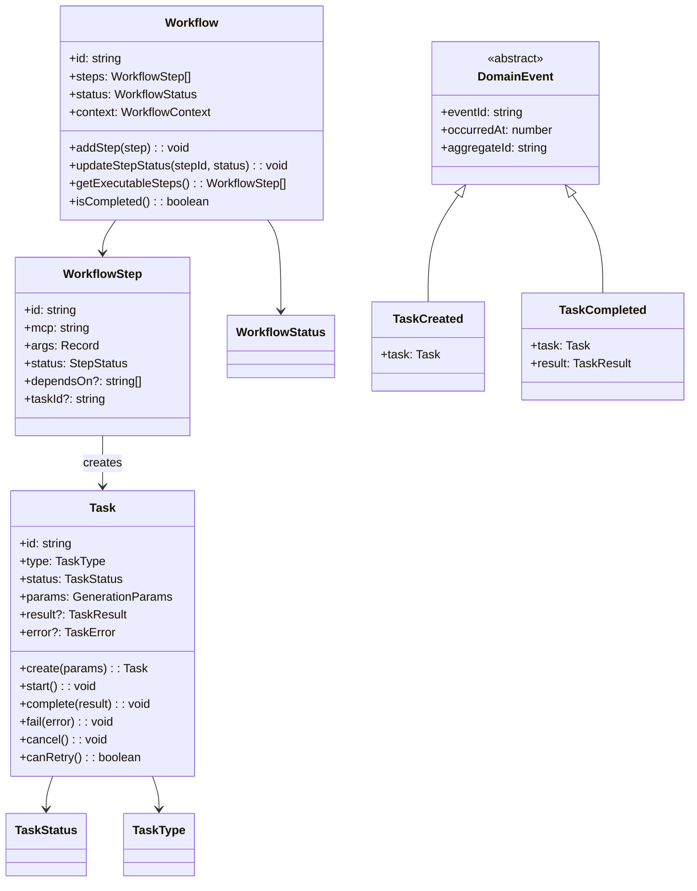

## 用户需求

对当前项目的任务(Task)和工作流(Workflow)相关逻辑进行架构分析，引入领域驱动设计(DDD)方式来降低复杂度，收敛领域知识，并便于后续扩展。

## 产品概述

当前系统是一个 AI 图像/视频生成工具，核心功能涉及：

- **任务队列管理**：支持图片、视频、角色提取、灵感板等多种生成任务
- **工作流编排**：支持多步骤 MCP 工具调用的工作流执行
- **双模式执行**：Service Worker 模式（主用）和主线程降级模式
- **状态同步**：主线程与 SW 之间的双向通信和状态同步

## 核心问题分析

### 1. 类型定义散落重复（3处）

- `packages/drawnix/src/types/task.types.ts` - 主线程类型
- `apps/web/src/sw/task-queue/types.ts` - SW 端类型
- `packages/drawnix/src/services/sw-channel/types/` - 通信层类型
- 依赖注释 "Keep in sync with..." 维护一致性，极易出错

### 2. 双模式维护成本高

- SW 模式：`swTaskQueueService` + `SWTaskQueue` + `WorkflowExecutor`
- 降级模式：`taskQueueService` + `WorkflowEngine`
- 两套几乎相同的任务执行和状态管理逻辑

### 3. 工作流状态分散

- `WorkflowContext` - React 状态
- `WorkflowSubmissionService` - 提交服务
- `WorkflowPollingService` - 轮询服务
- `WorkflowCompletionService` - 后处理追踪
- `workflowStorageReader/Writer` - 存储服务
- 各服务独立维护状态，难以追踪完整生命周期

### 4. 职责边界模糊

- `swTaskQueueService` 既管理任务状态，又负责 SW 通信
- `workflowSubmissionService` 既负责提交，又处理恢复和事件分发
- 缺乏清晰的领域边界

### 5. 缺乏统一领域事件

- 各服务使用独立 RxJS Subject，事件类型不统一
- 跨服务协调依赖直接方法调用，耦合度高

## 设计目标

1. **统一领域模型**：建立任务和工作流的单一真相来源(Single Source of Truth)
2. **清晰边界划分**：应用 DDD 分层架构，分离领域逻辑与基础设施
3. **降低耦合度**：通过领域事件实现服务间松耦合通信
4. **消除重复**：统一类型定义，抽象共享行为
5. **可扩展性**：支持新任务类型和工作流步骤的低成本接入

## 技术栈

- **语言**：TypeScript（严格模式）
- **状态管理**：RxJS（领域事件流）
- **持久化**：IndexedDB（通过 localforage）
- **通信**：postmessage-duplex（SW 双工通信）
- **UI 框架**：React + Context API

## 实现方案

### DDD 分层架构设计

采用经典 DDD 四层架构，适配当前 Service Worker + 主线程的双模式场景：

```
┌─────────────────────────────────────────────────────────────┐
│                    Application Layer                         │
│   (React Hooks/Context, WorkflowSubmissionService)          │
├─────────────────────────────────────────────────────────────┤
│                    Domain Layer (NEW)                        │
│   Task Aggregate │ Workflow Aggregate │ Domain Events       │
├─────────────────────────────────────────────────────────────┤
│                Infrastructure Layer                          │
│   SW Channel │ Storage │ API Services │ Executors           │
└─────────────────────────────────────────────────────────────┘
```

### 1. 统一领域模型（Domain Layer）

#### 核心聚合根

```
packages/drawnix/src/domain/
├── task/
│   ├── task.ts              # Task 聚合根（值对象 + 行为）
│   ├── task-status.ts       # TaskStatus 值对象
│   ├── task-type.ts         # TaskType 值对象
│   └── task-repository.ts   # 仓储接口
├── workflow/
│   ├── workflow.ts          # Workflow 聚合根
│   ├── workflow-step.ts     # WorkflowStep 实体
│   └── workflow-repository.ts # 仓储接口
├── events/
│   ├── domain-event.ts      # 领域事件基类
│   ├── task-events.ts       # 任务相关事件
│   ├── workflow-events.ts   # 工作流相关事件
│   └── event-bus.ts         # 统一事件总线
└── index.ts                 # 公共导出
```

#### 设计要点

**Task 聚合根**：封装任务状态机和业务规则

- 状态转换：`PENDING → PROCESSING → COMPLETED/FAILED/CANCELLED`
- 执行阶段：`SUBMITTING → POLLING → DOWNLOADING`
- 业务规则：只有 FAILED/CANCELLED 状态的任务可重试

**Workflow 聚合根**：封装工作流编排逻辑

- 步骤依赖解析和并行执行
- 动态步骤添加（AI 分析后添加）
- 主线程/SW 步骤分类和路由

**领域事件**：统一的事件契约

- `TaskCreated`, `TaskStatusChanged`, `TaskCompleted`, `TaskFailed`
- `WorkflowStarted`, `WorkflowStepCompleted`, `WorkflowCompleted`

### 2. 仓储模式（Repository Pattern）

抽象存储访问，隔离 IndexedDB 细节：

```typescript
// 仓储接口（领域层）
interface TaskRepository {
  findById(id: string): Promise<Task | null>;
  findByStatus(status: TaskStatus): Promise<Task[]>;
  save(task: Task): Promise<void>;
  delete(id: string): Promise<void>;
}

// 实现（基础设施层）
class IndexedDBTaskRepository implements TaskRepository {
  // 封装 taskStorageReader/Writer
}
```

### 3. 执行策略模式（Strategy Pattern）

统一 SW 和主线程执行器接口：

```typescript
// 执行策略接口
interface TaskExecutionStrategy {
  execute(task: Task): Promise<TaskResult>;
  cancel(taskId: string): Promise<void>;
  resume(task: Task): Promise<TaskResult>;
}

// SW 执行策略
class SWExecutionStrategy implements TaskExecutionStrategy { }

// 主线程降级执行策略
class MainThreadExecutionStrategy implements TaskExecutionStrategy { }

// 策略选择器
class ExecutionStrategySelector {
  async getStrategy(): Promise<TaskExecutionStrategy> {
    return await this.isSWAvailable()
      ? this.swStrategy
      : this.mainThreadStrategy;
  }
}
```

### 4. 统一事件总线

替代分散的 RxJS Subject：

```typescript
// 领域事件基类
abstract class DomainEvent {
  readonly eventId: string;
  readonly occurredAt: number;
  readonly aggregateId: string;
}

// 事件总线
class DomainEventBus {
  private subject = new Subject<DomainEvent>();

  publish(event: DomainEvent): void {
    this.subject.next(event);
  }

  subscribe<T extends DomainEvent>(
    eventType: new (...args: any[]) => T,
    handler: (event: T) => void
  ): Subscription {
    return this.subject.pipe(
      filter((e): e is T => e instanceof eventType)
    ).subscribe(handler);
  }

  // 支持按聚合 ID 过滤
  subscribeToAggregate(
    aggregateId: string,
    handler: (event: DomainEvent) => void
  ): Subscription { }
}
```

### 5. 应用服务重构

简化现有服务，专注协调领域操作：

```typescript
// 重构后的 TaskApplicationService
class TaskApplicationService {
  constructor(
    private taskRepo: TaskRepository,
    private executionStrategy: ExecutionStrategySelector,
    private eventBus: DomainEventBus
  ) {}

  async createTask(params: CreateTaskParams): Promise<Task> {
    const task = Task.create(params);
    await this.taskRepo.save(task);
    this.eventBus.publish(new TaskCreated(task));
    
    // 异步执行
    this.executeTask(task);
    return task;
  }

  private async executeTask(task: Task): Promise<void> {
    const strategy = await this.executionStrategy.getStrategy();
    try {
      const result = await strategy.execute(task);
      task.complete(result);
      this.eventBus.publish(new TaskCompleted(task));
    } catch (error) {
      task.fail(error);
      this.eventBus.publish(new TaskFailed(task, error));
    }
    await this.taskRepo.save(task);
  }
}
```

## 实现说明

### 迁移策略

采用**渐进式重构**，不一次性重写：

1. **Phase 1**：建立领域层，新代码使用新模型
2. **Phase 2**：逐步迁移现有服务到新架构
3. **Phase 3**：废弃旧代码，统一到新模型

### 关键设计决策

1. **类型统一**：领域层定义唯一类型，SW/主线程通过序列化/反序列化共享
2. **事件溯源预留**：领域事件设计支持未来引入事件溯源
3. **SW 边界清晰**：SW 只作为执行器，领域逻辑在主线程
4. **React 集成**：通过 `useDomainEvent` Hook 将领域事件桥接到 React

### 性能考量

- 领域事件使用 RxJS Subject，内存占用可控
- 仓储层实现缓存策略，减少 IndexedDB 访问
- 大批量任务支持分页加载

## 架构设计

### 系统架构图



### 领域模型类图



## 目录结构

```
packages/drawnix/src/
├── domain/                              # [NEW] 领域层 - 核心业务逻辑
│   ├── task/
│   │   ├── task.ts                     # Task 聚合根。封装任务状态机（PENDING→PROCESSING→COMPLETED/FAILED），包含 create()、start()、complete()、fail()、cancel() 等状态转换方法，以及 canRetry() 等业务规则校验。
│   │   ├── task-status.ts              # TaskStatus 值对象。定义任务状态枚举，统一主线程和 SW 的状态定义，消除当前 3 处重复定义的问题。
│   │   ├── task-type.ts                # TaskType 值对象。定义任务类型（IMAGE/VIDEO/CHARACTER/INSPIRATION_BOARD/CHAT），包含类型相关的配置（超时时间等）。
│   │   ├── task-result.ts              # TaskResult 值对象。封装任务结果数据结构，支持不同类型任务的结果格式。
│   │   ├── task-repository.ts          # TaskRepository 接口。定义任务仓储契约（findById/findByStatus/save/delete），隔离持久化细节。
│   │   └── index.ts                    # Task 模块导出。
│   ├── workflow/
│   │   ├── workflow.ts                 # Workflow 聚合根。封装工作流状态管理和步骤编排逻辑，包含 addStep()、updateStepStatus()、getExecutableSteps() 等方法。
│   │   ├── workflow-step.ts            # WorkflowStep 实体。定义工作流步骤结构，包含依赖关系、执行状态、关联的任务 ID 等。
│   │   ├── workflow-status.ts          # WorkflowStatus 值对象。定义工作流状态枚举（pending/running/completed/failed/cancelled）。
│   │   ├── workflow-repository.ts      # WorkflowRepository 接口。定义工作流仓储契约。
│   │   └── index.ts                    # Workflow 模块导出。
│   ├── events/
│   │   ├── domain-event.ts             # DomainEvent 基类。定义所有领域事件的公共属性（eventId、occurredAt、aggregateId），提供事件序列化能力。
│   │   ├── task-events.ts              # 任务领域事件。包含 TaskCreated、TaskStatusChanged、TaskCompleted、TaskFailed、TaskCancelled 等事件类。
│   │   ├── workflow-events.ts          # 工作流领域事件。包含 WorkflowStarted、WorkflowStepStatusChanged、WorkflowStepCompleted、WorkflowCompleted、WorkflowFailed 等事件类。
│   │   ├── event-bus.ts                # DomainEventBus 单例。统一的事件发布/订阅中心，替代分散的 RxJS Subject，支持按事件类型和聚合 ID 过滤订阅。
│   │   └── index.ts                    # Events 模块导出。
│   ├── shared/
│   │   ├── generation-params.ts        # GenerationParams 值对象。统一的生成参数定义，被 Task 和 Workflow 共享。
│   │   └── index.ts                    # Shared 模块导出。
│   └── index.ts                        # 领域层统一导出。
├── application/                         # [NEW] 应用服务层 - 用例编排
│   ├── task-application-service.ts     # TaskApplicationService。协调任务创建、执行、状态更新的用例，使用仓储和执行策略，发布领域事件。替代当前 swTaskQueueService 中的业务逻辑。
│   ├── workflow-application-service.ts # WorkflowApplicationService。协调工作流提交、步骤执行、状态同步的用例，整合当前 workflowSubmissionService、workflowPollingService、workflowCompletionService 的职责。
│   └── index.ts                        # 应用服务层导出。
├── infrastructure/                      # [MODIFY] 基础设施层 - 重组现有服务
│   ├── persistence/
│   │   ├── indexeddb-task-repository.ts    # IndexedDBTaskRepository。实现 TaskRepository 接口，封装 taskStorageReader/Writer，提供任务持久化能力。
│   │   ├── indexeddb-workflow-repository.ts # IndexedDBWorkflowRepository。实现 WorkflowRepository 接口，封装 workflowStorageReader/Writer。
│   │   └── index.ts                        # 持久化模块导出。
│   ├── execution/
│   │   ├── execution-strategy.ts           # TaskExecutionStrategy 接口。定义任务执行策略契约（execute/cancel/resume）。
│   │   ├── sw-execution-strategy.ts        # SWExecutionStrategy。通过 SW Channel 执行任务的策略实现，封装 swChannelClient 调用。
│   │   ├── mainthread-execution-strategy.ts # MainThreadExecutionStrategy。主线程降级执行策略，封装 media-executor 调用。
│   │   ├── execution-strategy-selector.ts  # ExecutionStrategySelector。根据 SW 可用性自动选择执行策略的选择器。
│   │   └── index.ts                        # 执行策略模块导出。
│   └── index.ts                            # 基础设施层导出。
├── hooks/
│   ├── useDomainEvent.ts               # [NEW] useDomainEvent Hook。将领域事件桥接到 React，订阅指定类型的事件并触发组件更新。
│   ├── useTask.ts                      # [MODIFY] 重构为使用 TaskApplicationService 和 useDomainEvent，简化状态管理逻辑。
│   └── useWorkflow.ts                  # [MODIFY] 重构为使用 WorkflowApplicationService 和 useDomainEvent。
└── services/
    ├── sw-task-queue-service.ts        # [MODIFY] 简化为薄层，委托给 TaskApplicationService，保留向后兼容的 API。
    ├── workflow-submission-service.ts  # [MODIFY] 简化为薄层，委托给 WorkflowApplicationService。
    └── ...                             # 其他服务保持不变或逐步迁移。
```

## 核心代码结构

### Task 聚合根接口

```typescript
/**
 * Task 聚合根
 * 封装任务状态机和业务规则
 */
export class Task {
  private constructor(
    public readonly id: string,
    public readonly type: TaskType,
    private _status: TaskStatus,
    public readonly params: GenerationParams,
    public readonly createdAt: number,
    private _updatedAt: number,
    private _startedAt?: number,
    private _completedAt?: number,
    private _result?: TaskResult,
    private _error?: TaskError,
    private _progress?: number,
    private _executionPhase?: TaskExecutionPhase
  ) {}

  // 工厂方法
  static create(params: CreateTaskParams): Task;

  // 状态查询
  get status(): TaskStatus;
  get result(): TaskResult | undefined;
  get error(): TaskError | undefined;

  // 状态转换
  start(): void;
  updateProgress(progress: number, phase?: TaskExecutionPhase): void;
  complete(result: TaskResult): void;
  fail(error: TaskError): void;
  cancel(): void;

  // 业务规则
  canRetry(): boolean;
  isTerminal(): boolean;
}
```

### DomainEventBus 接口

```typescript
/**
 * 领域事件总线
 * 统一的事件发布/订阅中心
 */
export class DomainEventBus {
  private static instance: DomainEventBus;
  private subject = new Subject<DomainEvent>();

  static getInstance(): DomainEventBus;

  // 发布事件
  publish(event: DomainEvent): void;

  // 按类型订阅
  subscribe<T extends DomainEvent>(
    eventType: new (...args: any[]) => T,
    handler: (event: T) => void
  ): Subscription;

  // 按聚合 ID 订阅
  subscribeToAggregate(
    aggregateId: string,
    handler: (event: DomainEvent) => void
  ): Subscription;

  // 订阅所有事件（调试用）
  subscribeAll(handler: (event: DomainEvent) => void): Subscription;
}
```

### ExecutionStrategySelector 接口

```typescript
/**
 * 执行策略选择器
 * 自动选择 SW 或主线程执行策略
 */
export class ExecutionStrategySelector {
  constructor(
    private swStrategy: SWExecutionStrategy,
    private mainThreadStrategy: MainThreadExecutionStrategy
  ) {}

  async getStrategy(): Promise<TaskExecutionStrategy> {
    const swAvailable = await this.checkSWAvailability();
    return swAvailable ? this.swStrategy : this.mainThreadStrategy;
  }

  private async checkSWAvailability(): Promise<boolean>;
}
```

## Agent Extensions

### SubAgent

- **code-explorer**
- 目的：在实现阶段深度探索现有服务的具体实现细节，包括 SW 端的 handlers、存储实现、通信协议等
- 预期结果：获取完整的代码上下文，确保新领域层与现有基础设施的正确集成