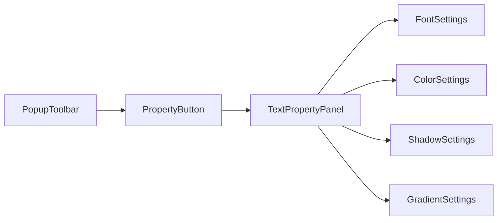

## 产品概述

在 popup-toolbar 工具栏最右侧添加一个属性设置按钮，点击后从选中元素的右侧滑出一个属性面板，整合所有文本相关的属性设置功能，同时移除原有分散在工具栏上的相关按钮，使界面更加简洁统一。

## 核心功能

- 属性设置按钮：在 popup-toolbar 最右侧添加属性设置入口按钮
- 滑出式属性面板：点击按钮后，面板从选中元素右侧向右滑出展开
- 文本属性整合：面板内整合字体、字号、颜色、阴影、渐变等文本属性设置
- 工具栏精简：移除 popup-toolbar 上原有的字体、阴影、渐变等分散按钮

## 技术方案

### 系统架构

基于现有项目架构进行增量开发，复用现有的组件结构和状态管理模式。



### 模块划分

- **PropertyButton 组件**：属性设置入口按钮，负责触发面板的显示/隐藏
- **TextPropertyPanel 组件**：滑出式属性面板容器，包含动画效果和定位逻辑
- **属性设置子组件**：复用或迁移现有的字体、字号、颜色、阴影、渐变设置组件

### 数据流

用户点击属性按钮 -> 更新面板显示状态 -> 计算面板定位（基于选中元素位置） -> 渲染属性面板 -> 用户修改属性 -> 更新文本样式

## 实现细节

### 核心目录结构

```
src/
├── components/
│   ├── popup-toolbar/
│   │   ├── PropertyButton.tsx      # 新增：属性设置按钮
│   │   └── index.tsx               # 修改：添加按钮，移除旧按钮
│   └── text-property-panel/
│       ├── index.tsx               # 新增：属性面板主容器
│       ├── FontSettings.tsx        # 新增/迁移：字体字号设置
│       ├── ColorSettings.tsx       # 新增/迁移：颜色设置
│       ├── ShadowSettings.tsx      # 新增/迁移：阴影设置
│       └── GradientSettings.tsx    # 新增/迁移：渐变设置
```

### 关键代码结构

**面板状态接口**：定义属性面板的显示状态和定位信息

```typescript
interface TextPropertyPanelState {
  isOpen: boolean;
  position: { top: number; left: number };
  selectedElement: HTMLElement | null;
}
```

**面板定位逻辑**：根据选中元素计算面板位置，确保从元素右侧滑出

```typescript
function calculatePanelPosition(element: HTMLElement): Position {
  const rect = element.getBoundingClientRect();
  return {
    top: rect.top,
    left: rect.right + 8  // 元素右侧偏移8px
  };
}
```

### 技术实现要点

1. **滑出动画**：使用 CSS transform + transition 实现平滑的右滑展开效果
2. **定位策略**：基于选中元素的 getBoundingClientRect 动态计算面板位置
3. **组件复用**：尽量复用现有的字体、阴影、渐变设置逻辑，迁移到新面板中
4. **点击外部关闭**：监听点击事件，点击面板外部时自动收起

## 设计风格

采用与现有 popup-toolbar 一致的设计语言，属性面板使用卡片式设计，配合平滑的滑出动画，营造流畅的交互体验。

## 页面设计

### 属性设置按钮

- 位于 popup-toolbar 最右侧
- 使用设置/属性图标（如齿轮或滑块图标）
- 悬停时显示 tooltip 提示"属性设置"
- 激活状态时高亮显示

### 属性面板

- 从选中元素右侧向右滑出，带有平滑的 slide-in 动画
- 面板宽度约 280px，圆角卡片设计
- 轻微阴影增加层次感
- 内部分区展示各属性设置项

### 面板内容区块

- **字体设置区**：字体选择下拉框、字号输入/选择
- **颜色设置区**：文本颜色选择器
- **阴影设置区**：阴影开关及参数调整
- **渐变设置区**：渐变类型选择及颜色配置

## Agent Extensions

### SubAgent

- **code-explorer**
- Purpose: 探索现有 popup-toolbar 组件结构，查找字体、阴影、渐变相关按钮的实现位置和逻辑
- Expected outcome: 获取现有组件的文件路径、组件结构、状态管理方式，为迁移和移除提供依据