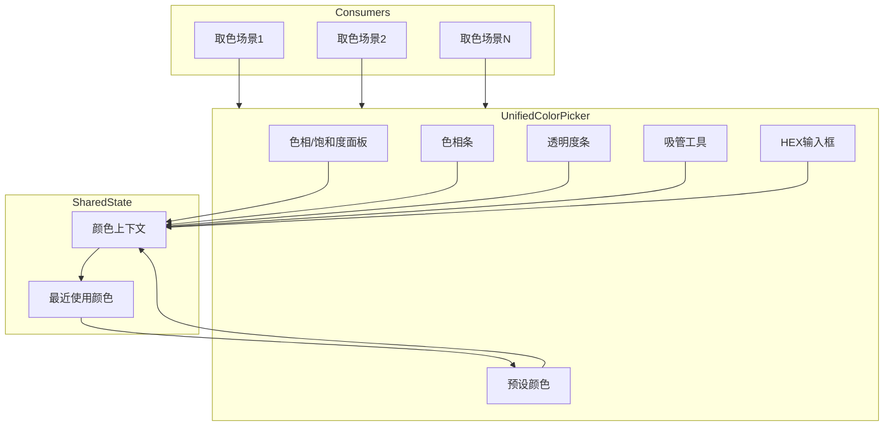
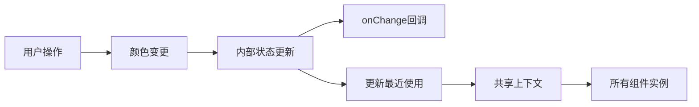

## 产品概述

封装一个统一的公共取色器组件 `UnifiedColorPicker`，提供完整的颜色选择功能，用于替换项目中所有现有的取色场景，确保用户体验一致性。

## 核心功能

- 色相/饱和度面板：大面板支持直观选择颜色的饱和度和明度
- 色相条：水平或垂直色相选择条，覆盖 0-360 度色相范围
- 透明度条：支持 0-100% 透明度调节，显示棋盘格背景
- 预设颜色：使用现有 CLASSIC_COLORS 常量，以圆点形式展示快速选择
- 吸管工具：支持从屏幕任意位置取色
- HEX 输入：支持手动输入 HEX 颜色值，附带透明度百分比输入
- 最近使用颜色：所有取色场景共享最近使用的颜色记录

## 技术栈

基于项目现有技术栈进行开发：

- 前端框架：React + TypeScript
- 样式方案：沿用项目现有样式方案
- 状态管理：使用 React Context 或现有状态管理方案共享最近使用颜色

## 技术架构

### 系统架构



### 模块划分

- **UnifiedColorPicker 主组件**：整合所有子组件，管理内部颜色状态
- **HSPanel 子组件**：色相/饱和度二维选择面板
- **HueSlider 子组件**：色相条滑块组件
- **AlphaSlider 子组件**：透明度条滑块组件
- **PresetColors 子组件**：预设颜色圆点展示
- **EyeDropper 子组件**：吸管取色工具
- **HexInput 子组件**：HEX 值和透明度输入
- **RecentColorsContext**：最近使用颜色的共享上下文

### 数据流



## 实现细节

### 核心目录结构

```
src/
├── components/
│   └── UnifiedColorPicker/
│       ├── index.tsx                 # 主组件导出
│       ├── UnifiedColorPicker.tsx    # 主组件实现
│       ├── HSPanel.tsx               # 色相/饱和度面板
│       ├── HueSlider.tsx             # 色相条
│       ├── AlphaSlider.tsx           # 透明度条
│       ├── PresetColors.tsx          # 预设颜色
│       ├── EyeDropper.tsx            # 吸管工具
│       ├── HexInput.tsx              # HEX输入
│       ├── RecentColorsContext.tsx   # 最近使用颜色上下文
│       ├── types.ts                  # 类型定义
│       ├── utils.ts                  # 颜色转换工具函数
│       └── styles.module.css         # 样式文件
```

### 关键代码结构

**颜色数据结构**：定义 HSV、RGB、RGBA 颜色模型及组件 Props 接口

```typescript
interface HSVColor {
  h: number;  // 0-360
  s: number;  // 0-100
  v: number;  // 0-100
}

interface RGBAColor {
  r: number;  // 0-255
  g: number;  // 0-255
  b: number;  // 0-255
  a: number;  // 0-1
}

interface UnifiedColorPickerProps {
  value?: string;           // HEX 或 RGBA 字符串
  onChange?: (color: string) => void;
  showAlpha?: boolean;      // 是否显示透明度
  showEyeDropper?: boolean; // 是否显示吸管
  presetColors?: string[];  // 自定义预设颜色
}
```

**最近使用颜色上下文**：提供跨组件共享的最近使用颜色状态

```typescript
interface RecentColorsContextValue {
  recentColors: string[];
  addRecentColor: (color: string) => void;
}

const RecentColorsContext = React.createContext<RecentColorsContextValue | null>(null);
```

**颜色转换工具函数**：HSV/RGB/HEX 之间的相互转换

```typescript
function hsvToRgb(hsv: HSVColor): RGBAColor;
function rgbToHsv(rgb: RGBAColor): HSVColor;
function rgbToHex(rgb: RGBAColor): string;
function hexToRgb(hex: string): RGBAColor | null;
```

### 技术实现要点

1. **色相/饱和度面板**

- 使用 Canvas 或 CSS 渐变绘制二维色彩空间
- 支持鼠标拖拽和点击选择
- 实时预览当前选中位置

2. **吸管工具**

- 使用 EyeDropper API（需检测浏览器支持）
- 不支持时隐藏或禁用吸管按钮

3. **最近使用颜色持久化**

- 使用 localStorage 存储最近使用颜色
- 限制最大存储数量（如 10 个）
- 通过 Context 实现跨组件共享

4. **HEX 输入验证**

- 支持 3 位、6 位、8 位 HEX 格式
- 实时验证输入合法性
- 失焦时自动格式化

## Agent Extensions

### SubAgent

- **code-explorer**
- 用途：探索项目现有代码结构，查找所有现有取色器使用场景、CLASSIC_COLORS 常量定义位置、现有颜色相关组件和工具函数
- 预期结果：获取项目中所有需要替换的取色场景列表，以及可复用的现有代码资源