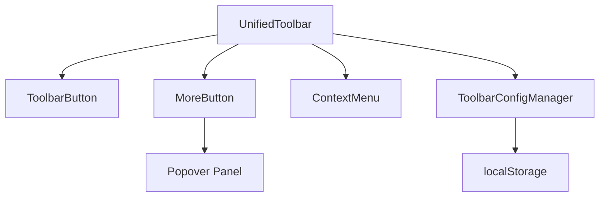
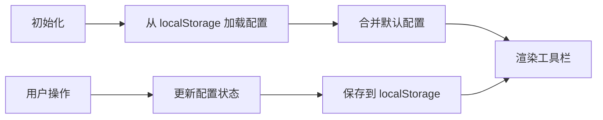

## Product Overview

参考 Mac 程序坞（Dock）的交互体验，优化 unified-toolbar 工具栏组件，实现更灵活的按钮管理功能，包括按钮的收起/展开、右键菜单操作、拖拽排序等，并将配置集中管理且持久化到 localStorage。

## Core Features

- **按钮收起/展开**：工具栏显示常用按钮，其他按钮收起到"更多功能"按钮中，hover 时通过 Popover 弹出面板展示
- **右键菜单**：支持右键点击按钮弹出上下文菜单，可快速设置按钮的显示/隐藏状态
- **拖拽排序**：支持拖拽调整工具栏按钮的显示顺序，提供流畅的拖拽交互体验
- **配置集中管理**：统一管理按钮的默认显示状态和顺序配置，便于维护和扩展
- **配置持久化**：将按钮顺序和显示状态自动保存到 localStorage，用户下次访问时恢复上次配置
- **默认按钮配置**：按使用频率排序默认显示按钮：ai-image、ai-video、toolbox、image、menu、text、mind，其他按钮默认收起

## Tech Stack

- 前端框架：React + TypeScript（基于现有项目技术栈）
- 状态管理：React Hooks (useState, useEffect, useCallback)
- 拖拽实现：原生 HTML5 Drag and Drop API 或 dnd-kit 库
- 数据持久化：localStorage API
- UI 组件：Popover（更多功能弹出面板）、ContextMenu（右键菜单）

## Architecture Design

### System Architecture

采用组件化架构，将工具栏功能模块化拆分，便于维护和扩展。



### Module Division

| 模块名称 | 职责 | 关键技术 |
| --- | --- | --- |
| UnifiedToolbar | 工具栏主容器，管理按钮布局和拖拽 | React, Drag and Drop |
| ToolbarButton | 单个工具按钮组件 | React |
| MoreButton | "更多功能"按钮，hover 展示 Popover | Popover |
| ContextMenu | 右键菜单组件 | React Portal |
| ToolbarConfigManager | 配置管理器，处理持久化 | localStorage |


### Data Flow



## Implementation Details

### Core Directory Structure

```
src/
├── components/
│   └── unified-toolbar/
│       ├── index.tsx                 # 主组件入口
│       ├── ToolbarButton.tsx         # 按钮组件
│       ├── MoreButton.tsx            # 更多功能按钮
│       ├── ContextMenu.tsx           # 右键菜单
│       ├── PopoverPanel.tsx          # 弹出面板
│       ├── hooks/
│       │   ├── useToolbarConfig.ts   # 配置管理 Hook
│       │   └── useDragSort.ts        # 拖拽排序 Hook
│       ├── config/
│       │   └── defaultConfig.ts      # 默认配置
│       └── types.ts                  # 类型定义
```

### Key Code Structures

```typescript
// types.ts
interface ToolbarButtonConfig {
  id: string;
  name: string;
  icon: string;
  visible: boolean;
  order: number;
}

interface ToolbarConfig {
  buttons: ToolbarButtonConfig[];
  version: number;
}

// defaultConfig.ts
const DEFAULT_VISIBLE_BUTTONS = [
  'ai-image', 'ai-video', 'toolbox', 
  'image', 'menu', 'text', 'mind'
];

// useToolbarConfig.ts
function useToolbarConfig() {
  // 加载、保存、更新配置的逻辑
  const loadConfig = () => { /* ... */ };
  const saveConfig = (config: ToolbarConfig) => { /* ... */ };
  const updateButtonVisibility = (id: string, visible: boolean) => { /* ... */ };
  const reorderButtons = (fromIndex: number, toIndex: number) => { /* ... */ };
}
```

### Technical Implementation Plan

1. **配置管理系统**

- 创建统一的配置数据结构
- 实现 localStorage 读写逻辑
- 处理配置版本迁移

2. **拖拽排序功能**

- 使用 HTML5 Drag and Drop 或 dnd-kit
- 实现拖拽视觉反馈
- 拖拽结束后更新配置

3. **Popover 弹出面板**

- hover 触发显示/隐藏
- 展示收起的按钮列表
- 支持从面板拖拽按钮到工具栏

4. **右键菜单**

- 监听 contextmenu 事件
- 动态定位菜单位置
- 提供显示/隐藏切换选项

## Agent Extensions

### SubAgent

- **code-explorer**
- Purpose: 探索现有 unified-toolbar 组件的代码结构，了解当前实现方式和可复用的代码
- Expected outcome: 获取现有组件的完整结构、接口定义、样式实现，为优化提供基础