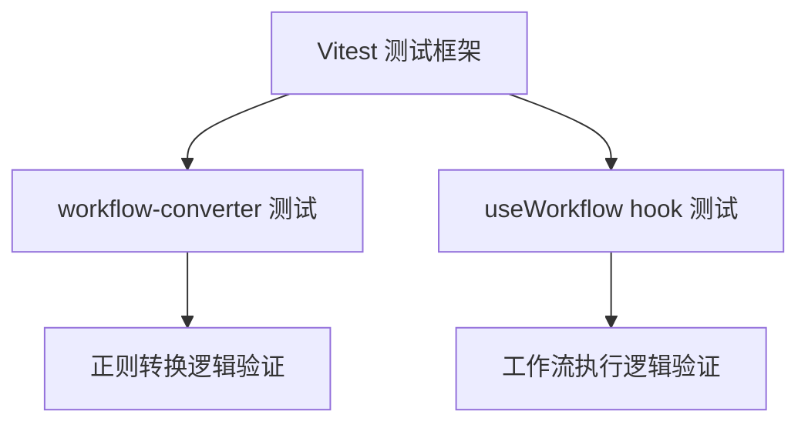

## Product Overview

为 drawnix 包中场景1-3（直接生成）的正则转换逻辑和工作流执行功能添加 vitest 单元测试，确保核心业务逻辑的正确性和稳定性。

## Core Features

- 为 workflow-converter.ts 中的正则转换逻辑编写单元测试，覆盖各种输入场景
- 为 useWorkflow hook 的工作流执行逻辑编写单元测试
- 配置 drawnix 包的 vitest 测试环境，参考 collimind 目录下的 vitest.config.ts

## Tech Stack

- 测试框架: Vitest ^3.0.8（项目已安装）
- 测试工具: @testing-library/react-hooks（用于测试 React hooks）
- 配置参考: collimind/vitest.config.ts

## Tech Architecture

### System Architecture



### Module Division

- **测试配置模块**: drawnix 包的 vitest.config.ts 配置
- **转换逻辑测试模块**: workflow-converter.ts 的单元测试
- **Hook 测试模块**: useWorkflow hook 的单元测试

### Data Flow

测试用例输入 -> 被测函数/Hook 执行 -> 断言结果验证 -> 测试报告输出

## Implementation Details

### Core Directory Structure

```
packages/drawnix/
├── vitest.config.ts              # 新增: Vitest 配置文件
├── src/
│   └── components/
│       └── ai-generation/
│           └── __tests__/        # 新增: 测试目录
│               ├── workflow-converter.test.ts
│               └── useWorkflow.test.ts
```

### Key Code Structures

**Vitest 配置**: 参考 collimind 的配置，适配 drawnix 包的测试需求

```typescript
// vitest.config.ts
import { defineConfig } from 'vitest/config';

export default defineConfig({
  test: {
    environment: 'jsdom',
    globals: true,
    include: ['src/**/*.test.ts', 'src/**/*.test.tsx'],
  },
});
```

**测试用例结构**: 覆盖正则转换的各种边界情况

```typescript
// workflow-converter.test.ts
describe('workflow-converter', () => {
  describe('场景1转换', () => {
    it('should convert valid input correctly', () => {});
    it('should handle edge cases', () => {});
  });
});
```

### Technical Implementation Plan

1. **问题**: drawnix 包目前使用 jest，需要添加 vitest 配置
2. **方案**: 参考 collimind/vitest.config.ts 创建 drawnix 专用配置
3. **关键技术**: Vitest, @testing-library/react-hooks
4. **实现步骤**:

- 创建 vitest.config.ts 配置文件
- 编写 workflow-converter.ts 单元测试
- 编写 useWorkflow hook 单元测试
- 添加 npm scripts 运行测试

5. **测试策略**: 覆盖正常输入、边界情况、异常输入

## Agent Extensions

### SubAgent

- **code-explorer**
- Purpose: 探索 workflow-converter.ts 和 useWorkflow hook 的具体实现，了解需要测试的函数签名和逻辑；同时查看 collimind/vitest.config.ts 的配置作为参考
- Expected outcome: 获取被测代码的完整结构、导出函数列表、参数类型和返回值类型，以及 vitest 配置的最佳实践