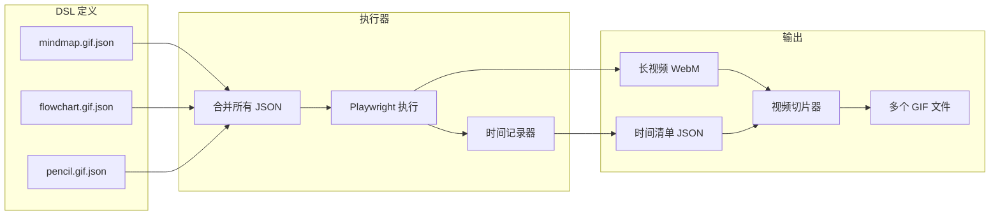
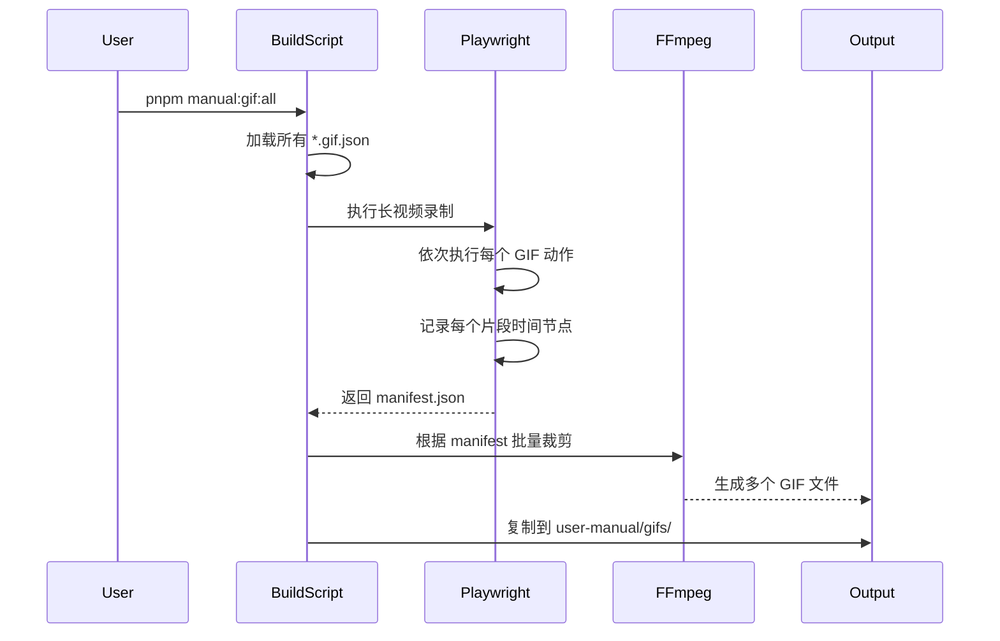

# GIF 录制 DSL 系统设计

## 架构概览



## 1. DSL 格式设计

每个页面的 GIF 定义为独立 JSON 文件，存放在 `apps/web-e2e/src/manual-gen/gifs/` 目录：

```json
// mindmap.gif.json
{
  "id": "mindmap-create",
  "name": "思维导图创建演示",
  "output": "思维导图创建演示.gif",
  "targetPage": "drawing/mindmap",
  "actions": [
    { "type": "click", "target": "[data-testid='toolbar-more']", "label": "点击更多工具" },
    { "type": "click", "target": "button:has-text('Markdown 到 Drawnix')", "label": "选择 Markdown 转换" },
    { "type": "click", "target": "button:has-text('插入')", "label": "点击插入" },
    { "type": "press", "key": "Escape", "wait": 2000 },
    { "type": "click", "target": ".mind-node-content >> nth=0", "label": "点击节点进入编辑" },
    { "type": "keyHint", "key": "Tab", "hint": "Tab：添加子节点" },
    { "type": "press", "key": "Tab" },
    { "type": "type", "text": "新子节点", "delay": 200 },
    { "type": "keyHint", "key": "Enter", "hint": "Enter：添加同级节点" },
    { "type": "press", "key": "Enter" },
    { "type": "type", "text": "同级节点", "delay": 200 },
    { "type": "mouseClick", "x": 100, "y": 100 }
  ]
}
```

### 支持的动作类型

| 类型 | 参数 | 说明 |

|------|------|------|

| `click` | target, label?, wait? | 点击元素并显示点击效果 |

| `press` | key, wait? | 按键 |

| `type` | text, delay? | 输入文字 |

| `keyHint` | key, hint, duration? | 显示快捷键提示 |

| `mouseClick` | x, y, label? | 点击坐标位置 |

| `mouseDraw` | points[] | 绘制路径 |

| `wait` | duration | 等待 |

| `scroll` | target?, deltaY | 滚动 |

## 2. 文件结构

```
apps/web-e2e/src/manual-gen/
├── gifs/                          # GIF 定义目录
│   ├── mindmap.gif.json
│   ├── flowchart.gif.json
│   ├── pencil-tool.gif.json
│   ├── shapes.gif.json
│   ├── ai-image.gif.json
│   └── ...
├── gif-executor.ts                # DSL 执行器
├── gif-manifest.ts                # 时间清单管理
└── gif-recordings.manual.spec.ts  # 录制测试入口

scripts/
├── video-to-gif.js                # 现有，增强支持批量裁剪
└── build-all-gifs.js              # 新增：一键构建所有 GIF
```

## 3. 核心组件

### 3.1 DSL 执行器 ([gif-executor.ts](apps/web-e2e/src/manual-gen/gif-executor.ts))

```typescript
interface GifDefinition {
  id: string;
  name: string;
  output: string;
  targetPage: string;
  actions: Action[];
}

interface GifManifest {
  gifs: Array<{
    id: string;
    output: string;
    startTime: number;
    endTime: number;
  }>;
}

class GifExecutor {
  private manifest: GifManifest = { gifs: [] };
  private startTime: number;
  
  async executeAll(page: Page, definitions: GifDefinition[]) {
    this.startTime = Date.now();
    
    for (const def of definitions) {
      const gifStart = this.elapsed();
      console.log(`\n🎬 开始录制: ${def.name}`);
      
      await this.executeActions(page, def.actions);
      
      const gifEnd = this.elapsed();
      this.manifest.gifs.push({
        id: def.id,
        output: def.output,
        startTime: gifStart,
        endTime: gifEnd
      });
      
      // 片段间隔（用于视觉分隔）
      await page.waitForTimeout(1000);
    }
    
    return this.manifest;
  }
}
```

### 3.2 视频切片器 ([video-to-gif.js](scripts/video-to-gif.js) 增强)

增加 `--manifest` 参数支持批量裁剪：

```bash
# 单个裁剪（现有）
node scripts/video-to-gif.js --test "思维导图" --trim 2.9

# 批量裁剪（新增）
node scripts/video-to-gif.js --manifest apps/web-e2e/test-results/gif-manifest.json
```

manifest 文件格式：

```json
{
  "videoPath": "apps/web-e2e/test-results/.../video.webm",
  "gifs": [
    { "id": "mindmap-create", "output": "思维导图创建演示.gif", "startTime": 2.9, "endTime": 18.5 },
    { "id": "flowchart-create", "output": "流程图创建演示.gif", "startTime": 19.5, "endTime": 35.2 }
  ]
}
```

## 4. 工作流程



## 5. 使用方式

### 定义新 GIF

1. 在 `apps/web-e2e/src/manual-gen/gifs/` 创建 `xxx.gif.json`
2. 定义动作序列

### 生成所有 GIF

```bash
pnpm manual:gif:all
```

### 只生成特定 GIF

```bash
pnpm manual:gif:one mindmap-create
```

### 预览动作（不录制）

```bash
pnpm manual:gif:preview mindmap-create
```

## 6. 优势

- **声明式**: JSON 定义动作，无需写测试代码
- **高效**: 一次录制，多个输出，减少启动开销
- **可维护**: 每个页面独立 JSON，便于维护
- **可复用**: 动作类型标准化，可组合复用
- **自动化**: 时间节点自动计算，裁剪精准