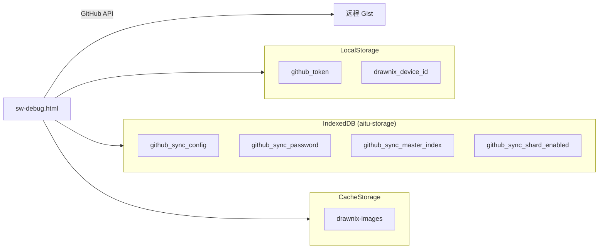

# Gist 调试面板增强方案

## 现状分析

当前 sw-debug.html 的 Gist 管理 tab 功能较基础，只展示 Token 状态、Gist ID、任务数和画布文件数，无法有效定位同步问题。

用户遇到的问题：

- 当前画布的素材未被同步到远程
- 同步到远程下载下来，在素材库未展示
- 任务列表没能完全合并展示，可能丢数据

## 技术方案

### 配置共享机制

sw-debug.html 与应用层共享同一个 IndexedDB（`aitu-storage`），可直接读取配置：




### UI 结构设计

将 Gist 管理 tab 分为多个功能区块：

1. **配置信息区** - 展示当前同步配置
2. **分片概览区** - 展示分片系统状态和统计
3. **数据诊断区** - 本地 vs 远程数据对比（子 tab 切换）
  - 任务对比
  - 画板对比
  - 素材对比

## 实现细节

### 1. 扩展 crypto-helper.js

添加读取更多配置的函数：

```javascript
// 新增导出
export async function getMasterIndex() { ... }
export async function getShardEnabledStatus() { ... }
export async function listCacheStorageMedia() { ... }
```

**文件**: [apps/web/public/sw-debug/crypto-helper.js](apps/web/public/sw-debug/crypto-helper.js)

### 2. 增强 gist-management.js

重构为更完整的调试面板：

- 添加分片系统状态展示
- 添加数据对比功能（本地 vs 远程）
- 添加素材缓存诊断
- 支持展开/折叠详情

**文件**: [apps/web/public/sw-debug/gist-management.js](apps/web/public/sw-debug/gist-management.js)

### 3. 更新 sw-debug.html

重构 gistTab 的 HTML 结构：

```html
<div class="tab-content" id="gistTab">
  <!-- 配置信息区 -->
  <div class="gist-config-section">...</div>
  
  <!-- 分片概览区 -->
  <div class="gist-shard-section">...</div>
  
  <!-- 数据诊断区（子 tab） -->
  <div class="gist-diagnostics-section">
    <div class="sub-tabs">
      <button data-subtab="tasks">任务对比</button>
      <button data-subtab="boards">画板对比</button>
      <button data-subtab="media">素材对比</button>
    </div>
    <div class="subtab-content">...</div>
  </div>
</div>
```

**文件**: [apps/web/public/sw-debug.html](apps/web/public/sw-debug.html)

### 4. 添加样式支持

在 styles.css 中添加新的样式类：

- `.gist-section` - 区块样式
- `.comparison-table` - 对比表格样式
- `.sync-status-badge` - 同步状态标记

**文件**: [apps/web/public/sw-debug/styles.css](apps/web/public/sw-debug/styles.css)

## 关键功能说明

### 配置信息展示


| 配置项       | 来源                                          | 说明        |
| --------- | ------------------------------------------- | --------- |
| Token 状态  | localStorage `github_token`                 | 已实现，保持不变  |
| 主 Gist ID | IndexedDB `github_sync_config.gistId`       | 已实现，保持不变  |
| 分片启用      | IndexedDB `github_sync_shard_enabled`       | 新增        |
| 同步密码      | IndexedDB `github_sync_password`            | 新增，显示是否设置 |
| 设备 ID     | localStorage `drawnix_device_id`            | 新增        |
| 最后同步时间    | IndexedDB `github_sync_config.lastSyncTime` | 新增        |


### 分片概览

从远程 `master-index.json` 读取：

- 分片总数、活跃/已满/归档数
- 文件总数和总大小
- 各分片详情（ID、文件数、大小、状态）

### 任务对比


| 本地来源                                 | 远程来源              |
| ------------------------------------ | ----------------- |
| IndexedDB `sw-task-queue` -> `tasks` | Gist `tasks.json` |


对比维度：

- 总数对比
- ID 列表对比（本地独有 / 远程独有 / 共有）
- 关键字段对比（status、createdAt、updatedAt）

### 画板对比


| 本地来源                                   | 远程来源                |
| -------------------------------------- | ------------------- |
| IndexedDB `aitu-workspace` -> `boards` | Gist `*.drawnix` 文件 |


对比维度：

- 画板 ID 列表
- 更新时间对比

### 素材对比


| 本地来源                           | 远程来源                                    |
| ------------------------------ | --------------------------------------- |
| Cache Storage `drawnix-images` | 分片 Gist 的 `master-index.json.fileIndex` |


对比维度：

- URL 列表对比
- 文件大小对比
- 同步状态（本地独有 / 远程独有 / 已同步）

## 文件变更清单


| 文件                                            | 操作  | 说明                 |
| --------------------------------------------- | --- | ------------------ |
| `apps/web/public/sw-debug.html`               | 修改  | 重构 gistTab HTML 结构 |
| `apps/web/public/sw-debug/gist-management.js` | 修改  | 增强核心功能             |
| `apps/web/public/sw-debug/crypto-helper.js`   | 修改  | 添加读取更多配置的函数        |
| `apps/web/public/sw-debug/styles.css`         | 修改  | 添加新样式              |


