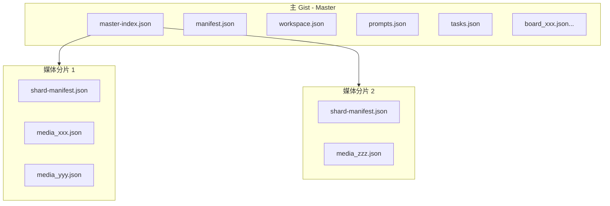

# Gist 分片索引方案

## 问题分析

**现有限制**：

- 单个 Gist 最多 300 个文件
- 当前媒体同步已占用约 5 个系统文件（manifest, workspace, prompts, tasks, settings）
- 实际可用于媒体存储：~295 个文件

**需求**：

- 自动分片：超过 250 个文件时自动创建新 Gist
- 统一索引：文件与 Gist 的映射关系
- 软删除：保留删除记录，支持恢复
- 别名管理：每个 Gist 有可读别名

---

## 架构设计

### 整体架构




### 主索引结构 (`master-index.json`)

```typescript
interface MasterIndex {
  version: 2;
  appVersion: string;
  createdAt: number;
  updatedAt: number;
  
  // 分片注册表
  shards: Record<string, ShardInfo>;
  
  // 文件路由索引 (URL -> 分片位置)
  fileIndex: Record<string, FileIndexEntry>;
  
  // 软删除记录（保留 30 天）
  tombstones: MediaTombstone[];
  
  // 统计
  stats: {
    totalFiles: number;
    totalSize: number;
    activeShards: number;
  };
}

interface ShardInfo {
  gistId: string;
  alias: string;              // 可读别名，如 "photos-2024"
  description: string;        // Gist 描述
  createdAt: number;
  updatedAt: number;
  fileCount: number;
  totalSize: number;
  status: 'active' | 'full' | 'archived';
}

interface FileIndexEntry {
  shardId: string;            // 分片 ID（alias）
  filename: string;           // media_xxx.json
  size: number;
  type: 'image' | 'video';
  syncedAt: number;
  checksum?: string;
}

interface MediaTombstone {
  url: string;
  shardId: string;
  filename: string;
  size: number;
  deletedAt: number;
  deletedBy: string;
  expiresAt: number;          // 30 天后过期
}
```

### 分片清单结构 (`shard-manifest.json`)

```typescript
interface ShardManifest {
  version: 1;
  shardId: string;            // 与 MasterIndex 中的 alias 对应
  masterGistId: string;       // 主 Gist ID（用于验证）
  createdAt: number;
  updatedAt: number;
  
  // 本分片文件列表
  files: Record<string, ShardFileInfo>;
}

interface ShardFileInfo {
  url: string;                // 原始 URL
  type: 'image' | 'video';
  size: number;
  mimeType: string;
  syncedAt: number;
}
```

---

## 核心模块设计

### 1. ShardRouter（分片路由器）

路径：`packages/drawnix/src/services/github-sync/shard-router.ts`

```typescript
class ShardRouter {
  private masterIndex: MasterIndex;
  private shardCache: Map<string, ShardManifest>;
  
  // 获取文件所在分片
  getShardForFile(url: string): ShardInfo | null;
  
  // 分配新文件到分片（自动创建新分片）
  async allocateFile(fileSize: number): Promise<{ 
    shard: ShardInfo; 
    isNewShard: boolean;
  }>;
  
  // 创建新分片
  async createShard(alias?: string): Promise<ShardInfo>;
  
  // 批量分配（高性能）
  async allocateFiles(files: Array<{ url: string; size: number }>): Promise<Map<string, ShardInfo>>;
}
```

### 2. ShardSyncService（分片同步服务）

路径：`packages/drawnix/src/services/github-sync/shard-sync-service.ts`

```typescript
class ShardSyncService {
  // 上传媒体到分片
  async uploadMedia(items: MediaItem[]): Promise<BatchMediaSyncResult>;
  
  // 下载媒体从分片
  async downloadMedia(urls: string[]): Promise<BatchMediaSyncResult>;
  
  // 软删除
  async softDeleteMedia(urls: string[]): Promise<void>;
  
  // 清理过期 tombstone
  async cleanupExpiredTombstones(): Promise<number>;
  
  // 恢复软删除
  async restoreMedia(url: string): Promise<boolean>;
}
```

### 3. ShardManager（分片管理器）

路径：`packages/drawnix/src/services/github-sync/shard-manager.ts`

```typescript
class ShardManager {
  // 列出所有分片
  async listShards(): Promise<ShardInfo[]>;
  
  // 重命名分片别名
  async renameShardAlias(shardId: string, newAlias: string): Promise<void>;
  
  // 归档分片（标记为只读）
  async archiveShard(shardId: string): Promise<void>;
  
  // 合并分片（将小分片合并）
  async mergeShards(sourceIds: string[], targetId: string): Promise<void>;
  
  // 获取分片统计
  async getShardStats(): Promise<ShardStats>;
}
```

---

## 分片策略

### 自动分片触发条件

```typescript
const SHARD_CONFIG = {
  FILE_LIMIT: 250,           // 每分片最多 250 文件
  SIZE_LIMIT: 500 * 1024 * 1024,  // 500MB
  TOMBSTONE_RETENTION_DAYS: 30,
  BATCH_SIZE: 20,            // 批量操作大小
  CONCURRENCY: 3,            // 并发请求数
};
```

### 分片分配算法

```typescript
async allocateFile(fileSize: number): Promise<ShardAllocation> {
  // 1. 查找有空间的活跃分片（按已用容量排序，优先填满）
  const activeShard = this.findActiveShard(fileSize);
  if (activeShard) {
    return { shard: activeShard, isNewShard: false };
  }
  
  // 2. 没有可用分片，创建新分片
  const shardNumber = Object.keys(this.masterIndex.shards).length + 1;
  const newShard = await this.createShard(`media-${shardNumber}`);
  return { shard: newShard, isNewShard: true };
}
```

---

## 高性能优化

### 1. 批量操作

```typescript
// 批量上传：按分片分组，并发处理
async uploadMediaBatch(items: MediaItem[]): Promise<BatchResult> {
  // 按分片分组
  const groupedByShards = this.groupByTargetShard(items);
  
  // 并发上传各分片（限制并发数）
  const results = await pMap(
    Object.entries(groupedByShards),
    ([shardId, files]) => this.uploadToShard(shardId, files),
    { concurrency: SHARD_CONFIG.CONCURRENCY }
  );
  
  return this.mergeResults(results);
}
```

### 2. 增量索引

```typescript
// 只同步索引变更，不重新下载全部
async syncIndex(): Promise<void> {
  const remoteIndex = await this.fetchMasterIndex();
  const localIndex = await this.getLocalIndex();
  
  // 差异比较
  const diff = this.diffIndex(localIndex, remoteIndex);
  
  // 只处理变更的条目
  await this.applyIndexDiff(diff);
}
```

### 3. 本地缓存

```typescript
// 缓存分片元数据，避免重复请求
class ShardCache {
  private cache: Map<string, { data: ShardManifest; expiry: number }>;
  
  async getShardManifest(shardId: string): Promise<ShardManifest> {
    const cached = this.cache.get(shardId);
    if (cached && cached.expiry > Date.now()) {
      return cached.data;
    }
    
    const manifest = await this.fetchShardManifest(shardId);
    this.cache.set(shardId, { 
      data: manifest, 
      expiry: Date.now() + 5 * 60 * 1000  // 5 分钟
    });
    return manifest;
  }
}
```

---

## 别名管理

### 默认别名规则

- 第一个分片：`media-1` 或用户自定义
- 自动创建的分片：`media-{n}` (n = 分片序号)
- Gist 描述格式：`Opentu - Media Shard #{n} ({alias})`

### 别名重命名

```typescript
async renameShardAlias(shardId: string, newAlias: string): Promise<void> {
  // 1. 检查别名唯一性
  if (this.aliasExists(newAlias)) {
    throw new Error(`Alias "${newAlias}" already exists`);
  }
  
  // 2. 更新主索引
  this.masterIndex.shards[shardId].alias = newAlias;
  
  // 3. 更新 Gist 描述
  await this.updateGistDescription(
    shard.gistId, 
    `Opentu - Media Shard #${shard.order} (${newAlias})`
  );
  
  // 4. 保存主索引
  await this.saveMasterIndex();
}
```

---

## 数据迁移

### 从旧版迁移

```typescript
async migrateFromV1(): Promise<MigrationResult> {
  // 1. 读取现有 manifest.syncedMedia
  const oldMedia = await this.loadOldMediaIndex();
  
  // 2. 创建主索引和第一个分片
  const masterIndex = this.initMasterIndex();
  const shard = await this.createShard('media-1');
  
  // 3. 迁移文件索引（不移动实际数据）
  for (const [url, info] of Object.entries(oldMedia)) {
    masterIndex.fileIndex[url] = {
      shardId: shard.alias,
      filename: SYNC_FILES.mediaFileFromUrl(url),
      size: info.size,
      type: info.type,
      syncedAt: info.syncedAt,
    };
  }
  
  // 4. 保存主索引
  await this.saveMasterIndex(masterIndex);
}
```

---

## 文件结构变更

### 新增文件

- `packages/drawnix/src/services/github-sync/shard-types.ts` - 分片类型定义
- `packages/drawnix/src/services/github-sync/shard-router.ts` - 分片路由器
- `packages/drawnix/src/services/github-sync/shard-sync-service.ts` - 分片同步服务
- `packages/drawnix/src/services/github-sync/shard-manager.ts` - 分片管理器
- `packages/drawnix/src/services/github-sync/shard-cache.ts` - 分片缓存

### 修改文件

- `[types.ts](packages/drawnix/src/services/github-sync/types.ts)` - 添加分片相关类型
- `[sync-engine.ts](packages/drawnix/src/services/github-sync/sync-engine.ts)` - 集成分片路由
- `[media-sync-service.ts](packages/drawnix/src/services/github-sync/media-sync-service.ts)` - 使用分片服务

---

## 实现顺序

1. **Phase 1**：类型定义和基础结构
2. **Phase 2**：分片路由器（核心分配逻辑）
3. **Phase 3**：分片同步服务（上传/下载）
4. **Phase 4**：集成到现有同步引擎
5. **Phase 5**：UI 管理界面（分片列表、别名编辑）
6. **Phase 6**：数据迁移工具

