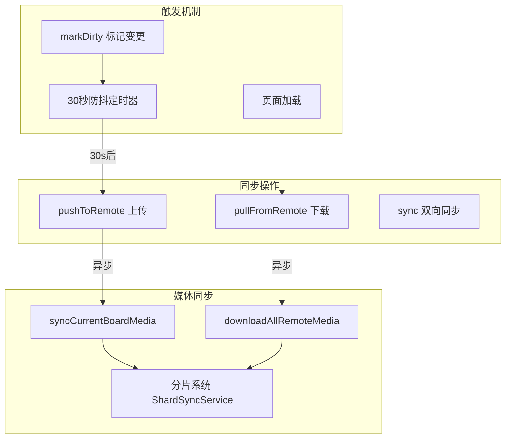

# Gist 数据同步优化方案

## 一、当前同步策略梳理

### 1.1 同步架构




### 1.2 核心文件


| 文件                                                                                       | 职责                            |
| ---------------------------------------------------------------------------------------- | ----------------------------- |
| [sync-engine.ts](packages/drawnix/src/services/github-sync/sync-engine.ts)               | 同步引擎，调度自动同步、执行 push/pull/sync |
| [media-sync-service.ts](packages/drawnix/src/services/github-sync/media-sync-service.ts) | 媒体同步服务（传统方式）                  |
| [shard-sync-service.ts](packages/drawnix/src/services/github-sync/shard-sync-service.ts) | 分片同步服务（大文件分片存储）               |
| [media-collector.ts](packages/drawnix/src/services/github-sync/media-collector.ts)       | 媒体资源收集器                       |


### 1.3 自动同步流程

1. 用户编辑画板 → 调用 `markDirty()` 标记变更
2. `scheduleAutoSync()` 设置 30 秒防抖定时器
3. 30 秒后执行 `pushToRemote()` 上传本地变更
4. 上传完成后异步调用 `syncCurrentBoardMediaAsync()` 同步媒体

---

## 二、用户明确提出的问题

### 问题描述

每次 30 秒自动同步当前画布图片时，对于缓存中不存在的图片都会重新请求外部 URL，这是不必要的：

- 缓存中没有意味着之前请求失败过（CORS 限制、URL 失效、网络错误）
- 再次请求大概率也会失败
- 浪费网络请求和时间

### 问题代码位置

**位置 1**: [media-sync-service.ts#L403-L415](packages/drawnix/src/services/github-sync/media-sync-service.ts)

```typescript
} else if (source === 'external') {
  // 外部资源：先尝试从缓存获取，否则下载
  blob = await unifiedCacheService.getCachedBlob(url);
  if (!blob && originalUrl) {
    blob = await this.fetchMediaFromUrl(originalUrl);  // 问题：每次都重试
    if (blob && blob.size > 0) {
      await unifiedCacheService.cacheToCacheStorageOnly(url, blob);
    }
  }
}
```

**位置 2**: [shard-sync-service.ts#L437-L457](packages/drawnix/src/services/github-sync/shard-sync-service.ts)

```typescript
} else if (source === 'external') {
  blob = await unifiedCacheService.getCachedBlob(url);
  if (!blob && originalUrl) {
    try {
      const response = await fetch(originalUrl, { ... });  // 问题：每次都重试
      ...
    } catch (error) {
      logWarning('Failed to fetch', { url: originalUrl, error: String(error) });
    }
  }
}
```

### 解决方案

**核心思路**：同步的目的是备份已缓存的数据，不是重新获取外部资源。如果缓存中没有数据，直接跳过即可，无需尝试 fetch。

**修改位置 1**: [media-sync-service.ts#L403-L415](packages/drawnix/src/services/github-sync/media-sync-service.ts)

```typescript
// 修改前：缓存没有会尝试 fetch
} else if (source === 'external') {
  blob = await unifiedCacheService.getCachedBlob(url);
  if (!blob && originalUrl) {
    blob = await this.fetchMediaFromUrl(originalUrl);  // 删除这行
    if (blob && blob.size > 0) {
      await unifiedCacheService.cacheToCacheStorageOnly(url, blob);
    }
  }
}

// 修改后：缓存没有直接跳过
} else if (source === 'external') {
  // 外部资源：只从缓存获取，没有缓存则跳过同步
  // 同步的目的是备份已有数据，不应重新获取外部资源
  blob = await unifiedCacheService.getCachedBlob(url);
}
```

**修改位置 2**: [shard-sync-service.ts#L437-L457](packages/drawnix/src/services/github-sync/shard-sync-service.ts)

```typescript
// 修改前：缓存没有会尝试 fetch
} else if (source === 'external') {
  blob = await unifiedCacheService.getCachedBlob(url);
  if (!blob && originalUrl) {
    try {
      const response = await fetch(originalUrl, { ... });
      // ...
    } catch (error) { ... }
  }
}

// 修改后：缓存没有直接跳过
} else if (source === 'external') {
  // 外部资源：只从缓存获取，没有缓存则跳过同步
  blob = await unifiedCacheService.getCachedBlob(url);
}
```

**为什么不需要"失败 URL 缓存"**：

- 同步场景：缓存没有就明确跳过，逻辑简单确定
- 其他场景（如 AI 生成插入画布）：用户可以主动重试，不应被限制

---

## 三、其他优化建议

### 3.1 远程已同步 URL 缓存

**问题**: 每次 `syncCurrentBoardMedia` 都会调用 `getRemoteSyncedUrls()` 从远程获取已同步 URL 列表。

**位置**: [media-sync-service.ts#L191](packages/drawnix/src/services/github-sync/media-sync-service.ts)

**优化方案**: 缓存已同步 URL 集合，在本次 push 操作完成后刷新。

```typescript
private remoteSyncedUrlsCache: Set<string> | null = null;
private cacheTimestamp: number = 0;
const CACHE_TTL = 5 * 60 * 1000; // 5 分钟

async getRemoteSyncedUrls(): Promise<Set<string>> {
  // 如果缓存有效，直接返回
  if (this.remoteSyncedUrlsCache && 
      Date.now() - this.cacheTimestamp < CACHE_TTL) {
    return this.remoteSyncedUrlsCache;
  }
  
  // 否则从远程获取
  const urls = await shardSyncService.getSyncedUrls();
  this.remoteSyncedUrlsCache = urls;
  this.cacheTimestamp = Date.now();
  return urls;
}

// 同步完成后刷新缓存
invalidateRemoteSyncedUrlsCache(): void {
  this.remoteSyncedUrlsCache = null;
}
```

### 3.2 分片系统初始化优化

**问题**: 每次媒体同步都会调用 `shardedMediaSyncAdapter.initialize()`。

**优化方案**: 使用单次初始化 + 状态检查。

```typescript
// sharded-media-sync-adapter.ts 已有类似逻辑，但可以更明确
private initializePromise: Promise<void> | null = null;

async initialize(): Promise<void> {
  if (this.initialized) return;
  if (this.initializePromise) return this.initializePromise;
  
  this.initializePromise = this.doInitialize();
  await this.initializePromise;
}
```

### 3.3 媒体收集优化

**问题**: `collectCurrentBoardMedia` 会遍历画板所有元素，在大画板上可能较慢。

**优化方案**: 使用增量收集 + 缓存上次结果。

### 3.4 日志优化

**问题**: 同步模块有大量 `logDebug` 调用，可能影响性能。

**优化方案**: 生产环境条件性输出日志，或使用日志级别控制。

---

## 四、实现优先级


| 优先级 | 优化项           | 影响        | 复杂度 |
| --- | ------------- | --------- | --- |
| P0  | 移除外部 URL 重试逻辑 | 避免重复无效请求  | 极低  |
| P1  | 远程 URL 缓存     | 减少 API 调用 | 低   |
| P2  | 分片初始化优化       | 减少重复初始化   | 低   |
| P3  | 媒体收集优化        | 大画板性能提升   | 中   |
| P4  | 日志优化          | 生产环境性能    | 低   |


---

## 五、实现步骤

### 步骤 1: 移除外部 URL 重试逻辑（核心修改，极简）

1. 修改 `media-sync-service.ts` 的 `syncSingleMediaItem` 方法：移除 fetch 重试代码
2. 修改 `shard-sync-service.ts` 的 `prepareMediaForUpload` 方法：移除 fetch 重试代码

### 步骤 2: 添加远程 URL 缓存（可选优化）

1. 在 `MediaSyncService` 中添加缓存字段
2. 修改 `getRemoteSyncedUrls` 方法使用缓存
3. 添加缓存失效逻辑

### 步骤 3: 其他优化（按需实施）

根据实际需要逐步实施。