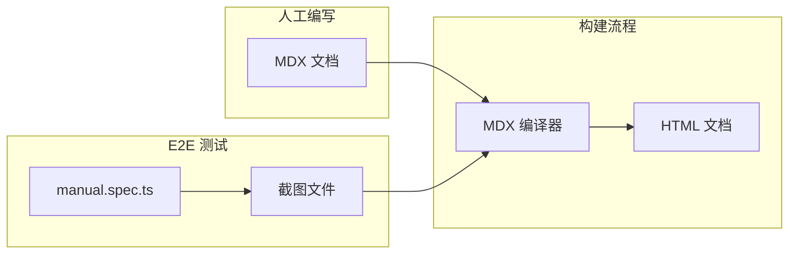

# MDX 帮助文档生成方案

## 核心设计



## 文件结构

```
docs/user-manual/
├── content/                    # 人工编写的 MDX 文档
│   ├── getting-started.mdx
│   ├── ai-generation/
│   │   ├── image-generation.mdx
│   │   └── inspiration-board.mdx
│   └── drawing/
│       ├── pencil-tool.mdx
│       ├── shapes.mdx
│       └── text.mdx
├── screenshots/                # E2E 生成的截图（自动更新）
├── dist/                       # 生成的 HTML 文档
└── config.yaml                 # 文档配置（目录结构、分类）
```

## MDX 文档示例

```mdx
---
title: 使用 AI 生成图片
category: ai-generation
order: 1
---

# 使用 AI 生成图片

Aitu 支持通过自然语言描述生成图片，支持多种 AI 模型。

## 步骤

### 1. 输入提示词

在底部输入框中输入您想要生成的图片描述。**建议**：描述越详细，生成效果越好。

<Screenshot id="ai-step-1" alt="输入提示词" />

### 2. 选择模型

点击 `#` 按钮打开模型选择器，支持以下模型：

- **Gemini Imagen** - Google 图像生成模型
- **FLUX** - 高质量开源模型

<Screenshot id="ai-step-2" alt="选择模型" />

:::tip
不同模型有不同的特点，建议多尝试找到最适合您需求的模型。
:::

### 3. 发送请求

点击发送按钮或按 `Enter` 键开始生成。

<Screenshot id="ai-step-3" alt="准备发送" />

## 常见问题

**Q: 生成失败怎么办？**

A: 请检查 API 配置是否正确，或尝试更换模型。
```

## 实现步骤

### 1. 安装 MDX 工具链

在 [package.json](package.json) 添加依赖：

```json
"devDependencies": {
  "@mdx-js/mdx": "^3.0.0",
  "gray-matter": "^4.0.3",
  "unified": "^11.0.0",
  "rehype-stringify": "^10.0.0"
}
```

### 2. 创建 Screenshot 组件

定义 `<Screenshot>` 组件，运行时替换为实际截图路径：

```typescript
// scripts/mdx-components.ts
export const Screenshot = ({ id, alt }: { id: string; alt?: string }) => {
  // 编译时替换为实际截图路径
  return ``;
};
```

### 3. 修改 E2E 测试截图命名

在 [apps/web-e2e/src/manual-gen/*.manual.spec.ts](apps/web-e2e/src/manual-gen/) 中：

- 统一截图命名：`{page-id}-{step-id}.png`
- 例如：`ai-generation-step-1.png`

### 4. 创建 MDX 编译脚本

[scripts/generate-manual.ts](scripts/generate-manual.ts) 重写：

1. 读取 `docs/user-manual/content/*.mdx` 文件
2. 解析 frontmatter 获取元数据
3. 编译 MDX → HTML
4. 替换 `<Screenshot>` 为实际图片标签
5. 生成最终 HTML 文件

### 5. 添加命令

```json
"scripts": {
  "manual:update-screenshots": "pnpm e2e:manual",
  "manual:build": "npx ts-node scripts/generate-manual.ts",
  "manual:dev": "pnpm manual:update-screenshots && pnpm manual:build"
}
```

## 工作流程

1. **开发者编写 MDX**：在 `docs/user-manual/content/` 创建/编辑 MDX 文件
2. **运行 E2E 更新截图**：`pnpm manual:update-screenshots` 生成最新截图
3. **构建文档**：`pnpm manual:build` 编译 MDX 生成 HTML
4. **预览**：打开 `docs/user-manual/dist/index.html` 预览

## 关键优势

- **内容与截图分离**：人工内容在 MDX 中，截图由 E2E 自动生成
- **实时更新**：UI 变化后只需重跑 E2E 测试，截图自动更新
- **版本控制友好**：MDX 是纯文本，易于 diff 和 review
- **组件复用**：可定义 Tip、Warning、Code 等通用组件