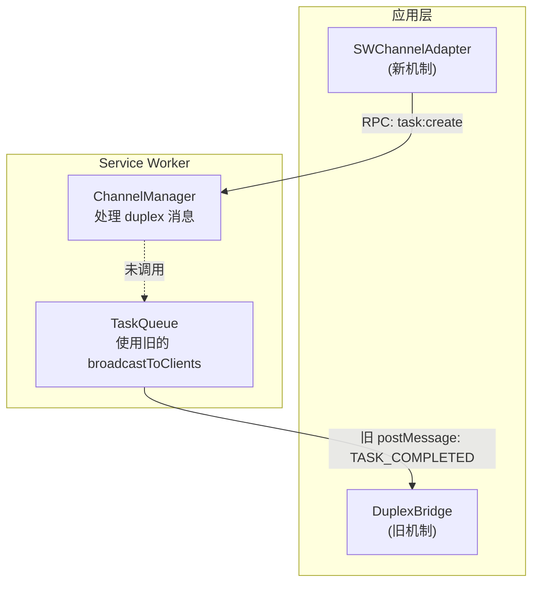

# postmessage-duplex 通信层优化方案

## 问题诊断

### 白屏根本原因

当前存在**两套独立的通信机制**同时运行，但未正确集成：



**核心问题**：

1. `TaskQueue` 的事件广播（`TASK_COMPLETED`, `TASK_FAILED` 等）只通过旧的 `broadcastToClients` 发送
2. `SWChannelAdapter` 订阅的是 `ChannelManager` 的事件，但 `ChannelManager` 的 `sendTaskCompleted` 等方法**从未被调用**
3. 应用层使用新客户端发送任务，但收不到完成通知，导致任务状态永远是 "processing"

### 其他问题

- `DuplexBridge` 仍在被 `WorkflowBridge` 使用，形成冗余层
- `SWChannelClient` 定义了重试配置但未实现
- 缺少初始化超时保护和连接状态监控

---

## 优化方案

### Phase 1: 修复消息广播 (解决白屏 - 高优先级)

让 `TaskQueue` 通过 `ChannelManager` 广播事件，确保使用 duplex 的客户端能收到消息。

**修改文件**: [apps/web/src/sw/task-queue/queue.ts](apps/web/src/sw/task-queue/queue.ts)

在 `broadcastToClients` 调用处，同时调用 `ChannelManager` 的对应方法：

```typescript
// 在 broadcastToClients 后添加 duplex 广播
private async completeTask(taskId: string, result: TaskResult) {
  // ... 现有逻辑
  this.broadcastToClients({
    type: 'TASK_COMPLETED',
    taskId,
    result,
    // ...
  });
  
  // 新增：通过 duplex 广播
  const channelManager = getChannelManager();
  if (channelManager) {
    channelManager.sendTaskCompleted(taskId, result, remoteId);
  }
}
```

需要修改的广播点：

- `completeTask` → `sendTaskCompleted`
- `failTask` → `sendTaskFailed`
- `submitTask` (创建时) → `sendTaskCreated`
- `updateTaskStatus` → `sendTaskStatus`
- `cancelTask` → `sendTaskCancelled`
- `deleteTask` → `sendTaskDeleted`

### Phase 2: 删除冗余的 bridge 层

`DuplexBridge` 使用原生 postMessage，与新的 `postmessage-duplex` 功能重叠。

**删除文件**:

- `packages/drawnix/src/services/sw-channel/bridge/duplex-bridge.ts`
- `packages/drawnix/src/services/sw-channel/bridge/workflow-bridge.ts`
- `packages/drawnix/src/services/sw-channel/bridge/index.ts`

**修改文件**: [packages/drawnix/src/services/workflow-submission-service.ts](packages/drawnix/src/services/workflow-submission-service.ts)

- 移除对 `WorkflowBridge` 的依赖
- 直接使用 `swChannelAdapter` 或 `navigator.serviceWorker.addEventListener`

### Phase 3: 改进初始化流程

**文件**: [packages/drawnix/src/services/sw-channel/client.ts](packages/drawnix/src/services/sw-channel/client.ts)

1. 实现重试机制（已定义 `maxRetries`、`retryDelay` 但未使用）
2. 添加初始化超时保护
3. 添加并发保护（防止重复初始化）
```typescript
private initializing: Promise<boolean> | null = null;

async initialize(): Promise<boolean> {
  if (this.initialized && this.channel?.isReady) return true;
  
  // 并发保护：复用正在进行的初始化
  if (this.initializing) return this.initializing;
  
  this.initializing = this.doInitialize();
  try {
    return await this.initializing;
  } finally {
    this.initializing = null;
  }
}

private async doInitialize(): Promise<boolean> {
  for (let attempt = 0; attempt <= this.maxRetries; attempt++) {
    try {
      this.channel = await ServiceWorkerChannel.createFromPage<SWMethods>({
        timeout: 30000,
      });
      this.setupEventSubscriptions();
      this.initialized = true;
      return true;
    } catch (error) {
      if (attempt < this.maxRetries) {
        await new Promise(r => setTimeout(r, this.retryDelay));
      }
    }
  }
  return false;
}
```


### Phase 4: 简化 sw-channel 模块结构

当前结构过于复杂，清理后：

```
sw-channel/
├── adapter.ts      # 兼容适配器（保留）
├── client.ts       # postmessage-duplex 客户端（优化）
├── types.ts        # 类型定义（保留）
├── index.ts        # 导出（简化）
├── chat-workflow-client.ts   # Chat workflow（迁移到使用新机制）
└── chat-workflow-types.ts    # Chat workflow 类型（保留）
```

---

## 实施顺序

1. **Phase 1** - 修复消息广播 (预计改动 1 个文件，约 20 行)
2. **Phase 3** - 改进初始化流程 (预计改动 1 个文件，约 30 行)
3. **Phase 2** - 删除 bridge 层 (删除 3 个文件，修改 2 个文件)
4. **Phase 4** - 简化模块结构 (调整导出)

---

## 验证方法

1. 启动开发服务器 `pnpm start`
2. 打开应用，检查是否白屏
3. 创建一个图片生成任务
4. 验证任务状态能正确更新（从 processing 到 completed/failed）
5. 打开多个标签页，验证任务不会重复创建