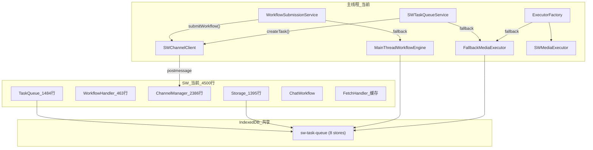
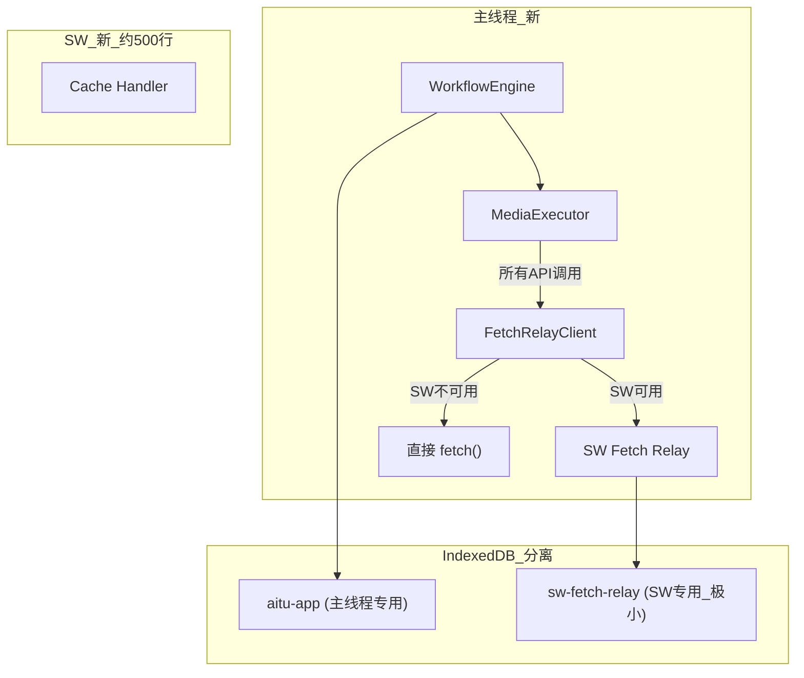

# SW 架构精简：从全能执行器到 Fetch 代理

## 现状问题

当前 SW (~4500 行) 承担了过多职责：任务队列管理、工作流编排、API 调用、IDB 存储、调试等。主线程和 SW 共享 `sw-task-queue` 数据库（8 个 object store），导致 IDB `versionchange` 阻塞、连接竞争等不稳定问题。




## 目标架构

SW 精简为 ~500 行，仅做两件事：

1. **Fetch Relay**：代理关键 API 请求（LLM/图片/视频），页面关闭后继续执行并保存结果
2. **Cache Handler**：图片/字体等资源缓存（现有逻辑保留）




## 分阶段实施

### Phase 1: 创建 Fetch Relay 基础设施（非破坏性）

新建 SW 端 Fetch Relay 模块和主线程客户端，与现有架构并行，不影响现有功能。

**SW 端**：新建 `apps/web/src/sw/fetch-relay.ts` (~200 行)

```typescript
// SW 端 Fetch Relay - 核心接口
interface FetchRelayRequest {
  requestId: string;
  url: string;
  method: string;
  headers: Record<string, string>;
  body?: string;
  stream: boolean;  // 是否流式
}

// RPC 处理器
channel.subscribe('fetch:start', async (req: FetchRelayRequest) => {
  // 1. 记录 in-flight 请求到 IDB
  // 2. 执行 fetch()
  // 3. 流式：逐 chunk broadcast 回主线程
  // 4. 非流式：完成后返回结果
  // 5. 如果客户端断开，存储结果到 IDB
});

channel.subscribe('fetch:recover', async () => {
  // 返回所有已完成但未被领取的结果
  // 清理已领取的结果
});

channel.subscribe('fetch:cancel', async ({ requestId }) => {
  // 取消 in-flight 请求（AbortController）
});
```

**SW 端 IDB**：`sw-fetch-relay` 数据库（仅 2 个 store）

- `inflight`: 正在执行的请求记录 `{ requestId, url, method, headers, body, startedAt }`
- `results`: 客户端断开后保存的结果 `{ requestId, status, headers, body, completedAt }`
- 自动清理：10 分钟过期

**主线程端**：新建 `packages/drawnix/src/services/fetch-relay/client.ts` (~200 行)

```typescript
class FetchRelayClient {
  // 核心方法：通过 SW 代理 fetch
  async fetch(url: string, init: RequestInit, options?: { 
    stream?: boolean;
    onChunk?: (chunk: string) => void;
  }): Promise<Response> {
    if (!swAvailable) return directFetch(url, init);
    // 发送到 SW，接收响应/流式 chunks
  }

  // 页面加载时恢复断开期间完成的请求
  async recoverResults(): Promise<RecoveredResult[]> { ... }
}
```

### Phase 2: 迁移 API 调用到 Fetch Relay

将关键 API 调用从"SW 执行模式"切换为"Fetch Relay 代理模式"。

**修改 `packages/drawnix/src/utils/gemini-api/apiCalls.ts**`：

- `callApiStreamRaw()`: 用 `fetchRelayClient.fetch(url, init, { stream: true })` 替代 `callApiStreamViaSW()`
- `callApiWithRetry()`: 用 `fetchRelayClient.fetch(url, init)` 替代直接 `fetch()`
- 移除 `callApiStreamViaSW()` 函数

**修改 `packages/drawnix/src/services/media-executor/fallback-executor.ts**`：

- 内部的 `fetch()` 调用改为 `fetchRelayClient.fetch()`
- 重命名为 `media-executor.ts`（不再是 fallback，而是主执行器）

### Phase 3: 主线程接管所有业务逻辑

**简化 ExecutorFactory** (`packages/drawnix/src/services/media-executor/factory.ts`)：

- 移除 `SWMediaExecutor`，只保留一个主线程执行器
- 移除 SW 可用性检测逻辑
- `getExecutor()` 直接返回主线程执行器

**简化 WorkflowSubmissionService** (`packages/drawnix/src/services/workflow-submission-service.ts`)：

- 移除 `swChannelClient.submitWorkflow()` 调用路径
- 始终使用 `MainThreadWorkflowEngine`
- 移除复杂的 SW 可用性检测和降级逻辑
- 保留事件广播机制（改为从引擎事件转发）

**简化 SWTaskQueueService** (`packages/drawnix/src/services/sw-task-queue-service.ts`)：

- 移除 SW 提交逻辑，始终使用主线程执行
- 或直接废弃此服务，用 `WorkflowEngine` 统一管理

### Phase 4: IDB 分离

**主线程新数据库**：`aitu-app`（主线程独占）

- Store `tasks`: 任务状态和结果
- Store `workflows`: 工作流状态
- Store `config`: API 配置

**修改的文件**：

- `packages/drawnix/src/services/media-executor/task-storage-writer.ts` → 改用 `aitu-app`
- `packages/drawnix/src/services/task-storage-reader.ts` → 改用 `aitu-app`
- `packages/drawnix/src/services/base-storage-reader.ts` → 改用 `aitu-app`
- `packages/drawnix/src/services/workflow-engine/workflow-storage-writer.ts` → 改用 `aitu-app`
- `packages/drawnix/src/services/workflow-storage-reader.ts` → 改用 `aitu-app`

**数据迁移**：首次启动时从 `sw-task-queue` 迁移历史数据到 `aitu-app`（一次性）。

**SW 端**：`sw-fetch-relay` 数据库（SW 独占，极小）

- 仅保存 in-flight 请求和断开后的结果
- 不与主线程共享

### Phase 5: SW 瘦身

**删除**（从 `apps/web/src/sw/` 中）：

- `task-queue/queue.ts` (1484 行) - 任务执行逻辑
- `task-queue/workflow-handler.ts` (463 行) - 工作流编排
- `task-queue/chat-workflow/` - 聊天工作流
- `task-queue/storage.ts` 大部分 (1395 行) - 复杂 IDB 操作
- `task-queue/channel-manager.ts` 大部分 (2386 行) - 复杂 RPC 处理器

**保留**（约 500 行）：

- `fetch-relay.ts` (新建，~200 行) - Fetch 代理核心
- Fetch event handler (缓存图片/字体/静态资源) - 现有逻辑
- CDN fallback - 现有逻辑
- 精简的 channel manager (仅 fetch relay 相关的 RPC)

**删除主线程文件**：

- `packages/drawnix/src/services/media-executor/sw-executor.ts` - SW 执行器
- `packages/drawnix/src/services/sw-channel/` 大部分 - 复杂通信客户端

## 收益总结

- **稳定性**：消除 IDB 并发竞争，消除 SW 超时导致的级联阻塞
- **简洁性**：SW 从 ~4500 行降至 ~500 行，移除 ~4000 行复杂代码
- **可维护性**：业务逻辑全在主线程，调试和排错更容易
- **保留 SW 核心价值**：页面刷新/关闭时 API 请求继续执行，保护用户的 API 费用

