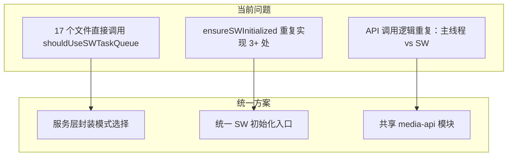
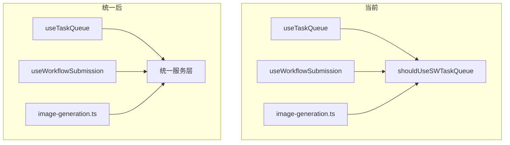

# SW 与降级模式统一方案

## 问题全景




## 第一层：API 调用逻辑统一

### 问题


| 功能     | 主线程位置                       | SW 位置                               |
| ------ | --------------------------- | ----------------------------------- |
| 图片生成   | `fallback-utils.ts`         | `mcp/tools.ts`, `handlers/image.ts` |
| 视频轮询   | `fallback-utils.ts:153-201` | `media-generation-utils.ts:218-344` |
| 异步图片轮询 | `fallback-utils.ts:207-327` | `handlers/image.ts:264-395`         |


### 方案

创建共享模块 `packages/drawnix/src/services/media-api/`：

```
media-api/
├── index.ts           # 统一导出
├── types.ts           # 类型定义
├── image-api.ts       # generateImage, pollImageStatus
├── video-api.ts       # submitVideo, pollVideoStatus
└── utils.ts           # normalizeApiBase, buildRequestBody
```

**设计原则**：

- 只依赖标准 `fetch`（SW 和主线程都支持）
- 无 DOM 依赖
- 可注入 `fetch` 实现（SW 可注入 debugFetch）

### 涉及文件

**需重构**：

- [packages/drawnix/src/services/media-executor/fallback-utils.ts](packages/drawnix/src/services/media-executor/fallback-utils.ts)
- [apps/web/src/sw/task-queue/utils/media-generation-utils.ts](apps/web/src/sw/task-queue/utils/media-generation-utils.ts)
- [apps/web/src/sw/task-queue/handlers/image.ts](apps/web/src/sw/task-queue/handlers/image.ts)
- [apps/web/src/sw/task-queue/handlers/video.ts](apps/web/src/sw/task-queue/handlers/video.ts)

---

## 第二层：服务入口统一

### 问题

17 个文件直接调用 `shouldUseSWTaskQueue()`，导致：

- 分支逻辑分散
- 修改模式选择逻辑需改多处
- 容易遗漏某些分支

### 当前分布


| 分类        | 文件                                                                                                   |
| --------- | ---------------------------------------------------------------------------------------------------- |
| Hooks     | `useTaskQueue`, `useTaskExecutor`, `useTaskStorage`, `useFilteredTaskQueue`, `useWorkflowSubmission` |
| Contexts  | `AssetContext.tsx`                                                                                   |
| Services  | `chat-service.ts`, `gemini-api/services.ts`, `gemini-api/apiCalls.ts`                                |
| MCP Tools | `image-generation.ts`, `video-generation.ts`, `photo-wall-tool.ts`, `creative-photo-wall-tool.ts`    |
| 主入口       | `drawnix.tsx`                                                                                        |


### 方案

**原则**：服务层封装模式选择，上层只调用统一接口




**已有统一入口（继续使用）**：

- `taskQueueService`：任务队列（已自动选择）
- `executorFactory.getExecutor()`：媒体执行器
- `unifiedGenerationService.generate()`：统一生成
- `workflowSubmissionService.submitWorkflow()`：工作流

**需要调整的调用点**：

1. MCP Tools 中的分支判断 → 改用 `unifiedGenerationService`
2. Hooks 中的直接检查 → 改用服务层方法
3. `drawnix.tsx` 初始化 → 保留（入口需要）

---

## 第三层：SW 初始化统一

### 问题

`ensureSWInitialized()` 在多处重复实现：

- `gemini-api/services.ts`
- `gemini-api/apiCalls.ts`
- 其他服务文件

### 方案

统一到 `sw-channel/client.ts` 或创建 `sw-init-service.ts`：

```typescript
// sw-init-service.ts
export async function ensureSWReady(): Promise<boolean> {
  if (!shouldUseSWTaskQueue()) return false;
  // 统一初始化逻辑
}
```

---

## 实施路线

### 阶段 1：API 调用统一

1. 创建 `media-api/` 共享模块
2. 从 `fallback-utils.ts` 提取核心函数
3. 主线程迁移 + 测试
4. SW 迁移 + 测试

### 阶段 2：服务入口统一

1. 审计 17 个直接调用点
2. MCP Tools 改用 `unifiedGenerationService`
3. Hooks 改用服务层方法
4. 移除不必要的 `shouldUseSWTaskQueue()` 调用

### 阶段 3：SW 初始化统一

1. 创建 `sw-init-service.ts`
2. 迁移 `ensureSWInitialized()` 调用
3. 清理重复实现

### 阶段 4：清理验证

1. 删除所有重复代码
2. 更新 CLAUDE.md 相关规则
3. 全功能回归测试

---

## 预期收益


| 指标                        | 当前         | 统一后        |
| ------------------------- | ---------- | ---------- |
| API 调用代码                  | ~800 行（两处） | ~400 行（一处） |
| `shouldUseSWTaskQueue` 调用 | 17 处       | ≤5 处（仅入口）  |
| `ensureSWInitialized` 实现  | 3+ 处       | 1 处        |
| 新增/修改模式逻辑                 | 改多处        | 改一处        |


---

## 不统一的部分

以下保持独立实现是合理的：

1. **SW Handler 调度逻辑**：SW 特有的后台执行、任务恢复
2. **IndexedDB 访问**：SW 和主线程各自的存储逻辑
3. **postMessage 通信**：SW 特有的通信机制

---

## 相关文件汇总

### 第一层（API 统一）

- `packages/drawnix/src/services/media-executor/fallback-utils.ts`
- `apps/web/src/sw/task-queue/utils/media-generation-utils.ts`
- `apps/web/src/sw/task-queue/handlers/image.ts`
- `apps/web/src/sw/task-queue/handlers/video.ts`

### 第二层（服务入口统一）

- `packages/drawnix/src/hooks/useTaskQueue.ts`
- `packages/drawnix/src/hooks/useTaskExecutor.ts`
- `packages/drawnix/src/hooks/useTaskStorage.ts`
- `packages/drawnix/src/hooks/useFilteredTaskQueue.ts`
- `packages/drawnix/src/hooks/useWorkflowSubmission.ts`
- `packages/drawnix/src/contexts/AssetContext.tsx`
- `packages/drawnix/src/mcp/tools/image-generation.ts`
- `packages/drawnix/src/mcp/tools/video-generation.ts`
- `packages/drawnix/src/mcp/tools/photo-wall-tool.ts`
- `packages/drawnix/src/mcp/tools/creative-photo-wall-tool.ts`
- `packages/drawnix/src/services/chat-service.ts`

### 第三层（SW 初始化统一）

- `packages/drawnix/src/utils/gemini-api/services.ts`
- `packages/drawnix/src/utils/gemini-api/apiCalls.ts`

