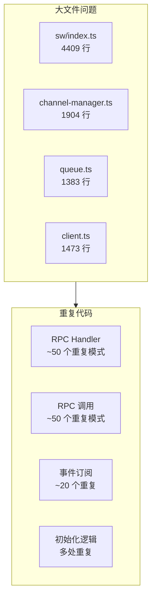

# SW 通信代码优化计划

## 问题总览




## 一、减少重复代码

### 1.1 SW 端: RPC Handler 重复模式 (高优先级)

**位置**: [channel-manager.ts](apps/web/src/sw/task-queue/channel-manager.ts) 第 639-689 行

**问题**: 多个 handler 使用相同的 try-catch-return 模式：

```typescript
// 当前 - 每个方法 10+ 行
private async handleTaskCancel(taskId: string): Promise<...> {
  if (!taskId) return { success: false, error: 'Missing taskId' };
  try {
    await this.taskQueue?.cancelTask(taskId);
    return { success: true };
  } catch (error: any) {
    return { success: false, error: error.message };
  }
}
// handleTaskRetry, handleTaskDelete, handleTaskMarkInserted... 完全相同结构
```

**优化**: 提取通用 wrapper：

```typescript
private async wrapTaskOperation(
  taskId: string,
  operation: () => Promise<void>
): Promise<{ success: boolean; error?: string }> {
  if (!taskId) return { success: false, error: 'Missing taskId' };
  try {
    await operation();
    return { success: true };
  } catch (error: any) {
    return { success: false, error: error.message };
  }
}

// 使用 - 每个方法 1-3 行
private handleTaskCancel = (taskId: string) => 
  this.wrapTaskOperation(taskId, () => this.taskQueue?.cancelTask(taskId)!);
```

**影响**: 减少约 50 行代码，统一错误处理

### 1.2 客户端: RPC 调用重复模式 (高优先级)

**位置**: [client.ts](packages/drawnix/src/services/sw-channel/client.ts) 第 248-400 行

**问题**: ~50 个方法使用相同的调用模式：

```typescript
// 当前 - 每个方法 8-12 行
async cancelTask(taskId: string): Promise<TaskOperationResult> {
  this.ensureInitialized();
  const response = await this.channel!.call('task:cancel', { taskId });
  if (response.ret !== ReturnCode.Success) {
    return { success: false, error: response.msg || 'Cancel task failed' };
  }
  return response.data || { success: true };
}
```

**优化**: 提取通用 RPC 调用器：

```typescript
private async callRPC<T>(
  method: string,
  params: unknown,
  defaultError: string
): Promise<T> {
  this.ensureInitialized();
  const response = await this.channel!.call(method, params);
  if (response.ret !== ReturnCode.Success) {
    return { success: false, error: response.msg || defaultError } as T;
  }
  return (response.data || { success: true }) as T;
}

// 使用 - 每个方法 2-3 行
cancelTask = (taskId: string) => 
  this.callRPC<TaskOperationResult>('task:cancel', { taskId }, 'Cancel failed');
```

**影响**: 减少约 400 行代码

### 1.3 客户端: 事件订阅重复 (中优先级)

**位置**: [client.ts](packages/drawnix/src/services/sw-channel/client.ts) 第 1267-1469 行

**问题**: ~20 个事件订阅使用相同模式

**优化**: 提取订阅 helper：

```typescript

private subscribeEvent<T>(event: string, handler: keyof SWChannelEventHandlers): void {

this.channel?.
```

