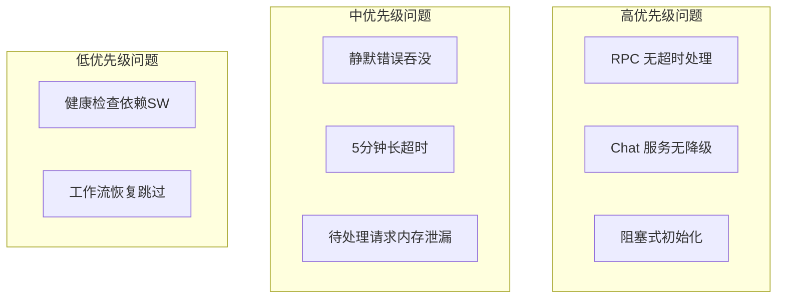

# SW 通信健壮性加固

## 问题全景




---

## Phase 1: RPC 超时处理

### 问题

`[packages/drawnix/src/services/sw-channel/client.ts](packages/drawnix/src/services/sw-channel/client.ts)` 中大部分 RPC 方法没有超时处理：


| 方法                                | 超时  | 风险      |
| --------------------------------- | --- | ------- |
| `createTask`                      | 无   | 可能永久挂起  |
| `submitWorkflow`                  | 无   | 工作流提交卡死 |
| `getTask`                         | 无   | 状态查询卡死  |
| `cancelTask/retryTask/deleteTask` | 无   | 操作无响应   |


### 方案

1. 创建统一的超时 RPC 包装器：

```typescript
// client.ts
private async callRPCWithTimeout<T>(
  method: string,
  params: unknown,
  timeoutMs: number = 10000
): Promise<T> {
  const result = await Promise.race([
    this.channel.call(method, params),
    new Promise((_, reject) => 
      setTimeout(() => reject(new Error(`RPC ${method} timeout`)), timeoutMs)
    )
  ]);
  return result as T;
}
```

1. 为关键方法添加超时：
  - `createTask`: 15s（需要等待任务创建）
  - `submitWorkflow`: 15s
  - `getTask`: 5s
  - `cancelTask/retryTask/deleteTask`: 10s

---

## Phase 2: Chat 服务降级

### 问题

`[packages/drawnix/src/services/sw-chat-service.ts](packages/drawnix/src/services/sw-chat-service.ts)` 和 `[sw-chat-workflow-service.ts](packages/drawnix/src/services/sw-chat-workflow-service.ts)` 在 SW 不可用时会失败：

```typescript
// 当前：无错误处理
if (!swChannelClient.isInitialized()) {
  await swChannelClient.initialize();  // ❌ 可能挂起
  await swChannelClient.init({...});
}
```

### 方案

1. 添加超时保护的初始化：

```typescript
// 修改后
if (!swChannelClient.isInitialized()) {
  try {
    const success = await Promise.race([
      swChannelClient.initialize(),
      new Promise(resolve => setTimeout(() => resolve(false), 5000))
    ]);
    if (!success) {
      // 降级到直接 API 调用
      return this.sendChatMessageDirectly(params);
    }
  } catch {
    return this.sendChatMessageDirectly(params);
  }
}
```

1. 实现直接 API 调用的降级路径（复用现有的 `gemini-api` 模块）

---

## Phase 3: 阻塞式初始化改造

### 问题

以下服务在 SW 不可用时会阻塞或失败：


| 服务                    | 文件                                                                                       | 问题                 |
| --------------------- | ---------------------------------------------------------------------------------------- | ------------------ |
| `SWGenerationService` | `[sw-generation-service.ts:107](packages/drawnix/src/services/sw-generation-service.ts)` | 抛出错误               |
| `SWMediaExecutor`     | `[sw-executor.ts:62](packages/drawnix/src/services/media-executor/sw-executor.ts)`       | 阻塞 `isAvailable()` |
| `useSWTaskQueue`      | `[useSWTaskQueue.ts:98](packages/drawnix/src/hooks/useSWTaskQueue.ts)`                   | 设置错误状态             |


### 方案

1. `SWGenerationService.initialize()` 改为非阻塞，失败时使用降级执行器
2. `SWMediaExecutor.isAvailable()` 使用缓存的 SW 状态，避免每次都检查
3. `useSWTaskQueue` 初始化失败时自动降级，不阻断 UI

---

## Phase 4: 静默错误处理

### 问题

多处空 catch 块导致错误被吞没，难以调试：

```typescript
// sw-task-queue-service.ts:1077, 1102, 1129, 1155, 1174
} catch {
  // 忽略错误 ❌
}
```

### 方案

1. 替换空 catch 为有意义的日志：

```typescript
} catch (error) {
  console.warn('[SWTaskQueue] getTask failed, using cached data:', error);
  // 继续使用缓存数据
}
```

1. 关键操作（如 `markTaskInserted`）添加重试逻辑

---

## Phase 5: 待处理请求清理

### 问题

`[workflow-executor.ts](apps/web/src/sw/task-queue/workflow-executor.ts)` 中的 `pendingToolRequests` Map 可能因响应未到达而无限增长。

### 方案

1. 添加清理定时器，移除超过 10 分钟的待处理请求
2. 在 SW 激活时清理过期请求

---

## 涉及文件

### 核心修改


| 文件                                                          | 修改内容         |
| ----------------------------------------------------------- | ------------ |
| `packages/drawnix/src/services/sw-channel/client.ts`        | 添加 RPC 超时包装器 |
| `packages/drawnix/src/services/sw-chat-service.ts`          | 添加降级路径       |
| `packages/drawnix/src/services/sw-chat-workflow-service.ts` | 添加降级路径       |
| `packages/drawnix/src/services/sw-generation-service.ts`    | 非阻塞初始化       |
| `packages/drawnix/src/services/sw-task-queue-service.ts`    | 修复空 catch 块  |
| `apps/web/src/sw/task-queue/workflow-executor.ts`           | 添加待处理请求清理    |


### 次要修改


| 文件                                                            | 修改内容     |
| ------------------------------------------------------------- | -------- |
| `packages/drawnix/src/services/media-executor/sw-executor.ts` | 缓存 SW 状态 |
| `packages/drawnix/src/hooks/useSWTaskQueue.ts`                | 优雅降级     |


---

## 实施顺序

1. **Phase 1** - RPC 超时（最关键，防止永久挂起）
2. **Phase 3** - 阻塞初始化改造（影响用户体验）
3. **Phase 2** - Chat 降级（功能完整性）
4. **Phase 4** - 错误处理（调试便利性）
5. **Phase 5** - 内存清理（长期稳定性）

