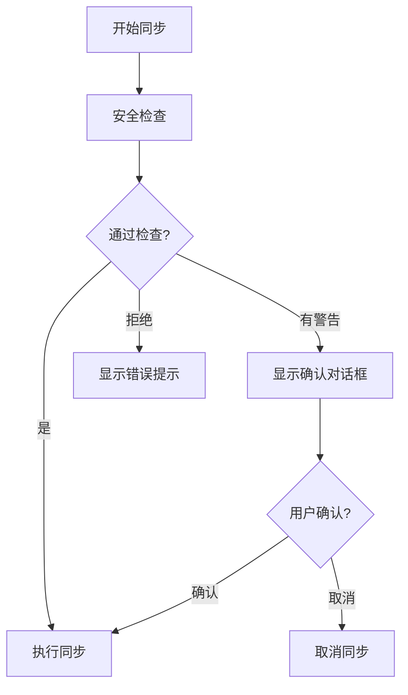
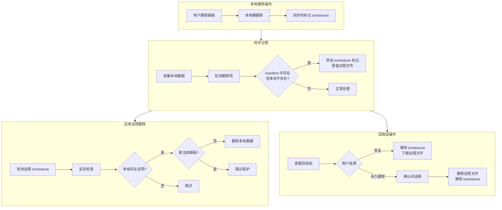

# 删除同步功能实现方案

## 核心设计

### 软删除（Tombstone）策略

在 manifest 中记录删除标记，**远程保留完整文件**便于恢复：

- 删除时：标记 tombstone + 保留远程文件（不删除 board_X.json）
- 同步时：有 tombstone 标记的数据不下载到本地
- 恢复时：移除 tombstone 标记 + 下载远程文件到本地
- 永久删除：用户手动清空回收站时才删除远程文件

### 数据安全保护（核心）

**原则：宁可同步失败，也不能误删用户数据**

#### 保护规则

| 保护项 | 规则 | 触发时处理 |
|-------|------|----------|
| 当前画板保护 | 正在编辑的画板不能被删除 | 跳过该画板的删除，保持本地数据 |
| 批量删除阈值 | 单次同步删除超过 50% 画板时触发警告 | 暂停同步，要求用户确认 |
| 空数据检测 | 如果同步会导致本地所有画板被删除 | 拒绝执行，提示用户检查远程数据 |
| 新设备保护 | 首次同步的新设备不执行任何删除操作 | 只下载数据，不删除本地现有数据 |

#### 实现方式

```typescript
interface SyncSafetyCheck {
  /** 是否通过安全检查 */
  passed: boolean;
  /** 需要用户确认的警告 */
  warnings: Array<{
    type: 'bulk_delete' | 'delete_current' | 'delete_all';
    message: string;
    affectedItems: string[];
  }>;
  /** 被保护跳过的项目 */
  skippedItems: Array<{
    id: string;
    reason: 'current_board' | 'new_device';
  }>;
}

/**
 * 同步前安全检查
 */
function performSafetyCheck(
  localBoards: Map<string, BoardData>,
  toDeleteLocally: string[],
  currentBoardId: string | null,
  isFirstSync: boolean
): SyncSafetyCheck
```

#### UI 确认流程



### 数据流




---

## 实现步骤

### 0. 数据安全保护实现 [sync-engine.ts](packages/drawnix/src/services/github-sync/sync-engine.ts)

**优先级最高，必须在删除逻辑之前实现**

```typescript
/** 安全检查结果 */
interface SyncSafetyCheck {
  passed: boolean;
  warnings: SyncWarning[];
  skippedItems: SkippedItem[];
  blockedReason?: string;
}

/** 同步警告 */
interface SyncWarning {
  type: 'bulk_delete' | 'delete_current';
  message: string;
  affectedItems: Array<{ id: string; name: string }>;
}

/** 被跳过的项目 */
interface SkippedItem {
  id: string;
  name: string;
  reason: 'current_board' | 'new_device';
}

/**
 * 执行同步前安全检查
 */
function performSafetyCheck(params: {
  localBoards: Map<string, BoardData>;
  toDeleteLocally: string[];
  currentBoardId: string | null;
  isFirstSync: boolean;
  remoteManifest: SyncManifest | null;
}): SyncSafetyCheck {
  const { localBoards, toDeleteLocally, currentBoardId, isFirstSync, remoteManifest } = params;
  const result: SyncSafetyCheck = { passed: true, warnings: [], skippedItems: [] };
  
  // 1. 空 manifest 检测
  if (!remoteManifest || Object.keys(remoteManifest.boards).length === 0) {
    // 远程数据异常，不执行删除
    result.skippedItems = toDeleteLocally.map(id => ({
      id,
      name: localBoards.get(id)?.name || id,
      reason: 'new_device' as const
    }));
    return result;
  }
  
  // 2. 新设备保护
  if (isFirstSync && toDeleteLocally.length > 0) {
    result.skippedItems = toDeleteLocally.map(id => ({
      id,
      name: localBoards.get(id)?.name || id,
      reason: 'new_device' as const
    }));
    return result;
  }
  
  // 3. 当前画板保护
  if (currentBoardId && toDeleteLocally.includes(currentBoardId)) {
    result.skippedItems.push({
      id: currentBoardId,
      name: localBoards.get(currentBoardId)?.name || currentBoardId,
      reason: 'current_board'
    });
  }
  
  // 4. 批量删除检测（删除超过 50%）
  const deleteRatio = toDeleteLocally.length / localBoards.size;
  if (deleteRatio > 0.5 && toDeleteLocally.length > 1) {
    result.passed = false;
    result.warnings.push({
      type: 'bulk_delete',
      message: `即将删除 ${toDeleteLocally.length}/${localBoards.size} 个画板 (${Math.round(deleteRatio * 100)}%)`,
      affectedItems: toDeleteLocally.map(id => ({
        id,
        name: localBoards.get(id)?.name || id
      }))
    });
  }
  
  // 5. 全部删除检测
  if (toDeleteLocally.length === localBoards.size && localBoards.size > 0) {
    result.passed = false;
    result.blockedReason = '检测到异常操作：远程数据要求删除所有本地画板，已阻止执行。请检查远程数据是否正常。';
  }
  
  return result;
}
```

---

### 1. 扩展类型定义 [types.ts](packages/drawnix/src/services/github-sync/types.ts)

扩展 `BoardSyncInfo` 添加删除标记：

```typescript
export interface BoardSyncInfo {
  name: string;
  updatedAt: number;
  checksum: string;
  deletedAt?: number;      // 新增：删除时间戳
  deletedBy?: string;      // 新增：删除设备 ID
}
```

新增提示词和任务的删除追踪结构：

```typescript
/** 提示词删除记录 */
export interface PromptTombstone {
  id: string;           // 提示词唯一标识（使用 createdAt 时间戳）
  type: 'prompt' | 'videoPrompt' | 'imagePrompt';
  deletedAt: number;
  deletedBy: string;
}

/** 任务删除记录 */
export interface TaskTombstone {
  taskId: string;
  deletedAt: number;
  deletedBy: string;
}

// 在 SyncManifest 中添加
export interface SyncManifest {
  // ... 现有字段
  deletedPrompts?: PromptTombstone[];   // 新增
  deletedTasks?: TaskTombstone[];       // 新增
}
```

扩展 `ChangeSet` 和 `SyncResult`：

```typescript
export interface ChangeSet {
  // ... 现有字段
  deletedPromptIds?: string[];  // 新增
  deletedTaskIds?: string[];    // 新增
}

export interface SyncResult {
  // ... 现有字段
  deleted: {                    // 新增
    boards: number;
    prompts: number;
    tasks: number;
    media: number;
  };
}
```

---

### 2. 增强删除检测逻辑 [data-serializer.ts](packages/drawnix/src/services/github-sync/data-serializer.ts)

新增 `detectDeletions` 方法：

```typescript
/**
 * 检测本地删除的数据
 * 对比当前本地数据与上次同步的 manifest，找出已删除的项
 */
detectDeletions(
  localData: { boards: Map<string, BoardData>; prompts: PromptsData; tasks: TasksData },
  lastSyncManifest: SyncManifest | null,
  deviceId: string
): {
  deletedBoards: Array<{ id: string; name: string }>;
  deletedPrompts: PromptTombstone[];
  deletedTasks: TaskTombstone[];
}
```

核心逻辑：

- 遍历 `lastSyncManifest.boards`，若本地不存在且未标记为 tombstone → 新增 tombstone
- 对比提示词列表，使用 `createdAt` 作为唯一 ID 进行匹配
- 对比任务列表，使用 `taskId` 进行匹配

修改 `compareBoardChanges` 返回删除列表：

```typescript
compareBoardChanges(...): {
  toUpload: string[];
  toDownload: string[];
  conflicts: string[];
  toDeleteLocally: string[];    // 新增：需要从本地删除的画板（远程有 tombstone）
  // 注意：不再需要 toDelete，因为远程文件保留不删除
}
```

---

### 3. 更新同步引擎 [sync-engine.ts](packages/drawnix/src/services/github-sync/sync-engine.ts)

修改 `performSync` 方法，增加删除处理阶段：

```typescript
// 在同步流程中增加：
// 1. 检测本地删除 → 更新 manifest 中的 tombstone
// 2. 检测远程 tombstone → 删除本地对应数据
// 3. 清理过期的 tombstone（可选：超过 30 天）
```

新增 `applyRemoteDeletions` 方法：

```typescript
/**
 * 应用远程删除到本地
 */
async applyRemoteDeletions(manifest: SyncManifest): Promise<{
  deletedBoards: number;
  deletedPrompts: number;
  deletedTasks: number;
}>
```

新增回收站相关方法：

```typescript
/**
 * 获取回收站中的已删除项目
 */
async getDeletedItems(): Promise<{
  boards: Array<{ id: string; name: string; deletedAt: number; deletedBy: string }>;
  prompts: PromptTombstone[];
  tasks: TaskTombstone[];
}>

/**
 * 恢复已删除的项目
 * - 移除 tombstone 标记
 * - 下载远程文件到本地
 */
async restoreItem(
  type: 'board' | 'prompt' | 'task',
  id: string
): Promise<{ success: boolean; error?: string }>

/**
 * 永久删除项目（从回收站清除）
 * - 删除远程文件
 * - 移除 tombstone 标记
 */
async permanentlyDelete(
  type: 'board' | 'prompt' | 'task',
  id: string
): Promise<{ success: boolean; error?: string }>

/**
 * 清空回收站（永久删除所有已删除项目）
 */
async emptyRecycleBin(): Promise<{
  deletedBoards: number;
  deletedPrompts: number;
  deletedTasks: number;
}>
```

---

### 4. 更新数据应用逻辑 [data-serializer.ts](packages/drawnix/src/services/github-sync/data-serializer.ts)

修改 `applySyncData` 方法，增加删除处理：

```typescript
async applySyncData(data: {
  // ... 现有参数
  deletedBoards?: string[];      // 新增：需要删除的画板 ID
  deletedPromptIds?: string[];   // 新增：需要删除的提示词 ID
  deletedTaskIds?: string[];     // 新增：需要删除的任务 ID
}): Promise<{
  // ... 现有返回值
  deletedBoards: number;         // 新增
  deletedPrompts: number;        // 新增
  deletedTasks: number;          // 新增
}>
```

---

### 5. 更新 UI 显示 [SyncSettings.tsx](packages/drawnix/src/components/sync-settings/SyncSettings.tsx)

在同步结果显示中增加删除统计：

```tsx
{result.deleted && (result.deleted.boards > 0 || result.deleted.prompts > 0 || result.deleted.tasks > 0) && (
  <div className="sync-deleted">
    已删除: {result.deleted.boards} 画板, {result.deleted.prompts} 提示词, {result.deleted.tasks} 任务
  </div>
)}
```

---

### 6. 回收站组件 [SyncSettings.tsx](packages/drawnix/src/components/sync-settings/SyncSettings.tsx)

在同步设置页面新增"回收站"Tab：

```tsx
// Tab 切换
<Tabs value={activeTab} onChange={setActiveTab}>
  <TabPanel value="sync" label="同步">...</TabPanel>
  <TabPanel value="recycle" label="回收站">
    <RecycleBin />
  </TabPanel>
</Tabs>
```

回收站组件设计：

```tsx
function RecycleBin() {
  const [deletedItems, setDeletedItems] = useState<DeletedItems | null>(null);
  const [loading, setLoading] = useState(false);
  
  // 加载回收站数据
  useEffect(() => {
    syncEngine.getDeletedItems().then(setDeletedItems);
  }, []);
  
  return (
    <div className="recycle-bin">
      {/* 头部：标题 + 清空按钮 */}
      <div className="recycle-bin-header">
        <h3>回收站</h3>
        <Button 
          variant="text" 
          theme="danger"
          onClick={handleEmptyRecycleBin}
          disabled={isEmpty}
        >
          清空回收站
        </Button>
      </div>
      
      {/* 分组显示：画板、提示词、任务 */}
      {deletedItems?.boards.length > 0 && (
        <div className="recycle-group">
          <h4>画板 ({deletedItems.boards.length})</h4>
          {deletedItems.boards.map(board => (
            <RecycleItem
              key={board.id}
              name={board.name}
              deletedAt={board.deletedAt}
              onRestore={() => handleRestore('board', board.id)}
              onDelete={() => handlePermanentDelete('board', board.id)}
            />
          ))}
        </div>
      )}
      
      {/* 类似处理 prompts 和 tasks */}
      
      {isEmpty && (
        <div className="recycle-empty">
          回收站是空的
        </div>
      )}
    </div>
  );
}

// 单个回收项
function RecycleItem({ name, deletedAt, onRestore, onDelete }) {
  return (
    <div className="recycle-item">
      <span className="recycle-item-name">{name}</span>
      <span className="recycle-item-date">
        {formatDate(deletedAt)}
      </span>
      <div className="recycle-item-actions">
        <Button size="small" onClick={onRestore}>恢复</Button>
        <Button size="small" theme="danger" onClick={onDelete}>永久删除</Button>
      </div>
    </div>
  );
}
```

样式要点：

- 回收站列表使用紧凑布局
- 永久删除按钮使用危险色（红色）
- 删除时间显示相对时间（如"3 天前"）

---

### 7. 安全确认对话框 [SyncSettings.tsx](packages/drawnix/src/components/sync-settings/SyncSettings.tsx)

批量删除警告对话框：

```tsx
function BulkDeleteWarningDialog({ 
  warning, 
  onConfirm, 
  onCancel 
}: {
  warning: SyncWarning;
  onConfirm: () => void;
  onCancel: () => void;
}) {
  return (
    <Dialog visible header="同步警告" onClose={onCancel}>
      <div className="bulk-delete-warning">
        <div className="warning-icon">⚠️</div>
        <p className="warning-message">{warning.message}</p>
        <div className="affected-items">
          <p>将被删除的画板：</p>
          <ul>
            {warning.affectedItems.map(item => (
              <li key={item.id}>{item.name}</li>
            ))}
          </ul>
        </div>
        <p className="warning-tip">
          这些画板在其他设备上已被删除。如果您想保留它们，请点击"取消"。
        </p>
      </div>
      <div className="dialog-actions">
        <Button onClick={onCancel}>取消</Button>
        <Button theme="danger" onClick={onConfirm}>
          确认删除
        </Button>
      </div>
    </Dialog>
  );
}
```

清空回收站确认对话框（需要输入确认文字）：

```tsx
function EmptyRecycleBinDialog({ 
  itemCount, 
  onConfirm, 
  onCancel 
}: {
  itemCount: { boards: number; prompts: number; tasks: number };
  onConfirm: () => void;
  onCancel: () => void;
}) {
  const [confirmText, setConfirmText] = useState('');
  const isValid = confirmText === '确认清空';
  
  return (
    <Dialog visible header="清空回收站" onClose={onCancel}>
      <div className="empty-recycle-warning">
        <p>此操作将永久删除回收站中的所有数据，无法恢复：</p>
        <ul>
          {itemCount.boards > 0 && <li>{itemCount.boards} 个画板</li>}
          {itemCount.prompts > 0 && <li>{itemCount.prompts} 条提示词</li>}
          {itemCount.tasks > 0 && <li>{itemCount.tasks} 个任务</li>}
        </ul>
        <p>请输入 <strong>确认清空</strong> 以继续：</p>
        <Input 
          value={confirmText}
          onChange={setConfirmText}
          placeholder="输入"确认清空""
        />
      </div>
      <div className="dialog-actions">
        <Button onClick={onCancel}>取消</Button>
        <Button theme="danger" disabled={!isValid} onClick={onConfirm}>
          永久删除
        </Button>
      </div>
    </Dialog>
  );
}
```

---

## 边界情况处理

### 常规场景

| 场景 | 处理方式 |
|-----|---------|
| 首次同步 | 无 tombstone，正常上传所有数据 |
| 设备 A 删除，设备 B 修改 | 删除时间 > 修改时间 → 执行删除；否则保留并移除 tombstone |
| 双方都删除同一项 | 正常删除，tombstone 合并取较早时间 |
| 从回收站恢复 | 移除 tombstone + 下载远程文件到本地 |
| 永久删除 | 删除远程文件 + 移除 tombstone |
| 离线期间删除 | 上线同步时检测删除并传播 |
| Gist 空间不足 | 提示用户清空回收站释放空间 |

### 数据安全场景

| 场景 | 处理方式 |
|-----|---------|
| 远程要删除当前正在编辑的画板 | **跳过该画板的删除**，保持本地数据不变，日志记录跳过原因 |
| 远程要删除超过 50% 的画板 | **暂停同步**，弹出确认对话框，显示将被删除的画板列表 |
| 远程要删除所有画板 | **拒绝执行**，提示"检测到异常删除操作"，建议用户检查远程数据 |
| 新设备首次同步 | **只下载不删除**，不执行任何本地删除操作，避免覆盖本地已有数据 |
| 远程 manifest 损坏或为空 | **拒绝执行删除**，只执行上传操作，保护本地数据 |
| 清空回收站 | **二次确认**，需输入"确认清空"文字才能执行 |
| 永久删除单项 | **确认对话框**，明确显示将删除的项目名称 |


---

## 文件修改清单

| 文件 | 修改内容 |
|-----|---------|
| [`types.ts`](packages/drawnix/src/services/github-sync/types.ts) | 扩展类型定义：tombstone、安全检查结果、警告类型 |
| [`data-serializer.ts`](packages/drawnix/src/services/github-sync/data-serializer.ts) | 删除检测 `detectDeletions`、变更比较 `compareBoardChanges` |
| [`sync-engine.ts`](packages/drawnix/src/services/github-sync/sync-engine.ts) | 安全检查 `performSafetyCheck`、同步流程整合、回收站服务 |
| [`SyncSettings.tsx`](packages/drawnix/src/components/sync-settings/SyncSettings.tsx) | 回收站组件、安全确认对话框、删除统计显示 |
| [`sync-settings.scss`](packages/drawnix/src/components/sync-settings/sync-settings.scss) | 回收站样式、警告对话框样式 |

