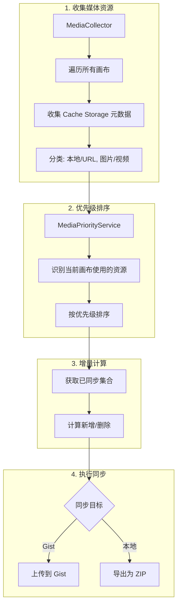

# 媒体同步优化方案

## 现状分析

当前 `media-sync-service.ts` 只处理 AI 任务产物同步，存在以下问题：

1. 不支持画布中引用的本地上传图片/视频
2. 不支持 URL 图片/视频的缓存同步
3. 没有优先级控制
4. 不支持本地文件导出

## 核心设计

### 1. 媒体资源分类与优先级

```
优先级（从高到低）：
1. 画布 (boards) - 已有
2. 提示词 (prompts) - 已有
3. 任务 (tasks) - 已有
4. 当前画布-本地图片
5. 当前画布-本地视频
6. 当前画布-URL图片
7. 当前画布-URL视频
8. 其他-本地图片
9. 其他-本地视频
10. 其他-URL图片
11. 其他-URL视频
```

### 2. 媒体资源类型判断

- **本地资源**：URL 以 `/asset-library/` 或 `/__aitu_cache__/` 开头
- **URL 资源**：URL 以 `http://` 或 `https://` 开头
- **图片/视频判断**：使用 `PlaitDrawElement.isImage()` 和 `isVideoElement()`

### 3. 增量同步策略

由于图片/视频数据不会变化（只有新增和删除），采用以下策略：

1. 本地维护已同步媒体的 URL 集合（存储在 IndexedDB）
2. 收集所有媒体 URL，与已同步集合比较
3. 新增：上传到远程
4. 删除：从远程删除（或标记为 tombstone）

### 4. 文件命名规则

使用 URL 的 Base64 编码作为文件名（可逆转回 URL）：

```typescript
// 编码
const filename = `media_${btoa(url).replace(/[/+=]/g, '_')}.json`;
// 解码
const url = atob(filename.replace(/^media_/, '').replace(/\.json$/, '').replace(/_/g, '/'));
```

### 5. 存储格式

```typescript
interface SyncedMediaFile {
  url: string;              // 原始 URL
  type: 'image' | 'video';
  source: 'local' | 'external';
  mimeType: string;
  size: number;
  base64Data: string;       // 图片/视频的 Base64
  syncedAt: number;
  syncedFromDevice: string;
  // 仅 URL 资源
  originalUrl?: string;     // 外部 URL（用于恢复时重新下载）
}
```

### 6. 同步目标支持

- **GitHub Gist**：使用现有 `gitHubApiService`
- **本地文件**：新增 `localFileExportService`，导出为 ZIP 包

## 关键文件修改

### 新增文件

1. `[media-priority-service.ts](packages/drawnix/src/services/github-sync/media-priority-service.ts)` - 媒体优先级计算服务
2. `[media-collector.ts](packages/drawnix/src/services/github-sync/media-collector.ts)` - 媒体资源收集器
3. `[local-export-service.ts](packages/drawnix/src/services/github-sync/local-export-service.ts)` - 本地文件导出服务

### 修改文件

1. `[media-sync-service.ts](packages/drawnix/src/services/github-sync/media-sync-service.ts)` - 重构，支持新的同步逻辑
2. `[types.ts](packages/drawnix/src/services/github-sync/types.ts)` - 添加新类型定义
3. `[sync-engine.ts](packages/drawnix/src/services/github-sync/sync-engine.ts)` - 集成新的媒体同步流程
4. `[data-serializer.ts](packages/drawnix/src/services/github-sync/data-serializer.ts)` - 添加媒体收集逻辑

## 实现步骤

### 阶段 1：媒体收集与优先级

1. 实现 `MediaCollector` 类，从画布和缓存中收集所有媒体资源
2. 实现 `MediaPriorityService` 类，按优先级排序媒体列表
3. 添加判断媒体是否在当前画布中使用的方法

### 阶段 2：增量同步核心

1. 重构 `MediaSyncService`，支持增量同步
2. 实现 URL 资源的下载和缓存
3. 实现 Base64 文件名编码/解码
4. 添加同步状态追踪（已同步 URL 集合）

### 阶段 3：同步目标支持

1. 实现 `LocalExportService`，支持导出为 ZIP
2. 在 `SyncEngine` 中集成媒体同步流程
3. 添加同步目标选择逻辑

### 阶段 4：下载与恢复

1. 实现从 Gist 下载媒体并恢复到 Cache Storage
2. 处理 URL 资源的重新下载
3. 添加媒体同步进度回调

## 数据流



## 注意事项

1. **Gist 文件数量限制**：单个 Gist 最多 300 个文件，需要考虑分片
2. **文件大小限制**：单个文件最大 100MB（Base64 后约 75MB 原始数据）
3. **URL 资源下载**：需要处理 CORS 限制，可能无法下载某些资源
4. **增量同步关键**：媒体数据不变，只需比较 URL 集合即可判断是否需要同步
